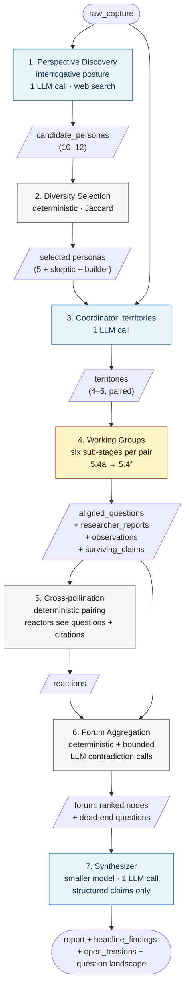
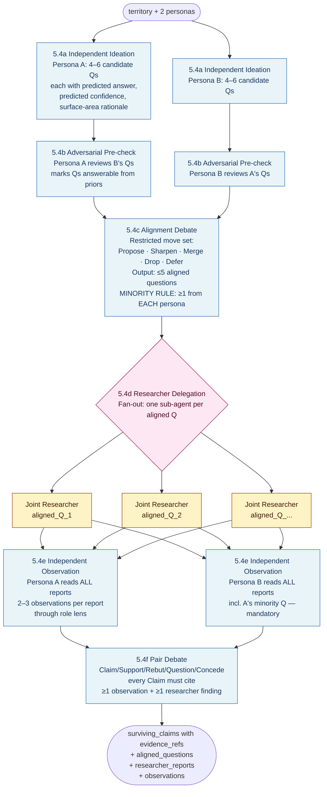
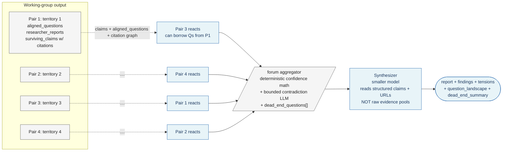

# msv — Architecture

> **The pipeline is now optimized for question generation, not debate.** msv's value is not in the eloquence of the personas' arguments — it's in the questions they would not have asked alone. Working groups now generate and align candidate questions before any debate happens, then dispatch a dedicated Joint Researcher sub-agent per question, then debate over the resulting findings. Everything downstream serves that reorientation.

This document captures the architectural shape of the prototype as it stands after the v5 restructure. For the *why*, see `specs/vision.md`. For the full schema, system prompts, and gotchas, see `specs/prototype.md` (currently being revised to match) — this document deliberately avoids restating them.

---

## At a glance



Blue nodes are LLM-driven; grey are deterministic; amber is the working-group stage, which is itself a six-step internal flow (see §Working Groups). The adaptive coordinator-spawn loop is **removed** in v5 — the working-group internal flow absorbs its function (the pair now generates its own questions).

**The 30-second tour:** discovery surveys the web for real intellectual traditions, framed as *curious investigators* of what each tradition finds puzzling → a deterministic selector picks the 5 most distinct, plus a fixed skeptic and builder → a coordinator decomposes the topic into 4–5 broad **territories of inquiry** (not focused questions) and assigns each to a maximally tense pair → working groups run a six-stage internal flow: each persona ideates candidate questions privately, adversarially checks the other's, aligns on at most 5 questions under a minority-protection rule, dispatches a Joint Researcher sub-agent per aligned question, observes the reports independently, then debates over the grounded findings → surviving claims cross-pollinate with citations attached → forum aggregates and preserves dead-end questions → synthesizer (on a smaller model, reading only structured claims) writes the report.

---

## What changed from v4

| Area | v4 | v5 |
|---|---|---|
| Coordinator output | 4–6 focused sub-questions | 4–5 broad **territories of inquiry** |
| Question generation | Done by Coordinator | Done by the pair inside the working group |
| Working-group flow | "Pair debate" — moves only | Six sub-stages: ideate → adversarial check → align → research → observe → debate |
| Researcher | None — personas search inline | **Joint Researcher** sub-agent per aligned question (own impl, inspired by claudekit research-expert pattern) |
| Spawn round | Optional second coordinator invocation | **Removed** — pair internally controls question generation |
| Claim citations | Optional `evidence_basis` text | Mandatory `evidence_refs[]` pointing to observation IDs and researcher-finding IDs |
| Discovery framing | "What does this tradition believe?" | "What does this tradition find PUZZLING here?" — interrogative posture |
| Synthesizer input | Forum + persona roster | **Structured claims + citation metadata + URLs only** — no raw evidence pools |
| Model heterogeneity | Out of scope | **In scope** — pair stages on 1M-context Sonnet, synthesizer on a smaller model |
| Review card | Findings + tensions | Question landscape (territories × questions × proposers) + findings + tensions + **dead ends** |
| Cost per run | 70–100k tokens, $1–3, 1–3 min | **200–250k tokens, $5–10, 3–10 min** — deliberate trade |

The pipeline name for the new value claim: *what makes msv worth running is not the report, it's the catalogue of questions we generated and answered that you would not have generated alone.*

---

## Model heterogeneity

A genuine architectural commitment now, not a v0.2 lever.

| Stage | Model | Why |
|---|---|---|
| Perspective Discovery | `claude-sonnet-4-6` | Web search + judgment over real traditions; standard context fine. |
| Coordinator (territories) | `claude-sonnet-4-6` | Small input, small output. Standard context fine. |
| Working-group sub-stages 5.4a–5.4c (ideate, adversarial check, alignment debate) | `claude-sonnet-4-6` | Inputs are small (persona prompts, territory, candidate lists). |
| Working-group sub-stage 5.4d (Joint Researcher) | `claude-sonnet-4-6` with web tools | Researcher sub-agent runs its own short loop. |
| **Working-group sub-stages 5.4e–5.4f (observation, pair debate)** | **`claude-sonnet-4-6` with 1M context** | Each persona reads ALL researcher reports for the pair — can be 100–200k tokens per pair. |
| Cross-pollination | `claude-sonnet-4-6` | Reactors see aligned questions + citations, not full evidence pools. Standard context. |
| Forum contradiction LLM calls | `claude-sonnet-4-6` | Tiny per-call payload (two claim strings). Standard context. |
| **Synthesizer** | **Smaller / cheaper model** (e.g., `claude-haiku-4`) | Input is already-distilled structured claims + citation metadata + URLs. No raw evidence. |

Two architectural reasons this matters:

1. **The pair-debate stage carries a real evidence pool.** Once each aligned question yields a Joint Researcher report (with citations and findings), the persona reading those reports during sub-stage 5.4e and the personas debating in 5.4f must hold the whole pool in context. 1M-context Sonnet is the only model that does this without losing structure.
2. **The synthesizer's input is structured.** The synthesizer doesn't read raw evidence — by the time it runs, claims are distilled, citations are URLs, contradictions are pre-detected. A smaller model is sufficient and substantially cheaper, and the synthesizer runs once per run.

The configuration lives in `src/anthropic.js` as a stage→model map; each stage explicitly asks for its model rather than reading a global default.

---

## Stages

### 1. Perspective Discovery (LLM, sequential)

Consumes `raw_capture`. Produces 10–12 `candidate_personas` and the `search_queries` used.

**Posture shift.** The discovery agent is no longer asked "what does this tradition believe?" It is asked: **"What would this tradition find puzzling, surprising, or under-investigated about this topic? What questions would it consider obvious but no one outside the tradition asks?"** Each candidate persona is framed as a *curious investigator*, advocate second. This change cascades downstream: when the persona later proposes candidate research questions in 5.4a, the prompt is already aligned with the persona's framing.

One agent with web search runs 3–5 broad surveys and identifies the distinct intellectual traditions speaking about the topic. Over-sampling is the point: the selector will cut. The stage may return fewer than 10 candidates on narrow topics rather than inventing personas.

### 2. Diversity-aware Selection (deterministic, sequential)

Consumes `candidate_personas`. Produces 5 `selected_persona_ids` plus two fixed personas (skeptic, builder). Unchanged from v4 — greedy max-diversity over tradition distance, stance distance, and Jaccard lexical distance.

### 3. Coordinator (LLM, sequential, invoked once)

Consumes `raw_capture` and the persona roster. Produces 4–5 `territories` with assigned pairs.

**Coordinator now produces territories, not sub-questions.** A territory is a broad area of inquiry — *"what would have to be true commercially for this idea"*, *"what cognitive or behavioural assumptions does this rest on"*, *"what would the regulatory surface look like"* — not a focused question. The territory is a frame within which the pair will generate its own research questions in 5.4a.

The coordinator pairs personas to maximize productive tension on each territory (same distinctness scoring as v4).

**The adaptive spawn round is removed.** The working-group internal flow now absorbs question-generation. Coordinator runs once and only once. This makes the pipeline strictly feed-forward except inside working groups.

### 4. Working Groups (LLM, parallel across pairs, six sub-stages within each pair)

The major change. Each pair runs a six-stage internal flow rather than a single debate. See the dedicated section below.

### 5. Cross-pollination Round (LLM, parallel-bounded)

Same permutation structure as v4. The change is what each reactor sees: not just surviving claims, but the **aligned questions and their citation graph**. Reactors can read which researcher findings supported which claims, and may borrow framings from the other pair's aligned-question list.

Total cost stays bounded: exactly 2N reactions for N pairs. Reactions remain constrained to Rebut, Question, or Concede.

### 6. Forum Aggregation (deterministic + bounded LLM)

Same arithmetic as v4. Two additions:

1. **Citations propagate.** A surviving claim carries its `evidence_refs[]` into the forum node. Contradiction detection now sees both claim contents *and* their citation footprints. The LLM contradiction prompt is unchanged structurally but receives richer context.
2. **Dead-end questions are preserved.** A question that was researched but yielded no usable evidence (Joint Researcher returned a "no useful findings" outcome, or no observation reached a citable claim) is recorded in `forum.dead_end_questions[]`. These are not discarded — the synthesizer surfaces them, and the review card shows the count.

### 7. Synthesizer (LLM, sequential, smaller model)

Consumes the forum + the territory→aligned-questions→citations metadata. Does **not** consume raw researcher reports or raw observation text — those have been distilled into claim contents and citation tuples upstream.

Produces:

- `report` — 800–1500 words, opinionated.
- `headline_findings` — 3–5 bullets.
- `open_tensions` — max 3 bullets.
- **`question_landscape`** — structured: per territory, the aligned questions with provenance (which persona proposed each).
- **`dead_end_summary`** — short prose acknowledging questions that were researched but yielded no evidence. Counts as a finding, not a failure.

Because input is structured, the synthesizer runs on a smaller/cheaper model.

---

## Working Groups in detail

This is the architecturally most interesting stage. Six sub-stages per pair, some sequential, some fan-out parallel.



Stage costs at a glance:

| Sub-stage | Calls per pair | Sequential? | Parallelism |
|---|---|---|---|
| 5.4a Independent Ideation | 2 (one per persona) | parallel within pair | — |
| 5.4b Adversarial Pre-check | 2 | parallel within pair | — |
| 5.4c Alignment Debate | ~6–8 moves | sequential | — |
| 5.4d Researcher Delegation | N researcher invocations (N = #aligned questions, ≤5) | fan-out parallel | within pair AND across pairs |
| 5.4e Independent Observation | 2 calls × N reports per persona | parallel within pair | — |
| 5.4f Pair Debate | ~10 moves | sequential | — |

Pairs across territories run in parallel, just as in v4 — `Promise.all` over territories. Inside a pair, the six sub-stages are *mostly* sequential with parallel fan-out at 5.4d.

### 5.4a Independent Ideation

Each persona, privately and without seeing the other's output, produces **4–6 candidate research questions** for the territory. For each candidate question, the persona articulates:

- `question` — the question itself, focused enough to research in one ~5–10 tool-call sub-agent invocation.
- `predicted_answer` — the persona's prior-only prediction of what the research would find.
- `predicted_confidence` — 0–10, the persona's confidence in the prediction.
- `surface_area_rationale` — why this question is worth asking. What does the persona expect to learn? Why would the answer move the conversation?

Two independent LLM calls — one per persona. Outputs are written to `pair_debate.candidate_questions[]` keyed by persona.

The point of recording `predicted_answer` is that it sets up the `surface_area_log` (§Schema additions): once researchers return findings, we can compare what the persona expected against what was found. A large gap is a high-surface-area question.

### 5.4b Adversarial Pre-check

Each persona reviews the *other's* candidate questions. For each one, the persona marks whether it could confidently answer that question from priors alone — and if so, what its answer would be.

The output is `pair_debate.adversarial_marks[]`. A question flagged "I can answer this from priors" by the other persona is flagged as **low-surface-area** — research likely won't surprise either party. The alignment debate in 5.4c uses these marks.

Two LLM calls — one per persona, in parallel.

### 5.4c Alignment Debate

The pair holds a short structured debate using a **restricted move set**: `Propose · Sharpen · Merge · Drop · Defer`. The goal is to lock in **at most 5 aligned questions** for the territory.

- **Propose** — bring forward a candidate question (one of yours or a sharpening of the other's).
- **Sharpen** — restate a proposed question more precisely or narrowly.
- **Merge** — combine two proposals into one.
- **Drop** — remove a proposal from consideration (with a brief rationale).
- **Defer** — set aside as out-of-scope for this territory.

The debate is bounded to ~6–8 moves total. It does *not* use the Claim/Support/Rebut/Question/Concede protocol — that comes later in 5.4f.

**Minority-protection rule (mechanically load-bearing).** The output of 5.4c is at most 5 aligned questions. Of these:

- **At least one** must come from Persona A's candidate list, regardless of whether Persona B agreed it was worth asking.
- **At least one** must come from Persona B's candidate list, regardless of whether Persona A agreed.
- The remaining (up to 3) are jointly aligned — both personas agreed they are worth asking.

Each aligned question carries an `origin` field: `minority_<persona_id>` or `aligned`. The minority questions cannot be vetoed in this stage. They are the architectural counterweight to homogenization — even if one persona dominates the alignment debate, the other persona's most-prized question survives to research.

The orchestrator enforces the minority rule deterministically *after* the debate. If 5.4c ended with fewer than the required minority questions, the orchestrator picks the highest-rated unsurviving candidate from the under-represented persona (by `predicted_confidence` × inverse `adversarial_marks` flagging — i.e., questions the *other* couldn't answer from priors) and adds it to the aligned set. This is a small post-hoc deterministic step, not an LLM call.

### 5.4d Researcher Delegation

Each aligned question becomes one **Joint Researcher sub-agent** invocation.

The Joint Researcher is a new architectural element — its own sub-agent implementation, **inspired by but not lifted from** claudekit's `research-expert` pattern. The internal loop:

1. **Broad search** — 1–2 web searches to map the question's surface.
2. **Targeted deep dives** — 2–4 WebFetch calls into specific sources surfaced by broad search.
3. **Gap filling** — 1–2 more searches to fill specific gaps identified during deep dives.

Tools used: **`WebSearch` + `WebFetch`**. Deliberately not Anthropic's server-side `web_search_20250305` tool — snippets alone are not enough. The researcher needs to *read* sources, not just see search excerpts. This is a quality lever, with cost as the trade.

Per-question budget: ~5–10 tool calls. Output: a structured `researcher_report` with:

- `question` — echo of the aligned question.
- `findings[]` — each finding has `finding_id`, `summary`, `source_url`, `source_quote`, `confidence_in_source` (the researcher's read of source quality).
- `outcome` — `useful | partial | dead_end`. Recorded explicitly so dead-end questions can be preserved downstream.

Researcher reports are written to `pair_debate.researcher_reports[]`.

Fan-out is parallel within the pair (`Promise.all` over the pair's aligned questions) and across pairs (every pair's fan-out runs concurrently with every other pair's). This is the single most expensive part of a run — and the most parallelizable.

### 5.4e Independent Observation

Each persona reads **all researcher reports for the pair**, including any researcher report that came from the other persona's minority question (this cross-reading is mandatory — it's the moment where minority questions actually shape both personas' views).

For each researcher report, the persona produces 2–3 grounded `observations` through its role lens. Each observation has:

- `observation_id`
- `by_persona_id`
- `report_id` — the researcher report being observed.
- `content` — the observation itself, 1–3 sentences.
- `cited_finding_ids[]` — at least one finding from the researcher report must be cited.

This stage produces a lot of LLM calls: 2 personas × N reports per pair. At N=5 aligned questions, that's 10 observation calls per pair. Critically, these calls have to read the report fully — this is why sub-stages 5.4e and 5.4f run on 1M-context Sonnet.

Observations are written to `pair_debate.observations[]`.

### 5.4f Pair Debate

The Claim/Support/Rebut/Question/Concede protocol from v4 — but with one structural change: **every Claim move must cite**.

- `evidence_refs[]` — required on every `Claim`. Must contain at least one `observation_id` and at least one `finding_id`. A Claim without grounded evidence is rejected by `moves.js`.
- The five move types and their reference rules are otherwise unchanged.
- The calcification validator is unchanged in mechanism, with the same `confidence ≥ 8 for 2 of own turns` threshold.

`moves.js` enforces the no-Claim-without-citation rule. A Claim that fails validation is rejected with a re-prompt; on second rejection, the move is dropped (not synthesized) — unlike calcification, which can synthesize a Concede, the citation rule cannot be auto-satisfied. The pair loses a turn but the validity invariant holds.

Termination is identical to v4: mutual concession (4-move floor) or `PAIR_MOVE_BUDGET` of 12 moves.

The output of 5.4f is `surviving_claims` with `evidence_refs` and `confidence_after_debate`. Same surviving-claim arithmetic as v4 — direct supports add, partial concession subtracts.

### Output of the working-group stage

Each pair returns:

- `candidate_questions[]` — per persona (5.4a).
- `adversarial_marks[]` — per persona (5.4b).
- `aligned_questions[]` — final set with `origin` (5.4c).
- `researcher_reports[]` — one per aligned question (5.4d).
- `observations[]` — per persona × per report (5.4e).
- `moves[]` — alignment-debate moves and pair-debate moves, distinguished by `stage` (5.4c, 5.4f).
- `surviving_claims[]` — with `evidence_refs[]` and `confidence_after_debate` (5.4f).
- `surface_area_log[]` — per question: `predicted_answer` vs. what the research found. **Record-only in v5; no acting on it.** Future versions may use this to retrospectively rank question quality.

---

## Cross-pollination, forum, synthesizer



**Cross-pollination assignment is still a permutation.** Reactors now see the aligned questions and the citation graph in addition to the surviving claims. They can borrow question framings — a reaction may take the form "if you'd also asked Q' (borrowed from pair X's aligned set), here's what it would have surfaced."

**Forum aggregation now preserves dead ends.** A researcher report with `outcome: dead_end` (no usable findings) registers a question in `forum.dead_end_questions[]` with its territory, originating pair, and proposing persona. These are surfaced by the synthesizer and the review card — preserving them is part of the value claim ("we asked these and they yielded nothing").

**Synthesizer reads structured input.** No raw evidence pools, no full researcher reports — those have already been distilled. The synthesizer sees claim contents, `evidence_refs` resolved to citation tuples (`finding.summary` + `source_url`), the question landscape, and dead ends. This is why a smaller model is sufficient.

---

## Agent role inventory

| Role | Count per run | Decides? | Tool surface | Model |
|---|---|---|---|---|
| Perspective Discovery | 1 | yes — what perspectives exist | web search | Sonnet |
| Diversity-aware Selector | 0 (deterministic) | no | — | — |
| Coordinator | 1 invocation | yes — territory decomposition, pairing | reads investigation state | Sonnet |
| Persona executor (5.4a ideation) | 2 per pair | no — emits candidate Qs | — | Sonnet |
| Persona executor (5.4b adversarial) | 2 per pair | no — marks Qs | — | Sonnet |
| Persona executor (5.4c alignment) | 2 per pair × ~3–4 moves each | no — restricted move set | — | Sonnet |
| **Joint Researcher** (sub-agent) | **N per pair (≤5)** | **yes — what to search, what to read** | **WebSearch + WebFetch** | **Sonnet** |
| Persona executor (5.4e observation) | 2 per pair × N reports | no — emits observations | — | **Sonnet 1M** |
| Persona executor (5.4f pair debate) | 2 per pair × ~6 moves | no — Claim/Support/Rebut/Question/Concede | — | **Sonnet 1M** |
| Persona executor (cross-pollination) | each persona × 1 move | no | reads other pairs' claims + Qs + citations | Sonnet |
| Forum aggregator | 0 (deterministic + bounded contradiction LLM) | no | — | Sonnet (contradiction LLM) |
| Synthesizer | 1 | yes — what survives, what contradicts | reads structured claims only | **smaller model (e.g. Haiku)** |

**Joint Researcher gets called out separately** because it is the only new architectural element in v5 that isn't a persona-flavored executor. It is a *sub-agent* — it has its own short loop (broad → targeted → gap-fill), its own tool surface (WebSearch + WebFetch), and its own structured output (`researcher_report` with citable findings). It is not a persona — it has no role-stance — it is a search-and-read worker the pair shares.

---

## Schema additions

The full schema lives in `specs/prototype.md` once that document is revised. Briefly, inside each `pair_debate`:

```json
{
  "territory_id": "t_001",
  "candidate_questions": [
    {
      "candidate_id": "cq_001",
      "by_persona_id": "p_002",
      "question": "...",
      "predicted_answer": "...",
      "predicted_confidence": 6,
      "surface_area_rationale": "..."
    }
  ],
  "adversarial_marks": [
    {
      "candidate_id": "cq_001",
      "marker_persona_id": "skeptic",
      "could_answer_from_priors": true,
      "predicted_answer": "..."
    }
  ],
  "aligned_questions": [
    {
      "aligned_id": "aq_001",
      "question": "...",
      "origin": "minority_p_002 | minority_skeptic | aligned",
      "source_candidate_ids": ["cq_003", "cq_007"]
    }
  ],
  "researcher_reports": [
    {
      "report_id": "rr_001",
      "aligned_id": "aq_001",
      "outcome": "useful | partial | dead_end",
      "findings": [
        {
          "finding_id": "f_001_01",
          "summary": "...",
          "source_url": "...",
          "source_quote": "...",
          "confidence_in_source": 7
        }
      ]
    }
  ],
  "observations": [
    {
      "observation_id": "o_001",
      "by_persona_id": "p_002",
      "report_id": "rr_001",
      "content": "...",
      "cited_finding_ids": ["f_001_01"]
    }
  ],
  "moves": [
    {
      "move_id": "m_t_001_alignment_0001",
      "stage": "alignment | debate",
      "by_persona_id": "p_002",
      "type": "Propose | Sharpen | Merge | Drop | Defer | Claim | Support | Rebut | Question | Concede",
      "content": "...",
      "confidence": 7,
      "references_move_id": "...",
      "evidence_refs": [
        { "observation_id": "o_001" },
        { "finding_id": "f_001_01" }
      ]
    }
  ],
  "surface_area_log": [
    {
      "aligned_id": "aq_001",
      "predicted_answer": "...",
      "research_outcome_summary": "...",
      "gap_score": 0.7
    }
  ],
  "surviving_claims": [
    {
      "claim_id": "c_001",
      "originating_move_id": "m_t_001_debate_0003",
      "content": "...",
      "confidence_after_debate": 6.5,
      "concession_status": "none | partial | full",
      "evidence_refs": [...]
    }
  ]
}
```

Notable schema invariants:

- Every `Claim` move in stage `debate` has non-empty `evidence_refs[]` (enforced by `moves.js`).
- Every `aligned_question` has at least one `source_candidate_id`.
- `aligned_questions` length ≤ 5 per pair.
- The set `{origin: "minority_<persona>"}` contains at least one entry from each of the pair's two personas (enforced by the orchestrator post-5.4c).

---

## Working-group invariants

- **PAIR_MOVE_BUDGET = 12** for stage `debate`. Unchanged from v4.
- **ALIGNMENT_MOVE_BUDGET = 8** for stage `alignment` — new soft cap.
- **MAX_ALIGNED_QUESTIONS = 5** per pair.
- **MIN_MINORITY_QUESTIONS = 1 per persona** — minority-protection rule.
- **NO_CLAIM_WITHOUT_CITATION** — every debate-stage Claim carries `evidence_refs[]` with ≥1 `observation_id` and ≥1 `finding_id`. Enforced by `moves.js`.
- **CALCIFICATION** — unchanged from v4: a Rebut at confidence ≥ 8 ignored for 2 of the rebutted persona's own turns triggers a forced Concede-or-counter-Rebut.
- **MANDATORY CROSS-READING** — in 5.4e, each persona must produce observations for *every* researcher report in the pair, including reports stemming from the other persona's minority question. The orchestrator validates this by counting observations per `(persona_id, report_id)` tuple before transitioning to 5.4f.

---

## Review card format

The review card surfaces the question landscape, not just the findings.

```text
────────────────────────────────────
{captured_at}  ·  {raw_capture truncated to 72 chars}
{territory_count} territories · {question_count} questions · {observation_count} observations · {token_count} tokens
────────────────────────────────────

QUESTIONS ASKED
{one representative aligned question per territory, e.g.}
  · [commercial]   What price floor would make this defensible against incumbents?
  · [cognitive]    Where does the user's mental model break when faced with X?
  · [regulatory]   Which jurisdictions treat this as a securities instrument?
  · [adoption]     What does an early-adopter substitution path look like?
                                            [q] expand full list with provenance

HEADLINE FINDINGS
{headline_findings as bullets, max 5}

OPEN TENSIONS
{open_tensions as bullets, max 3}

DEAD ENDS
{count}: questions researched but yielding no evidence  [e] expand

────────────────────────────────────
[r]ead full report  [q]uestions  [e]dead ends  [d]eeper (new topic)  [k]ill  [n]otes
> 
```

New menu items: `[q]uestions` (expands the full territories × aligned-questions × proposer list) and `[e]dead ends` (lists each dead-end question, its territory, originating persona, and the researcher's brief outcome note). The existing `[r/d/k/n]` keys are unchanged in semantics.

---

## Data on disk

Each idea lives in its own directory under `~/.msv/ideas/<id>/`:

```text
~/.msv/ideas/<id>/
├── index.json                              # structured, queryable schema
└── logs/
    ├── discovery.jsonl
    ├── coordinator.jsonl                   # only one coordinator invocation now
    ├── pair-<territory_id>-ideation.jsonl  # 5.4a outputs per persona
    ├── pair-<territory_id>-adversarial.jsonl
    ├── pair-<territory_id>-alignment.jsonl
    ├── pair-<territory_id>-researcher-<aligned_id>.jsonl
    ├── pair-<territory_id>-observation.jsonl
    ├── pair-<territory_id>-debate.jsonl
    ├── cross-pollination.jsonl
    ├── forum-contradictions.jsonl
    ├── synthesizer.jsonl
    └── parse-errors.jsonl
```

Per-sub-stage log files inside the pair scope keep raw API exchanges debuggable. `index.json` continues to hold the structured artifact (which is `jq`-friendly).

**index.json grows.** Where v4's `index.json` was 50–200 KB, v5's lands at 200 KB – 1 MB per idea due to the researcher reports, observations, and richer move metadata. Still small relative to the log volume.

**No resumability.** Same as v4 — re-running from scratch is the recovery path. A failed run leaves partial state in `index.json` and partial log files; the user reads them and decides whether to retry.

**Status state machine.** Unchanged: `pending` → `investigating` → `ready` → `archived`. The `[d]eeper` follow-up mechanism is unchanged.

---

## Source layout

```text
msv/
├── package.json
├── bin/
│   └── msv
├── src/
│   ├── cli.js
│   ├── commands/
│   │   ├── add.js
│   │   ├── run.js
│   │   └── review.js
│   ├── storage.js
│   ├── anthropic.js                  # now includes stage→model map
│   ├── agents/
│   │   ├── discovery.js
│   │   ├── coordinator.js
│   │   ├── persona.js                # generic persona executor
│   │   ├── researcher.js             # NEW: Joint Researcher sub-agent
│   │   ├── synthesizer.js
│   │   └── prompts.js
│   ├── working_group.js              # NEW: orchestrates the six sub-stages
│   ├── diversity.js
│   ├── forum.js
│   ├── moves.js                      # extended: alignment moves + citation invariant
│   └── render.js                     # extended: question landscape + dead ends
└── README.md
```

Two new modules: `src/agents/researcher.js` (Joint Researcher implementation) and `src/working_group.js` (the six-stage orchestrator). `moves.js` and `render.js` are extended rather than rewritten.

---

## Architectural commitments worth knowing

- **The pipeline's value is question generation, not debate.** Everything else — the personas, the protocol, the cross-pollination — exists to surface and answer questions the user would not have generated alone. If the question landscape is impoverished, no amount of debate quality salvages the run.
- **Minority protection is mechanical, not exhortatory.** The orchestrator enforces ≥1 aligned question per persona after 5.4c. It is not a prompt instruction — prompts can be ignored. It is a post-hoc deterministic check. This is the single most load-bearing rule in the working-group flow.
- **Joint Researcher uses WebSearch + WebFetch, not snippet-only search.** Snippets do not produce the citable depth observations require. Cost is the trade.
- **Model heterogeneity is a real architectural commitment, not a knob.** Pair stages run on 1M-context Sonnet because they hold the evidence pool. Synthesizer runs on a smaller model because its input is structured. Choosing the model is a per-stage decision in `anthropic.js`, not a global config.
- **All artifacts append, nothing mutates.** Unchanged from v4. The expanded artifact set (candidate questions, adversarial marks, researcher reports, observations, surface-area log) follows the same discipline.
- **No mid-run steering.** Unchanged from v4. The user has exactly one steering surface — the topic pitch.
- **No spawn round.** The coordinator runs once. The working-group internal flow absorbs question generation. Strictly feed-forward outside working groups.
- **No resumability.** Unchanged from v4.
- **Tool-use forced output for all persona moves.** Unchanged from v4. `emit_move`, `emit_reaction`, and now `emit_candidate_question`, `emit_adversarial_mark`, `emit_alignment_move`, `emit_observation`. Free-form JSON parsing remains out of the hot path.
- **Surface-area log is record-only.** v5 records the predicted-vs-actual gap per aligned question but does not act on it. Future versions may use it to retrospectively rank question quality or to feed the coordinator's next-run priors. Recording it now costs almost nothing and enables that future.
- **It's okay to use more tokens.** ~200–250k tokens per run (up from 70–100k), ~$5–10 (up from $1–3), 3–10 minutes wall time (up from 1–3). This is a deliberate trade for question depth and citation quality.

---

## Cost and latency

Rough estimates per run, at current pricing:

| Stage | Calls | Tokens | Notes |
|---|---|---|---|
| Perspective Discovery | 1 | ~5k | Same as v4. |
| Coordinator (territories) | 1 | ~3k | Smaller output than v4 (5 territories vs. 4–6 questions with rationale). |
| 5.4a Ideation | 2 × 4 pairs = 8 | ~8k | Small per-call. |
| 5.4b Adversarial | 2 × 4 pairs = 8 | ~8k | Small per-call. |
| 5.4c Alignment | ~7 × 4 pairs = 28 | ~15k | Bounded restricted-move debate. |
| **5.4d Researchers** | **5 × 4 pairs = 20 × ~7 tool calls each** | **~80k** | Largest single contributor. WebFetch payload is heavy. |
| 5.4e Observation | 2 × 5 × 4 pairs = 40 | ~40k | 1M-context Sonnet — each call ingests full report. |
| 5.4f Pair Debate | ~10 × 4 pairs = 40 | ~30k | 1M-context Sonnet — each turn re-reads observation pool. |
| Cross-pollination | ~12 | ~8k | Same shape as v4. |
| Forum contradictions | ~bounded LLM calls | ~5k | Same as v4. |
| Synthesizer | 1 (smaller model) | ~10k | Structured input only. |

**Total: 200–250k tokens, $5–10, 3–10 minutes wall time.**

The trade is explicit: more tokens, more wall time, but every Claim cites grounded research, dead ends are preserved, and the question landscape is broader than what any single agent (or a v4-style pair) would generate.

---

*See `specs/vision.md` for the why and `specs/prototype.md` for the full schema, system prompts, and gotchas. This document is intentionally a high-level map, not a substitute for the spec.*
