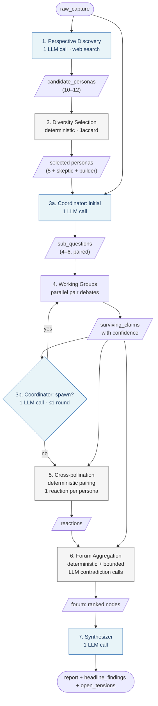
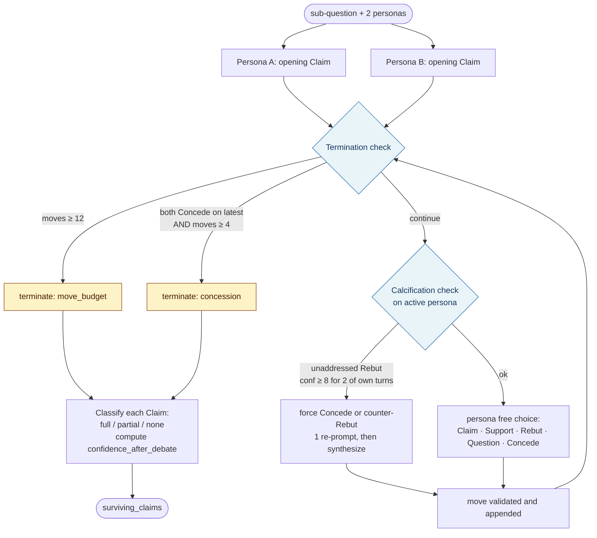
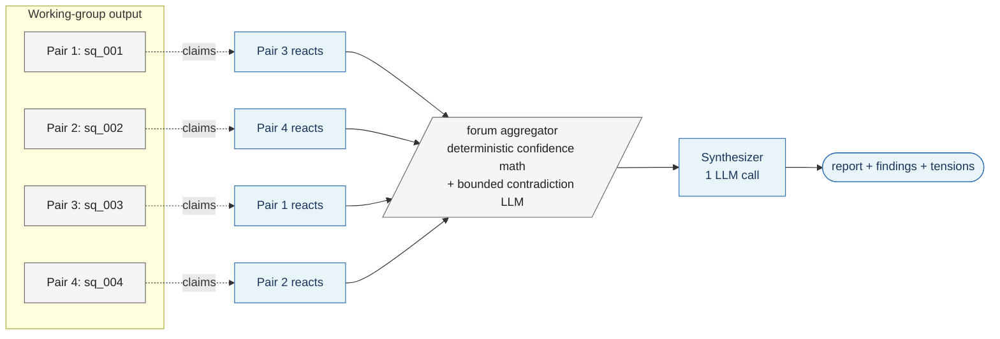

# msv — Architecture

> An in-process pipeline of seven stages that runs once per `msv run` and never resumes mid-flight. Each stage produces structured artifacts the next stage consumes; nothing mutates state once written.

This document captures the architectural shape of the prototype as committed to in `specs/prototype.md` v4. For the *why*, see `specs/vision.md`. For the full schema, system prompts, and gotchas, see `specs/prototype.md` §3, §7, and §8 respectively — this document deliberately avoids restating them.

---

## At a glance



Blue nodes are LLM-driven; grey are deterministic. The only loop is the optional coordinator spawn round (≤1 invocation, capped by the executor-call budget).

**The 30-second tour:** discovery surveys the web for real intellectual traditions and proposes 10–12 candidate personas → a deterministic selector picks the 5 most distinct, plus a fixed skeptic and builder → a coordinator decomposes the topic into 4–6 sub-questions and assigns each to a maximally tense pair → working groups debate in parallel using a five-move discourse protocol with verbalized confidence → surviving claims are cross-pollinated across pairs in a single constrained reaction round → a deterministic forum aggregator builds a flat ranked list of nodes with explicit contradictions → a synthesizer writes the opinionated report the user reads.

---

## Stages

### 1. Perspective Discovery (LLM, sequential)

Consumes `raw_capture`. Produces 10–12 `candidate_personas` and the `search_queries` used. One agent with web search runs 3–5 broad surveys and identifies the distinct intellectual *traditions* speaking about the topic — not abstract perspectives but communities of thought with identifiable methods. Over-sampling is the point: the selector will cut. The stage may legitimately return fewer than 10 candidates on narrow topics rather than inventing personas to hit a count.

### 2. Diversity-aware Selection (deterministic, sequential)

Consumes `candidate_personas`. Produces 5 `selected_persona_ids` plus two fixed personas (skeptic, builder). A greedy max-diversity algorithm scores all candidate pairs on tradition distance, stance distance, and Jaccard lexical distance over descriptions, then picks the candidate with the highest sum of distinctness to the already-selected set until 5 are chosen. No LLM — this is a small optimization over a known input set, and removing LLM variance here is desirable.

### 3. Coordinator (LLM, sequential, invoked up to twice)

Consumes `raw_capture`, the full persona roster, and (on the second invocation) the working-groups output. Produces `sub_questions` with assigned pairs. Round 0 decomposes the topic into 4–6 focused questions and pairs personas to maximize productive tension (using the §5.2 distinctness scores). Round 1 is adaptive: the coordinator reads the pair-debate transcripts and may spawn 1–2 additional sub-questions, but only with reference to a *specific* surfaced claim. Hard-stop at 80% of the executor budget.

### 4. Working Groups (LLM, parallel across pairs, sequential within each pair)

Consumes each sub-question and its assigned pair. Produces a sequence of `moves` and a list of `surviving_claims` with `confidence_after_debate`. Pair debates run in parallel via `Promise.all` over sub-questions — this is the only place the prototype uses concurrency. Within a pair, the two personas alternate moves under a five-move discourse protocol with mandatory `evidence_basis` before every confidence statement. Termination is via mutual concession (with a 4-move floor) or a `PAIR_MOVE_BUDGET` of 12 moves. The calcification validator runs before each turn. See the dedicated section below.

### 5. Cross-pollination Round (LLM, parallel-bounded)

Consumes all `surviving_claims` from all pairs. Produces `reactions` attached to claims. Each pair is matched to one other pair via a deterministic permutation maximizing inter-pair distinctness; no LLM call decides the pairing. Each persona in the reacting pair sees the claims it's reacting to and emits **one** move, constrained to Rebut, Question, or Concede — no new Claims or Supports. Total cost is bounded: exactly 2N reactions for N pairs, regardless of how many surviving claims each pair carries.

### 6. Forum Aggregation (deterministic + bounded LLM)

Consumes surviving claims and cross-pollination reactions. Produces a flat ranked list of `forum.nodes`. Most of the work is deterministic confidence arithmetic (see §5.6 of prototype.md for the exact deltas). The one LLM component is contradiction detection: for each pair of nodes whose claims originated in *different* working groups, one short LLM call asks "do these two claims contradict?" with cached results keyed by `(claim_id_a, claim_id_b)` sorted. Each node records at most one most-pointed contradiction link. The forum is shared state, not a deciding agent — it's a data structure the synthesizer reads.

### 7. Synthesizer (LLM, sequential)

Consumes `raw_capture`, the full forum, and the persona roster. Produces the user-facing `report` (800–1500 words), `headline_findings` (3–5 bullets), and `open_tensions` (max 3 bullets). The most carefully-prompted agent in the system: weight by confidence, do not average contradictions, treat `has_open_question: true` nodes as caveats rather than omissions, and take positions where the evidence warrants. Always invoked, even if budget overshot — abandoning the run without a report wastes everything already spent.

---

## Agent role inventory

| Role | Count per run | Decides? | Tool surface |
|---|---|---|---|
| Perspective Discovery | 1 | yes — what perspectives exist | web search |
| Diversity-aware Selector | 0 (deterministic) | no | — |
| Coordinator | 1–2 invocations | yes — decomposition, pairing, spawn | reads investigation state |
| Persona executor (pair debate) | 7 personas × ~6 moves each | no — executes role within protocol | web search, `emit_move` tool |
| Persona executor (cross-pollination) | each persona × 1 move | no | reads other pairs' claims, `emit_reaction` tool |
| Forum aggregator | 0 (deterministic + bounded contradiction LLM) | no | — |
| Synthesizer | 1 | yes — what survives, what contradicts | reads full forum |

The architecturally consequential agents are the ones that *decide* (discovery, coordinator, synthesizer). Persona executors are interchangeable in structure — they vary only in role description, not in the protocol they follow. All agents use `claude-sonnet-4-6`; model heterogeneity is a v0.2 lever.

---

## Working-group debate (pair debates)

This is the architecturally most interesting stage and the one most prone to failure modes. It earns its own section.



**Discourse moves.** Personas exchange one of five move types — Claim, Support, Rebut, Question, Concede — under a referential grammar that pins each move (except Claim) to a prior one via `references_move_id`. Every move carries mandatory `evidence_basis` and a 0–10 `confidence`. Concession status on each Claim at debate end determines whether it lives on as a surviving claim. See prototype.md §5.4 for the full move semantics and §10 for the glossary.

**Calcification + termination invariants.**

- A debate cannot terminate via mutual concession until at least 4 total moves have been emitted. The floor prevents vacuous early agreement.
- `PAIR_MOVE_BUDGET` is 12. The hard ceiling is the second termination condition.
- The calcification validator (`src/moves.js`) fires when a persona ignores a Rebut at `confidence ≥ 8` for two of its own turns. The next turn is constrained to Concede or counter-Rebut on that Rebut. One re-prompt is allowed; on second rejection, the orchestrator synthesizes a Concede with `confidence: 5` and an explanatory `evidence_basis`. The synthesized move counts toward `PAIR_MOVE_BUDGET`; re-prompts within a single turn do not.
- The validator only fires on Rebut. High-confidence Questions don't trigger calcification — a deferred extension.

**Parallel-pairs / sequential-within-pair.** All N pairs run in parallel via `Promise.all`. Inside any one pair, the conversation is strictly sequential — the two personas alternate, and each move is validated before being appended. Latency at this stage is dominated by the slowest pair, not the sum. Parallel pairs can hit per-minute token rate limits; the SDK handles 429s with backoff and on a low TPM tier the pairs effectively serialize. Acceptable for v0.1.

**Output forcing.** Personas emit moves via a forced tool-use call (`emit_move`) whose JSON Schema declares all required fields. Tool-use forced output guarantees structured responses — free-form JSON parsing is not in the hot path.

---

## Cross-pollination, forum, synthesizer



**Cross-pollination assignment is a permutation.** No pair reacts to itself; no pair is reacted to twice. The selection maximizes the sum of inter-pair distinctness (using the §5.2 scores) and is a lookup over pre-computed scores — no LLM call.

**Forum aggregation does the confidence arithmetic deterministically.** Cross-pollination Rebuts subtract from `aggregate_confidence` (more on strong Rebuts, less on weak ones), Concedes add, Questions flag `has_open_question` without changing confidence. The only LLM in this stage is the per-cross-group-node-pair contradiction call, results cached by sorted claim-id tuple.

**The synthesizer is the only deciding agent past the forum.** Its prompt repeats "do not average, do not equivocate" multiple times because over-averaging is the most consequential failure mode at this stage. Confidence is interpreted *relatively* (which claim ranks above which) rather than as an absolute probability — even noisy verbalized confidence preserves relative ordering reasonably well.

---

## Data on disk

Each idea lives in its own directory under `~/.msv/ideas/<id>/`:

```text
~/.msv/ideas/<id>/
├── index.json                      # structured, queryable schema (§3 of prototype.md)
└── logs/
    ├── discovery.jsonl
    ├── coordinator-initial.jsonl
    ├── coordinator-spawn.jsonl     # only if a spawn round happened
    ├── pair-<sq_id>.jsonl          # one per working group
    ├── cross-pollination.jsonl
    ├── forum-contradictions.jsonl  # LLM contradiction calls + cache hits
    ├── synthesizer.jsonl
    └── parse-errors.jsonl
```

**Two write disciplines.**

- `index.json` is rewritten atomically via tmp + rename within the idea directory after each stage. It holds the structured, `jq`-friendly state (50–200 KB). The forum aggregator and synthesizer read pair-debate moves as structured data directly from here.
- `logs/*.jsonl` are append-only via `fs.appendFile`, which is atomic for line-sized writes on Unix. Each pair writes to its own log file so parallel debates never contend. Each record is `{"ts": "ISO", "kind": "request|response|tool_use|tool_result|rejected_move|synthesized_move|cache_hit", "payload": {...}}`.

**Status state machine.** `pending` → `investigating` → `ready` → `archived`. A `[d]eeper` action archives the current idea and creates a new `pending` idea with `parent_id` set to the original. `investigating` is a real intermediate state — an idea stuck there is invisible to `msv review` and must be retried by hand-editing `status` back to `pending` and clearing `investigation.completed_at`. There is no resumability; the pipeline restarts from scratch.

**All artifacts append, nothing mutates.** Once a move is written, it's permanent. Cross-pollination attaches reactions to surviving claims but doesn't modify them. The forum aggregator builds a new structure rather than rewriting prior state. Partial transcripts on disk are for inspection, not continuation.

`fs.readdir('~/.msv/ideas/')` is the idea index. No separate index file across ideas.

---

## Source layout

```text
msv/
├── package.json
├── bin/
│   └── msv                       # shebang entry, dispatches to src/cli.js
├── src/
│   ├── cli.js                    # arg parsing + command dispatch
│   ├── commands/
│   │   ├── add.js
│   │   ├── run.js                # the multi-agent pipeline runner
│   │   └── review.js
│   ├── storage.js                # atomic JSON read/write in ~/.msv/ideas/
│   ├── anthropic.js              # messages endpoint wrapper, retries, tool-use loop
│   ├── agents/
│   │   ├── discovery.js
│   │   ├── coordinator.js
│   │   ├── persona.js            # generic — instantiated per persona role
│   │   ├── synthesizer.js
│   │   └── prompts.js            # all system prompts as exported strings
│   ├── diversity.js              # deterministic selector + pair-distinctness scoring
│   ├── forum.js                  # forum data structure + aggregation rules
│   ├── moves.js                  # discourse-move schema, parsers, calcification validator
│   └── render.js                 # review-mode card formatter
└── README.md
```

Two runtime dependencies: `@anthropic-ai/sdk` and `uuid`. Everything else is Node stdlib. No TypeScript, no bundler, no linter beyond editor-on-save.

---

## Architectural commitments worth knowing

The cross-cutting commitments that explain "why is X built this way":

- **All artifacts append, nothing mutates.** Once written, a move, a claim, a node, or a synthesis stays. This makes debugging tractable (you can `jq` your way through any point in the run's history) and rules out a class of state-corruption bugs in exchange for some disk growth.
- **One model for all agents (`claude-sonnet-4-6`).** Model heterogeneity is deliberately deferred. The hypothesis being tested is about *architectural* effects — diversity of personas, structure of debate, confidence-weighted aggregation — not about routing decisions across models.
- **No mid-run steering.** The user has exactly one steering surface — the topic pitch. Everything else is the agent society's call. Post-investigation, the user can `[d]eeper` into a refined topic; mid-investigation, there is no knob.
- **Single-process, no daemon, no scheduler.** `msv run` is a synchronous foreground command. The pipeline executes once per invocation and exits. No background worker, no cron, no resumability.
- **Confidence is verbalized with mandatory `evidence_basis`.** Each persona must articulate what its confidence rests on *before* committing to a number. This is a prompt-level approximation of the DMAD paper's RL-trained calibration (see prototype.md §11). Calibration noise is accepted; the answer-stability fallback is documented but not implemented.
- **Parallelism only at the working-groups level.** Pair debates run in parallel via `Promise.all`. Everything else — discovery, selection, coordinator, cross-pollination ordering, forum, synthesizer — is sequential. Concurrency is deliberately narrow because rate limits and debuggability both reward narrowness.
- **No resumability.** Re-running from scratch is the recovery path. To retry a failed run, hand-edit `index.json`: set `status` to `pending`, clear `investigation.completed_at`, then `msv run <id>`. Partial transcripts on disk are for inspection.
- **Tool-use forced output, not free-form JSON parsing.** Personas emit moves via forced tool calls (`emit_move`, `emit_reaction`) with JSON-Schema-declared required fields. Parse errors fall to `logs/parse-errors.jsonl` and the stage continues with what's available.
- **Deterministic where deterministic is enough.** Diversity selection, cross-pollination pairing, and most of forum aggregation are pure functions over the upstream artifacts. LLMs are reserved for stages where judgment is unavoidable (discovery, coordinator, persona moves, contradiction detection, synthesis).
- **The synthesizer is always called.** Even if the budget overshot, even if some pair failed, the run reaches the synthesizer. Abandoning a run without a report wastes everything already spent; the synthesizer's prompt is robust enough to acknowledge thin material when that's what it gets.

---

*See `specs/prototype.md` for the full schema (§3), system-prompt content (§7), gotchas (§8), and references (§11). This document is intentionally a high-level map, not a substitute for the spec.*
