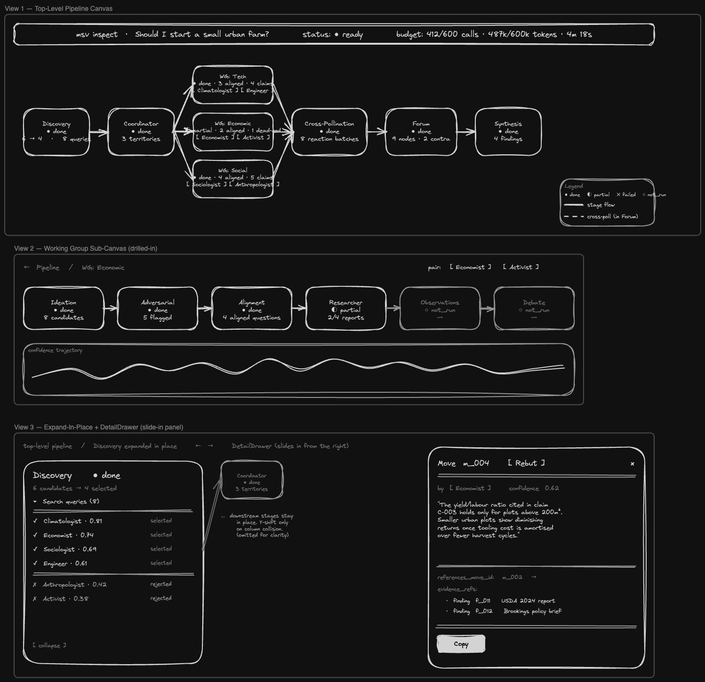

# `msv inspect` — Pipeline Inspector Graph

**Status:** Implemented (commit dc624aa)
**Author:** Eryk Napierała · 2026-05-17
**Related:** [`specs/feat-research-process-visualisation.md`](feat-research-process-visualisation.md) (the spec this one supersedes for the SPA layout, on top of the loader/view-builder it kept). [`specs/question-machine.md`](question-machine.md) (v5 pipeline stages). [`specs/feat-investigation-resumption.md`](feat-investigation-resumption.md) (partial-investigation rendering ties in).

---

## 1. Overview

`msv inspect <id>` today renders the investigation as a single long vertical scroll: `Header → Timeline → Discovery → Coordinator → Working Groups → Forum → Synthesis`. The scroll is faithful but flat — pipeline architecture is invisible at a glance, and digging into one stage means scrolling past everything else.

This spec replaces the scrolled SPA with a single-tab **pipeline inspector graph**: an interactive React Flow canvas that renders the pipeline architecture as a node graph and supports drill-down (expand-in-place for lightweight internal structure; drill-into-sub-canvas for content-heavy stages like Working Groups and Forum). Leaf content (a debate move, a finding, a contradiction verdict) opens in a side panel anchored to the graph.

The loader (`src/inspect/loader/`), view builder (`src/inspect/view/`), and `inspect-view.json` schema are unchanged. The SPA under `src/inspect-app/` is rewritten around a graph shell. The existing presentational components (`PersonaCard`, `MoveCard`, `ForumGraph`, `Markdown`, etc.) are reused as content renderers inside expanded nodes and the side panel. The CLI command remains `msv inspect <id>`.

This is a v1 — single tab, the graph itself. Future tabs (Personas, Territories, Working Groups focus mode, Provenance) are out of scope; the design leaves room for them but does not build them.

### Mockups

Three reference views, rendered as a wireframe on the Blueberry canvas. Source canvas JSON is checked in next to this spec for live editing.



- **View 1 — Top-level pipeline canvas.** Header strip; six stage boxes (Discovery, Coordinator, three fanned-out Working Groups, Cross-Pollination, Forum, Synthesis); status pips per box; legend of pip glyphs and edge styles.
- **View 2 — Working Group sub-canvas** (drilled-in, breadcrumb `Pipeline / WG: Economic`). Six sub-stages in horizontal flow with `not_run` sub-stages dimmed; pair chips top-right; confidence sparkline footer.
- **View 3 — Expand-in-place + DetailDrawer.** Discovery expanded inline showing selected vs. rejected personas; downstream stages shrunk and shifted right; right-side `DetailDrawer` with a `MoveCard` (persona, content, evidence refs, Copy / View-in-canvas actions).

Asset files:

- [`feat-pipeline-inspector-graph.mockup.png`](feat-pipeline-inspector-graph.mockup.png) — rendered wireframe.
- [`feat-pipeline-inspector-graph.mockup.json`](feat-pipeline-inspector-graph.mockup.json) — Blueberry canvas source (re-render with `blueberry canvas:draw <path>`).

---

## 2. Status

Draft.

---

## 3. Authors

Eryk Napierała · 2026-05-17.

---

## 4. Background / Problem Statement

The current SPA (`src/inspect-app/App.tsx`) renders eight sections stacked vertically, with an `AppShell.Navbar` of anchor links. Each section is independently good — `Discovery` lists candidate personas and selection scores, `WorkingGroupSection` uses an `Accordion` of territories with inner `Tabs` for the six sub-stages, `Forum` already renders a React Flow contradiction graph (`components/Forum/ForumGraph.tsx`). But the **architecture of the pipeline as a whole** is reduced to the order of section headers in a scroll.

Two concrete user pains motivate the rewrite:

**1. Orientation.** A new (or returning, weeks later) reader cannot answer "what is this pipeline doing?" without scrolling all sections. The shape — perspective discovery feeds the coordinator, the coordinator fans out into N parallel working groups, each working group runs six sub-stages internally, all working groups converge into the forum, the forum's surviving claims feed synthesis — is implicit in the section ordering, not visible. Anchor links in the side nav restate the labels but not the relationships.

**2. Focus.** When the reader is investigating a specific question — "why did the synthesizer drop persona X's claim?" — they have to scroll through Discovery and Coordinator (irrelevant) to reach the relevant Working Group. Mantine's `Accordion` collapses peers but the scroll-and-find pattern still dominates. The reader cannot start at the Forum, see which contradiction surfaced, click backward through provenance — they can only scroll and search.

The two audiences for the inspect view both feel both pains, with different emphasis:

- **Debugging the pipeline (you, iterating on prompts/code).** Wants forensic access — find a specific move, jump to the persona's prior moves, see the raw payload. Currently uses Ctrl-F. Often opens `index.json` in a JSON viewer in parallel.
- **Reading the investigation (you, treating the output as research).** Wants architecture-first reading — understand what happened at each stage in summary, drill into the parts that are interesting, skip the ones that aren't.

A graph-shaped UI serves both: the graph is the architecture (reading), nodes are drillable (debugging), the side panel surfaces raw content with copy/deep-link affordances (debugging). The current text scroll serves neither pain well.

### Why replace, not add a tab

The brainstorm explored a two-tab design (graph + text). Two reasons argue for replace over tab-coexistence:

1. **Bit-rot risk.** Two views of the same data drift. The graph view will get attention, the text view will stagnate. Either both stay current (cost) or one rots (worse than not having it).
2. **Cognitive cost.** Tabs imply meaningful choice. If the graph is genuinely better, the choice is a distraction; if it isn't, we shouldn't ship it.

The lean bet of this spec is that a well-designed inspector graph can replace the text scroll entirely. If, after building, specific forensic affordances are missing (search, copy-as-text, etc.), they get added to the graph rather than restoring the scroll. The deferred "future tabs" (Personas, Territories, Provenance) are entity-cross-cutting views, not duplicate stage scrolls.

---

## 5. Goals

* **Replace the vertical scroll with a single-tab pipeline graph** as the default and only top-level layout in v1. Existing presentational components (`PersonaCard`, `MoveCard`, `ConfidenceChart`, `Markdown`, etc.) are reused inside graph nodes and the side panel; the section wrappers (`Discovery.tsx`, `Coordinator.tsx`, `WorkingGroupSection.tsx`, `Forum.tsx`, `Synthesis.tsx`, `Timeline.tsx`) are removed or repurposed.
* **Make the pipeline architecture visible at first paint.** Stage boxes and the edges between them render on mount, before any interaction. A reader who has never seen msv before should be able to infer the shape (discovery → coordinator → fan-out to working groups → forum → synthesis) from the canvas alone.
* **Support two-level drill-down.**
    1. *Expand in place* — clicking a stage with lightweight internal structure (Discovery's candidates, Coordinator's territories, a Working Group's six sub-stages) reveals nested nodes within the same canvas.
    2. *Drill into sub-canvas* — clicking a stage with content-heavy structure (Forum's contradiction graph; a Working Group's per-sub-stage detail) replaces the active canvas with a sub-canvas; a breadcrumb at the top affords return.
* **Make leaf content readable in a side panel.** Clicking any leaf (a debate move, a finding, a contradiction verdict, a surviving claim) opens a `Drawer` from the right with the full content. The graph remains visible; the user can keep clicking to compare leaves.
* **Persist expand / drill / panel state in the URL hash** so deep links survive reload and can be shared in PR descriptions or chat. Extend the existing `parseRoute` enum (`src/inspect-app/hooks/useHashRoute.ts`).
* **Render partial investigations cleanly.** An investigation interrupted mid-stage-4 (see `feat-investigation-resumption.md`) renders the completed stages, the partial working group with its progress marker, and a clear "not run" state for the rest of the pipeline. No crashes on missing fields.
* **Reuse `@xyflow/react`.** The project already depends on it (Forum graph). No new graph library.
* **Keep the runtime dependency surface unchanged.** No new runtime packages. Mantine v9 + React Flow v12 + Recharts + react-markdown remain the full UI stack. Adding test-only dev dependencies (vitest + RTL + jsdom) is in scope — see §7 and §10.
* **Render v5 only.** v4 ideas show a one-line "v4 inspect view not supported in this build" empty state. The v4 fork in the previous SPA is deleted alongside the section wrappers.

---

## 6. Non-Goals

* **No second tab.** The graph is the only top-level view. No "text mode" fallback. (Future entity tabs — Personas, Territories, Provenance — explicitly deferred to a follow-up spec.)
* **No CLI changes.** `msv inspect <id>` still boots Vite, opens a browser, and serves the SPA from `node_modules`. No new flags. Loader and view builder are untouched.
* **No `inspect-view.json` schema changes.** Everything the graph renders is already in the view JSON. No new fields, no migrations.
* **No automatic graph layout library.** No `dagre`, no `elkjs`. Layout is hand-written per scope, following the precedent in `components/Forum/forumLayout.ts`. The pipeline is small and fixed; algorithmic layout would be more code than the manual one.
* **No multi-investigation comparison.** One id per invocation, same as today.
* **No replay / animation.** The graph renders the final state. No "play through the pipeline" timeline scrubber.
* **No editing.** Read-only. Same constraint as today.
* **No production build path.** Vite dev server only. Same constraint as the current SPA (`feat-research-process-visualisation.md` §6).
* **No provenance back-links from synthesis to surviving claims in v1.** The synthesis text renders as Markdown in a side panel; jumping back to claims is a future Provenance tab. Same posture as the prior spec (§6 last bullet).
* **No persona-as-protagonist filter / swimlane.** Brainstorm-discarded; revisit if a Personas tab is built.
* **No dark mode, no responsive mobile layout.** Inherited constraint.
* **No new state-management library.** React context + URL hash. Same constraint.
* **No live data reload.** Re-run `msv inspect <id>` to pick up changes. Same constraint.
* **No TypeScript outside `src/inspect-app/`.** Same constraint.
* **No removal of `@xyflow/react`'s existing usage in Forum.** Forum's contradiction graph remains and is reachable as the drill-into-sub-canvas of the Forum stage; its `ForumGraph` component is reused.
* **No v4 schema rendering.** v4 ideas land on a one-line empty state; the loader and view-builder still produce v4 view JSON (fixtures stay green for non-SPA tests).
* **No top-level MiniMap.** The pipeline graph is small enough that a minimap is noise. MiniMap remains inside `ForumCanvas` (carried over from the existing `ForumGraph`).
* **No "view in canvas" jump-and-flash affordance** in the drawer. Closing the drawer returns focus to the graph; explicit highlight animation is out of scope.

---

## 7. Technical Dependencies

### Existing (unchanged)

| Package | Version | Role in this spec |
|---|---|---|
| `@xyflow/react` | `^12.10.2` | Pipeline canvas, sub-canvases, custom node types per stage. |
| `@mantine/core`, `@mantine/hooks` | `^9.2.1` | `AppShell`, `Drawer`, `Breadcrumbs`, `Badge`, `Tabs` (inside expanded WG), `ScrollArea`. |
| `@emotion/react` | `^11.14.0` | App-level `css` prop for graph node styling. |
| `react`, `react-dom` | `^19.2.6` | UI runtime. |
| `recharts` | `^3.8.1` | Confidence sparklines inside expanded WG nodes (reused from existing `ConfidenceChart`). |
| `react-markdown`, `rehype-sanitize` | `^10.1.0` / `^6.0.0` | Synthesis report in side panel. |
| `vite`, `@vitejs/plugin-react` | `^8` / `^6` | Dev server (unchanged). |
| `typescript` | `^6.0.3` | Type checker for `src/inspect-app/`. |

### New (runtime)

None. This is a UI rewrite over existing runtime dependencies.

### New (test-only dev dependencies)

| Package | Version | Purpose |
|---|---|---|
| `vitest` | `^2` | Test runner for the SPA (Vite-native; co-resident with the existing Vite dev server). The CLI keeps `node --test`. |
| `@testing-library/react` | `^16` | Component rendering + interaction queries for the new graph shell. |
| `@testing-library/user-event` | `^14` | Keyboard + click simulation in component tests. |
| `jsdom` | `^25` | DOM environment for vitest in `src/inspect-app/**`. |
| `@vitest/coverage-v8` | `^2` | Optional — coverage reporting if/when wanted. |

Added under `devDependencies` only. Bundled SPA size and CLI runtime are unaffected. Vitest's config lives under `src/inspect-app/` so the project root continues to delegate `npm test` to `node --test` for the CLI; a separate script (`npm run test:app`) invokes vitest.

### React Flow features used

* `<ReactFlow nodes={…} edges={…} nodeTypes={…} fitView />` — same surface as the current `ForumGraph`.
* `useNodesState` / `useEdgesState` only for the *active* canvas; transitions between top-level and sub-canvas swap node/edge arrays.
* Custom `nodeTypes` per pipeline stage (`DiscoveryNode`, `CoordinatorNode`, `WorkingGroupNode`, `CrossPollinationNode`, `ForumNode`, `SynthesisNode`).
* `<Background>`, `<Controls>` on the top-level canvas. `<MiniMap>` is **not** used at the top level (see §6); it remains inside `ForumCanvas`.
* `panOnDrag`, `zoomOnScroll`, `nodesDraggable={false}` — read-only positioning; layout is deterministic.

Reference: [React Flow v12 docs](https://reactflow.dev/api-reference) (already linked from `feat-research-process-visualisation.md` §7).

---

## 8. Detailed Design

### 8.1 High-level UX

The SPA loads, the loader fetches `inspect-view.json` (unchanged path), and the user lands on the **top-level pipeline canvas**:

```
┌────────────────────────────────────────────────────────────────────────────┐
│  msv inspect  ·  <idea preview>                          status: ready     │
│  budget: 412/600 calls · 487k/600k tokens · 4m 18s                          │
└────────────────────────────────────────────────────────────────────────────┘
┌────────────────────────────────────────────────────────────────────────────┐
│                                                                             │
│   ┌──────────┐    ┌──────────────┐    ┌──────────────┐                      │
│   │Discovery │───▶│ Coordinator  │───▶│   WG: Tech   │──┐                   │
│   │  6 → 4   │    │ 3 territories│    │ 3 questions  │  │                   │
│   └──────────┘    └──────────────┘    └──────────────┘  │  ┌─────────┐      │
│                            │          ┌──────────────┐  ├─▶│  Forum  │──▶ Synthesis
│                            ├─────────▶│ WG: Economic │──┤  │ 9 nodes │      │
│                            │          │ 4 questions  │  │  │ 2 contra│      │
│                            │          └──────────────┘  │  └─────────┘      │
│                            │          ┌──────────────┐  │                   │
│                            └─────────▶│ WG: Social   │──┘                   │
│                                       │ 3 questions  │                      │
│                                       └──────────────┘                      │
│                                                                             │
└────────────────────────────────────────────────────────────────────────────┘
```

The header strip is a sticky Mantine `Group` outside the React Flow canvas, carrying the same `Header` component primitives that exist today (`StatusPill`, `BudgetBar`, parent-id link). The graph is everything else.

Every stage box shows:
* Stage name (top line).
* One-line summary derived from view data (e.g., "6 → 4" = candidate personas → selected; "3 territories"; "9 nodes / 2 contradictions").
* Stage status pip: `done` (green), `partial` (amber), `failed` (red), `not_run` (grey). Pulled from `view.stages[].status`.

#### Interaction model

* **Click a stage box.** If the stage has expand-in-place content, the box grows in place and reveals its internal structure (nested nodes). Otherwise, the canvas transitions to a drill-into sub-canvas (e.g., Forum's contradiction graph). The choice is per-stage and fixed (see §8.3).
* **Click an expanded leaf** (e.g., a persona inside the expanded Discovery box, a candidate question inside expanded WG → Ideation). The side `Drawer` opens with the leaf's full content. Graph stays visible.
* **Click the canvas background.** Closes the side drawer. Does not collapse expanded stages (collapse is via explicit re-click on the stage header or a "collapse" affordance inside).
* **Breadcrumb.** When drilled into a sub-canvas, a `Breadcrumbs` row above the canvas shows `Pipeline > Forum` or `Pipeline > Working Group: Economic`. Click `Pipeline` to return.
* **Keyboard.** `Esc` closes the drawer. Collapsing an expanded stage and returning from a sub-canvas are done via the explicit affordances (the in-stage `[collapse]` link and the breadcrumb).

#### State persisted to URL hash

All interaction state is reflected in `window.location.hash` so reloads and shared links restore the view exactly. Format:

```
#pipeline                                  (default top-level)
#pipeline/expand=discovery                 (Discovery expanded in place)
#pipeline/expand=discovery,wg:tech         (two stages expanded)
#pipeline/leaf=persona:p_oncologist        (top-level + side panel)
#wg:tech                                   (drilled into Working Group "tech")
#wg:tech/substage=researcher               (drilled into WG, sub-stage focused)
#wg:tech/leaf=move:m_004                   (drilled in + side panel)
#forum                                     (drilled into Forum contradiction graph)
#forum/leaf=node:n_007                     (drilled in + side panel)
```

(Implementation: an additive parser on top of the existing `parseRoute`; see §8.5.)

### 8.2 Component architecture

```
src/inspect-app/
├── App.tsx                          ← rewritten: shell + InspectorGraph
├── main.tsx                         ← unchanged
├── ViewContext.tsx                  ← unchanged
├── ErrorBoundary.tsx                ← unchanged
├── hooks/
│   ├── useView.ts                   ← unchanged
│   ├── useHashRoute.ts              ← extended: new ParsedRoute kinds
│   ├── usePersonaName.ts            ← unchanged
│   └── useExpandedStages.ts         ← new: derives expand set from hash
├── theme/
│   ├── tokens.ts                    ← extended: graph node tokens
│   └── personas.ts                  ← unchanged
├── primitives/                      ← unchanged (PersonaChip, Card, Section, Empty)
├── utils/                           ← unchanged
├── inspector/
│   ├── InspectorGraph.tsx           ← new: top-level shell, swaps canvases
│   ├── TopLevelCanvas.tsx           ← new: pipeline DAG
│   ├── DetailDrawer.tsx             ← new: side panel
│   ├── StageStatusPip.tsx           ← new: small status indicator
│   ├── canvases/
│   │   ├── WorkingGroupCanvas.tsx   ← new: WG sub-canvas (six sub-stages laid out)
│   │   └── ForumCanvas.tsx          ← new: wraps existing ForumGraph as sub-canvas
│   ├── nodes/
│   │   ├── DiscoveryNode.tsx        ← new: collapsed + expand-in-place renderer
│   │   ├── CoordinatorNode.tsx      ← new
│   │   ├── WorkingGroupNode.tsx     ← new
│   │   ├── CrossPollinationNode.tsx ← new
│   │   ├── ForumStageNode.tsx       ← new (the top-level box for Forum; not ForumNode which already exists for contradiction graph)
│   │   └── SynthesisNode.tsx        ← new
│   ├── layout/
│   │   ├── pipelineLayout.ts        ← new: deterministic positions for top-level
│   │   ├── workingGroupLayout.ts    ← new: six sub-stages laid out in WG sub-canvas
│   │   └── expand.ts                ← new: shifts neighbours when a stage expands
│   └── leafRenderers.tsx            ← new: dispatch (leaf kind → side-panel content)
└── components/                      ← existing presentational pieces, retained
    ├── Discovery/PersonaCard.tsx    ← reused inside expanded DiscoveryNode
    ├── Coordinator/SubQuestionCard.tsx ← reused inside expanded CoordinatorNode
    ├── WorkingGroup/*               ← Panels reused inside WG sub-canvas
    ├── Debate/MoveCard.tsx          ← reused inside drawer
    ├── Debate/ConfidenceChart.tsx   ← reused inside expanded WG node
    ├── Forum/ForumGraph.tsx         ← reused inside ForumCanvas
    ├── Forum/NodeDrawer.tsx         ← reused or absorbed into DetailDrawer
    └── Synthesis/Markdown.tsx       ← reused inside drawer
```

**Deleted** (or stubbed pending future tabs):

* `App.tsx` is rewritten — old `Navbar`, anchor-link nav, section stack are gone.
* `components/Timeline/*` — the pipeline graph subsumes the timeline. Stage status pips replace `StageChip`. The `Timeline.tsx` and `StageChip.tsx` files are deleted (their data still flows: `view.stages` feeds `StageStatusPip`).
* `components/Discovery/Discovery.tsx`, `components/Coordinator/Coordinator.tsx`, `components/WorkingGroup/WorkingGroupSection.tsx`, `components/Forum/Forum.tsx`, `components/Synthesis/Synthesis.tsx` — the section-level wrappers that compose anchor sections are deleted. Their children (cards, panels, graph) are kept and reused.
* `components/Debate/DebateSection.tsx` (v4 view) — **deleted**, per the v5-only commitment in §8.7.

### 8.3 Per-stage node design

Each stage node has a **collapsed** rendering and an **expanded** rendering. The expand-vs-drill choice is fixed per stage.

| Stage | Top-level interaction | Sub-canvas? |
|---|---|---|
| Discovery | Expand in place | No |
| Coordinator | Expand in place | No |
| Working Group (each) | Drill into sub-canvas | Yes (`WorkingGroupCanvas`) |
| Cross-Pollination | Expand in place | No |
| Forum | Drill into sub-canvas | Yes (`ForumCanvas` wrapping `ForumGraph`) |
| Synthesis | Open side panel (no expand) | No |

The split is driven by content volume. Discovery, Coordinator, Cross-Pollination are list-shaped and a 200–400px expanded card carries them well. Working Groups and Forum carry graph-shaped content that earns its own sub-canvas.

#### 8.3.1 DiscoveryNode

**Collapsed:** title `Discovery`, status pip, summary `{N} candidates → {M} selected`, search-query count badge.

**Expanded:** vertical list of candidate persona cards (reuse `PersonaCard`), badged `selected` or `rejected` with distinctness score. Search-query list collapsible underneath. Click a persona card → leaf `persona:<id>` opens drawer.

```
┌─Discovery─────────────────────────────┐
│ ●done  6 candidates → 4 selected      │
│                                        │
│ Search queries (8) ▾                  │
│                                        │
│ ✓ Climatologist · 0.81  ──── selected │
│ ✓ Economist · 0.74    ──── selected   │
│ ✓ Sociologist · 0.69  ──── selected   │
│ ✓ Engineer · 0.61     ──── selected   │
│ ✗ Anthropologist · 0.42 ── rejected   │
│ ✗ Activist · 0.38   ───── rejected    │
│                                        │
│  [collapse]                            │
└────────────────────────────────────────┘
```

Layout when expanded: the node grows vertically; neighbouring nodes (Coordinator) shift right by the expansion delta via `expand.ts`. Edges are recomputed.

#### 8.3.2 CoordinatorNode

**Collapsed:** title `Coordinator`, status pip, `{N} territories`, decision timestamp.

**Expanded:** vertical list of `SubQuestionCard` (already exists, renders territory name + description + assigned pair + distinctness score). Click a territory card → drill into the corresponding `WorkingGroupCanvas`.

#### 8.3.3 WorkingGroupNode

**Collapsed:** title `WG: <territory.name>`, status pip, `{N} aligned questions`, `{M} surviving claims`, `{K} dead ends` (orange badge if `K > 0`), persona pair chips at the bottom.

**Top-level interaction:** click drills into `WorkingGroupCanvas` (a sub-canvas), not expand-in-place. Reasoning: the WG carries six sub-stages × per-persona content × researcher tool calls — too dense for inline expansion at the top level.

#### 8.3.4 CrossPollinationNode

**Collapsed:** title `Cross-Pollination`, status pip, `{N} reaction batches`.

**Expanded:** a small table — for each surviving claim that received reactions, show the claim summary + reaction counts (Rebut/Concede/Question/Support) coloured by reaction type. Click a row → leaf `claim:<id>` opens drawer with full reactions.

#### 8.3.5 ForumStageNode

**Collapsed:** title `Forum`, status pip, `{N} nodes`, `{M} contradictions` (red badge if `M > 0`), `{K} open questions` (yellow badge).

**Top-level interaction:** click drills into `ForumCanvas`, which wraps the existing `ForumGraph` component (`src/inspect-app/components/Forum/ForumGraph.tsx`) unchanged. `ForumGraph`'s `onNodeSelect` is wired to set `leaf=node:<id>` in the hash, opening the drawer.

#### 8.3.6 SynthesisNode

**Collapsed:** title `Synthesis`, status pip, `{N} headline findings`, `{M} open tensions`.

**Click:** opens the side drawer directly with the synthesis report (Markdown), headline findings list, question landscape (v5), and dead-end summary (v5). No expand-in-place state, no sub-canvas — the synthesis is one readable artefact, not a structured graph.

### 8.4 Sub-canvases

#### 8.4.1 WorkingGroupCanvas

A drilled-into canvas for one territory. The canvas shows the six sub-stages as horizontally laid-out nodes:

```
┌──Pipeline > WG: Economic────────────────────────────────────────────────────┐
│   ┌──────────┐  ┌──────────────┐  ┌─────────┐  ┌──────────┐  ┌────────────┐ ┌────────┐
│   │ Ideation │─▶│ Adversarial  │─▶│Alignment│─▶│Researcher│─▶│Observations│▶│ Debate │
│   │ 8 cand.  │  │ 5 flagged    │  │ 4 chosen│  │ 4 reports│  │ 8 obs.     │ │ 12 mv. │
│   └──────────┘  └──────────────┘  └─────────┘  └──────────┘  └────────────┘ └────────┘
│        │             │                │             │              │            │
│        ▼ click       ▼                ▼             ▼              ▼            ▼
│     drawer        drawer          drawer        drawer         drawer       drawer
│                                                                                       │
│   ┌──── confidence sparkline (full width below the row) ────────────────────────────┐
│   └──────────────────────────────────────────────────────────────────────────────────┘
└──────────────────────────────────────────────────────────────────────────────────────┘
```

Each sub-stage node renders a count summary collapsed. Clicking a sub-stage opens its **panel content** (reuse `IdeationPanel`, `AdversarialPanel`, `AlignmentPanel`, `ResearcherPanel`, `ObservationPanel`, `DebatePanel`) inside the drawer.

The persona pair chips and `ConfidenceChart` render outside the React Flow canvas, in a small footer row, since they're per-WG context not per-sub-stage detail.

#### 8.4.2 ForumCanvas

A drilled-into canvas for the forum. Reuses `ForumGraph` essentially as-is. The toggle for intra-cluster references stays. The selected-node drawer is unified with the global `DetailDrawer`.

If `schema_version === 'v5'` and `forum.dead_end_questions.length > 0`, a sidebar lists dead-end questions; clicking one opens it in the drawer.

### 8.5 URL hash routing

`hooks/useHashRoute.ts` is extended. The current `parseRoute` returns one of `stage | debate | move | node | persona | none`. The new model is a structured path:

```ts
type CanvasRoute =
  | { canvas: 'pipeline'; expanded: ExpandedStage[]; leaf?: LeafRef }
  | { canvas: 'wg'; territoryId: string; substage?: WorkingGroupSubstage; leaf?: LeafRef }
  | { canvas: 'forum'; leaf?: LeafRef };

type ExpandedStage = 'discovery' | 'coordinator' | 'cross_pollination';
type WorkingGroupSubstage = 'ideation' | 'adversarial' | 'alignment' | 'researcher' | 'observation' | 'debate';
type LeafRef =
  | { kind: 'persona'; id: string }
  | { kind: 'territory'; id: string }
  | { kind: 'candidate'; id: string }
  | { kind: 'aligned'; id: string }
  | { kind: 'report'; id: string }
  | { kind: 'observation'; id: string }
  | { kind: 'move'; id: string }
  | { kind: 'claim'; id: string }
  | { kind: 'node'; id: string }
  | { kind: 'synthesis' };

function parseCanvasRoute(hash: string): CanvasRoute { /* … */ }
function formatCanvasRoute(route: CanvasRoute): string { /* … */ }
```

`App.tsx` reads the canvas from the hash on mount and on every `hashchange`. The active canvas is rendered conditionally:

```tsx
function InspectorGraph() {
  const { route } = useCanvasRoute();
  return (
    <Stack>
      <Header />
      <Breadcrumbs route={route} />
      {route.canvas === 'pipeline' && <TopLevelCanvas route={route} />}
      {route.canvas === 'wg' && <WorkingGroupCanvas route={route} />}
      {route.canvas === 'forum' && <ForumCanvas route={route} />}
      <DetailDrawer leaf={route.leaf} />
    </Stack>
  );
}
```

The old `parseRoute` enum and the anchor-scroll behaviour (`utils/anchorScroll.ts`) are removed — the new routing replaces them. `useAnchorScroll` had a sole job of scrolling to anchor links from `Navbar`; with the graph there is nothing to scroll to.

### 8.6 Side panel (`DetailDrawer`)

A Mantine `<Drawer>` positioned `right`, width `~520px`, `overlayProps={{ backgroundOpacity: 0 }}` so it slides in beside the graph without dimming. The drawer's title and body depend on `leaf.kind`:

| `leaf.kind` | Title | Body |
|---|---|---|
| `persona` | Persona name + tradition | `PersonaCard` with full description |
| `territory` | Territory name | `SubQuestionCard` (full) + link to drill-into WG canvas |
| `candidate` | Candidate question | text + by-persona chip + predicted confidence + rationale |
| `aligned` | Aligned question | text + origin + source-candidate links |
| `report` | Researcher report | `ResearcherPanel`-style finding list, search trace, outcome badge |
| `observation` | Observation | text + cited-finding links (click → switch leaf) |
| `move` | Move type + persona | `MoveCard` (already exists) — includes `references_move_id` link |
| `claim` | Surviving claim | content + confidence-after-debate + reactions list |
| `node` | Forum node | claim + contradictions (with verdict reason) + open-question flag |
| `synthesis` | Synthesis | report Markdown + headline findings + question landscape + dead-end summary (v5) |

Cross-leaf links (e.g., observation → finding it cited) update `leaf` in the hash; the drawer rerenders. Browser back/forward navigate through leaves.

The drawer has a copy button for raw content (debug affordance) and a close button. Returning to the graph is the natural close path — there is no explicit "view in canvas" jump animation.

### 8.7 v4 schema: empty state only

`view.schema_version` is `'v4' | 'v5'`. The new SPA renders v5 only. v4 ideas land on a centred empty-state component:

```
┌──────────────────────────────────────────────────────────┐
│                                                          │
│     This inspect view supports v5 investigations only.   │
│     The loaded idea (<id>) was produced by the v4        │
│     pipeline. Re-run with the current pipeline to        │
│     regenerate it.                                       │
│                                                          │
└──────────────────────────────────────────────────────────┘
```

Implementation: a single `<V4EmptyState />` returned from the top-level shell when `view.schema_version === 'v4'`. No `DebateCanvas`, no v4 fork in `pipelineLayout.ts`. `DebateSection.tsx` and `Timeline.tsx` are deleted. `MoveCard.tsx` and `ConfidenceChart.tsx` are retained — they are reused by the v5 WG sub-canvas drawer.

The loader and view-builder continue to produce v4 view JSON; existing CLI-side fixtures (`test/fixtures/inspect/ready`, `degraded-discovery`) keep their non-SPA assertions passing. Only the SPA rendering path is v5-only.

### 8.8 Investigation-resumption integration

`feat-investigation-resumption.md` adds sub-stage checkpoints inside stage 4 and a typed `last_failure` record. The inspector reflects partial state:

* `view.stages[i].status === 'partial'` renders the stage pip in amber.
* For a partially-completed working group, the `WorkingGroupNode` summary shows `2/4 questions complete` (or similar derived from `aligned_questions.length` vs. expected); inside the WG sub-canvas, sub-stages with no data render as grey "not_run" boxes.
* The header strip shows `last_failure` when present: a small red banner `"interrupted: anthropic_unavailable at WG: Economic / researcher · 2026-05-16 17:42"`. Banner has a "next: resume with msv run <id>" hint.
* If the view JSON is missing entire stages (e.g., synthesis never ran), those nodes still render with `status: 'not_run'` — no crashes.

The inspector itself is read-only; it does not trigger resume. Banner is informational.

### 8.9 Layout algorithms

Hand-written, in `inspector/layout/`. Two functions:

**`pipelineLayout.ts`** — given the view, returns `Node[]` with positions for the top-level canvas. Steps:

1. Place fixed-position stages on a horizontal flow with stable x-coordinates: Discovery (col 0), Coordinator (col 1), Cross-Pollination (col 3), Forum (col 4), Synthesis (col 5).
2. Working groups fan out in column 2 — vertically stacked in coordinator order for determinism.
3. Edges: Discovery→Coordinator, Coordinator→each WG, each WG→Cross-Pollination, Cross-Pollination→Forum, Forum→Synthesis.
4. **Expansion grows boxes vertically only.** When a stage is in the `expanded` set, its height increases by the expanded-content height (computed from data: candidate count × persona-card height; territory count × territory-card height; etc.). Other stages stay at their original positions. **Collision rule:** if an expanded stage's bottom edge crosses another stage's top edge (vertically overlapping in the same column), shift the lower stage down by the overlap delta; downstream columns are unaffected because expansion does not change x-positions.

**`workingGroupLayout.ts`** — given a `WorkingGroupView`, returns positions for the six sub-stage nodes in a single horizontal row, edges connecting them sequentially.

For Forum, no new layout — `forumLayout.ts` already exists (`components/Forum/forumLayout.ts`, `layoutRing`).

### 8.10 Edges

* **Solid edges:** stage-to-stage flow on the top-level canvas; sub-stage-to-sub-stage in the WG canvas.
* **Dashed edges (existing convention from `ForumGraph`):** cross-pollination reactions.
* **Red solid:** contradictions in `ForumCanvas`.
* Edge styling reuses `theme/tokens.ts` `edgeColors`.

### 8.11 Performance considerations

The current SPA renders every section on mount. The graph renders only the active canvas and the side drawer's current leaf — strictly less mount-time work. React Flow virtualises off-viewport nodes by default. The expand-in-place pattern adds DOM only when triggered.

Largest concrete fixture today (the `~722b7e3c…` reference investigation) has ~70 moves and 12 forum nodes. None of that renders until the user drills into a WG sub-stage or the Forum canvas. First paint of the top-level pipeline is on the order of 6–9 nodes and the same number of edges.

### 8.12 Accessibility

* Keyboard: `Tab` cycles through stage nodes (React Flow node `tabIndex={0}`); `Enter` activates (expand or drill); `Esc` collapses/closes. The drawer is a Mantine `Drawer` which has built-in focus trap.
* Each stage node has `role="button"` and `aria-expanded` reflecting expand state.
* Edge labels carry `aria-label` (e.g., "Discovery feeds Coordinator").
* High-contrast colour for status pips; pip uses both colour and shape (●/◐/✕/○) so colour-blindness doesn't lose information.

These are improvements over the current scroll, which has no keyboard navigation between sections beyond Tab through anchor links.

---

## 9. User Experience

Three illustrative journeys:

### 9.1 "What is this pipeline doing?" (first-time reader)

1. Run `msv inspect 8db8e9bf-…`. Browser opens to `#pipeline`.
2. Sees six labelled stage boxes on a horizontal flow with fan-out at the middle, edges showing convergence into Forum, then Synthesis.
3. Eyes scan box summaries: `6 → 4` (Discovery), `3 territories` (Coordinator), three WGs each labelled, `9 nodes / 2 contradictions` (Forum), `4 findings` (Synthesis).
4. Total time to absorb shape: ~10 seconds.

### 9.2 "Why did the synthesizer drop persona X's claim?" (debugging)

1. Sees Synthesis box. Clicks it. Drawer opens with the report.
2. Reads "we found no consistent evidence on X." Wants to know what claims persona X actually made.
3. Clicks the WG containing persona X. Drills into `WorkingGroupCanvas`.
4. Clicks the `Debate` sub-stage. Drawer shows debate moves, scrolls to persona X's claims.
5. Sees one claim was Concede'd in cross-pollination. Clicks the move's `references_claim_id` link. Drawer switches to the claim, shows the Concede reactions.
6. Hits browser back to return to the debate. Closes drawer. Navigates back to Pipeline.

Total clicks: ~6. Currently this requires scrolling through Discovery, Coordinator, all WGs, Forum, Synthesis to find each piece.

### 9.3 "Investigation was interrupted — what got done?" (resumption)

1. Runs `msv inspect` on an idea in `investigating` state with `last_failure.reason = 'anthropic_unavailable'`.
2. Top banner shows the failure context in red.
3. Pipeline canvas shows three stages green, one stage amber (the WG that was in flight), two stages grey ("not run").
4. Clicks the amber WG. Drills in. Three sub-stages green, one amber (`researcher`), two grey.
5. Clicks the amber `researcher` sub-stage. Drawer shows the partial reports that did complete before the failure.
6. Closes everything. Knows exactly where to resume.

---

## 10. Testing Strategy

The existing inspector test surface is thin — fixtures under `test/fixtures/inspect/` and snapshot-style assertions on derived view data. The graph rewrite expands the test surface in three layers.

### 10.1 Unit tests (Vitest is not installed; `node --test` is the runner — see `package.json` `"test": "node --test"`)

* **`pipelineLayout.ts`** — for each fixture (`ready`, `degraded-discovery`, `ready-v5`, `investigating`), assert the produced `Node[]` includes exactly the expected stage keys for that fixture's `schema_version` and stage completion state. Why: catches regressions where adding a stage breaks layout for older fixtures.
* **`expand.ts`** — given a hypothetical stage-height-delta, assert downstream nodes shift on the y-axis only if collision is detected, and that the delta is exactly applied. Why: layout regressions are subtle; a numeric assertion catches them faster than visual inspection.
* **`useHashRoute.parseCanvasRoute`** — round-trip tests: for each of the route shapes in §8.5, assert `format(parse(s)) === s`. Why: URL stability matters for deep links and the format is bespoke.
* **`useExpandedStages`** — given a hash, return the set of expanded stage ids; given a `setExpanded`, update hash idempotently. Why: prevents double-fire / lost-state bugs that bit the original `useAnchorScroll`.

### 10.2 Component tests (vitest + React Testing Library + jsdom)

The graph rewrite adds behavioural surface (click → hash, hash → canvas, drill, drawer dispatch) that pure-function tests cannot cover. This spec adds component test tooling — `vitest`, `@testing-library/react`, `@testing-library/user-event`, `jsdom` — under `devDependencies`. See §7 for versions. Vitest config lives under `src/inspect-app/`; the CLI keeps `node --test`.

* **`<TopLevelCanvas>`** — renders 6 nodes for a v5 fixture; clicking a `WorkingGroupNode` updates the hash to `#wg:<id>`; clicking Discovery sets expanded state in hash. Why: highest-traffic interaction; locks the click→hash contract.
* **`<DetailDrawer>`** — given `leaf = { kind: 'move', id: 'm_004' }`, renders `MoveCard` with the right move's content; `Esc` closes the drawer. Why: validates the dispatch table in `leafRenderers.tsx` and the keyboard contract.
* **`<WorkingGroupCanvas>`** — renders six sub-stage nodes; clicking each opens the drawer with the right panel; the confidence sparkline renders. Why: validates sub-canvas reuses existing panel components correctly.
* **Partial-investigation render** — given the `investigating` fixture (created by `feat-investigation-resumption.md` Phase 1 tests), assert: amber pip on the in-flight stage; grey "not_run" on later stages; banner with `last_failure` text. Why: regression check on the resumption integration.
* **v4 empty state** — given the `ready` v4 fixture, assert the `<V4EmptyState />` renders and no React Flow canvas mounts. Why: locks the v5-only commitment.
* **Expansion collision rule** — render `<TopLevelCanvas>` with two adjacent stages expanded; assert the lower stage shifts down by exactly the overlap delta. Why: prevents the layout regression flagged in spec validation.

### 10.3 Snapshot / fixture tests

The view-builder fixtures (`test/fixtures/inspect/*/inspect-view.json`) are unchanged. Snapshot the **rendered output** of `<TopLevelCanvas>` (count of nodes, edge sources/targets, status pips) against a small assertion table per fixture. Why: lightweight regression for the layout + node-type-selection logic.

### 10.4 Manual / visual

Visual layout is hard to assert programmatically. A short manual checklist in the PR description:

- [ ] Pipeline canvas legible in a 1280×800 viewport without horizontal scroll.
- [ ] Each stage's expand-in-place doesn't push downstream off-screen.
- [ ] Drawer + canvas remain readable side-by-side (~520px drawer + remainder).
- [ ] Browser back/forward navigates leaf history.
- [ ] Hash deep-link to `#wg:<id>/leaf=move:<id>` opens to the right canvas with drawer open.
- [ ] v4 fixture renders the `<V4EmptyState />` (no graph mounts, no React Flow errors in console).

### 10.5 What we are not testing

* No screenshot diffing (Playwright et al.) — not justified at this prototype stage.
* No tests of `@xyflow/react` internals — trust the library.
* No tests on the React Flow MiniMap / Controls — vendor-provided.

---

## 11. Performance Considerations

* **First paint:** ~6–9 nodes top-level. Negligible.
* **Expand in place:** Adds at most O(personas) or O(territories) DOM nodes — single-digit to low-double-digit cards. Acceptable.
* **Sub-canvas swap:** Tears down React Flow and rebuilds it. The 12-node Forum and the 6-node WG sub-canvases are well within React Flow's "feels instant" range.
* **Drawer content:** Renders one leaf at a time. The largest is the synthesis report (~1000 words of Markdown) — `react-markdown` handles this in <50ms.
* **No data-fetching on interaction:** All view data is in memory after first mount (`useView` loads `inspect-view.json` once). All interaction is in-memory state.

Bundle size: no new dependencies. The removed section-wrapper components save a few KB; the new graph code adds slightly more. Net change is small and not user-visible (dev server only).

---

## 12. Security Considerations

* **Same surface as today.** The SPA runs against localhost-only Vite, reading `inspect-view.json` from disk. No new network calls.
* **No new untrusted input.** All rendered content comes from the same `inspect-view.json` the current SPA reads. Markdown sanitisation via `rehype-sanitize` is already in place for synthesis content; preserved unchanged.
* **No new permissions, no new exfiltration surface.** The graph is a re-render of the same data.
* **Hash routes accept arbitrary strings.** `parseCanvasRoute` must guard against malformed hashes (return `{ canvas: 'pipeline' }` as a safe default) rather than throwing. Sanitise leaf ids to alphanumeric + underscore before lookup; reject unknown leaf kinds.
* **Loader / view-JSON errors.** No new error-handling surface is introduced; the existing `src/inspect-app/ErrorBoundary.tsx` continues to catch render-time exceptions from a malformed `inspect-view.json`. The graph shell mounts inside the same boundary as the current sections do today.

---

## 13. Documentation

* **`README.md`** — the `msv inspect <id>` section (currently §`msv inspect <id>`) gets a 4–6 line rewrite to describe the graph UX: "an interactive pipeline graph with click-to-drill stages and a side panel for full content". The current bulleted list of stages stays as a "what you see in the canvas" description.
* **No new docs file.** This spec doubles as the architecture reference.
* **JSDoc / TSDoc** on `parseCanvasRoute`, `formatCanvasRoute`, `useExpandedStages`, layout functions — the only API surface a future contributor will edit.

---

## 14. Implementation Phases

### Phase 1 — Pipeline canvas + drill-into sub-canvases + v5-only

The MVP, sufficient to replace the scroll.

1. Add new files under `src/inspect-app/inspector/`. Wire `App.tsx` to render `InspectorGraph` instead of the section stack.
2. Implement `pipelineLayout.ts`, the six stage node components, `TopLevelCanvas.tsx`.
3. Implement `WorkingGroupCanvas.tsx` (drill-in) and `ForumCanvas.tsx` (wraps `ForumGraph`).
4. Implement `DetailDrawer.tsx` + `leafRenderers.tsx`. Wire all leaf clicks to the drawer.
5. Extend `useHashRoute.ts` with `parseCanvasRoute` / `formatCanvasRoute`. Remove `useAnchorScroll`.
6. Add `<V4EmptyState />` and the v5-only branch in `InspectorGraph`.
7. Delete old section wrappers: `Discovery.tsx`, `Coordinator.tsx`, `WorkingGroupSection.tsx`, `Forum/Forum.tsx`, `Synthesis/Synthesis.tsx`, `Timeline/Timeline.tsx`, `Timeline/StageChip.tsx`, `Debate/DebateSection.tsx`. Retain child cards/panels (`PersonaCard`, `SubQuestionCard`, six WG panels, `MoveCard`, `ConfidenceChart`, `Markdown`, `ForumGraph`, `forumLayout`).
8. Add vitest + RTL + jsdom dev deps (§7) and a `test:app` npm script.
9. Update `README.md` `msv inspect` description.
10. Manual visual pass on each v5 fixture under `test/fixtures/inspect/`.

### Phase 2 — Expand-in-place + status banner + tests

Polish + correctness checks.

1. Implement expand-in-place for Discovery, Coordinator, Cross-Pollination. Add the collision-shift logic specified in §8.9.
2. Implement the `last_failure` banner in the header strip.
3. Add `node --test` unit tests for layout, route parsing.
4. Add the vitest component tests listed in §10.2.

### Phase 3 — Future tabs (out of scope for this spec, sketched for direction)

Documented here so the graph design doesn't paint into a corner:

* **Personas tab.** Lists all candidates (selected + rejected), each with a "where used" trail across stages. Likely renders as a sortable table on the left + a context preview on the right.
* **Territories tab.** Per-territory drill — what the territory was, which questions came from it, what survived.
* **Provenance tab.** Synthesis-claim-first; expanding a claim shows the surviving forum nodes that supported it, the debate moves those came from, the findings the moves cited. Bottom-up traversal of the data graph.

These get their own specs. This one ends at Phase 2.

---

## 15. Open Questions

* **Expand-in-place: tree vs. accordion.** When the user expands Discovery, then expands Coordinator, does Discovery stay expanded (tree) or collapse (accordion)? §8.1 implied tree, but accordion is simpler and may avoid layout pile-ups. Best resolved by trying tree and falling back if neighbour-shift becomes ugly.
* **Drawer width.** 520px is a guess; once content renders the right value will become obvious. Could be a setting eventually but not now.
* **Should the breadcrumb hold history (multi-level drill)?** Today only one drill level (pipeline → WG, pipeline → forum). If a future canvas drills deeper (e.g., WG → researcher report's findings as a sub-canvas), breadcrumb depth grows. Defer until needed.
* **Persistent expand state across reloads — useful or annoying?** URL hash gives it for free. If users complain that reload-restores-state is annoying when they wanted a fresh view, add a "reset" button.

---

## 16. References

* [`specs/feat-research-process-visualisation.md`](feat-research-process-visualisation.md) — the original SPA spec; loader, view-builder, and JSON schema are inherited unchanged.
* [`specs/question-machine.md`](question-machine.md) — v5 pipeline stages and sub-stages.
* [`specs/feat-investigation-resumption.md`](feat-investigation-resumption.md) — typed `last_failure` and partial-progress data shape the inspector reflects.
* [`specs/architecture.md`](architecture.md) — overall msv data model.
* React Flow docs: [https://reactflow.dev/api-reference](https://reactflow.dev/api-reference) — node types, controlled mode, custom edges.
* Mantine v9 `Drawer`: [https://mantine.dev/core/drawer/](https://mantine.dev/core/drawer/) — used for the side panel.
* Existing code prior art:
    * `src/inspect-app/components/Forum/ForumGraph.tsx` — pattern for React Flow with custom nodes.
    * `src/inspect-app/components/Forum/forumLayout.ts` — pattern for hand-written layout.
    * `src/inspect-app/hooks/useHashRoute.ts` — pattern for hash-route parsing, to be extended.
    * `src/inspect-app/components/WorkingGroup/WorkingGroupSection.tsx` — current six-sub-stage `Tabs` UX, repurposed inside `WorkingGroupCanvas`.

---
