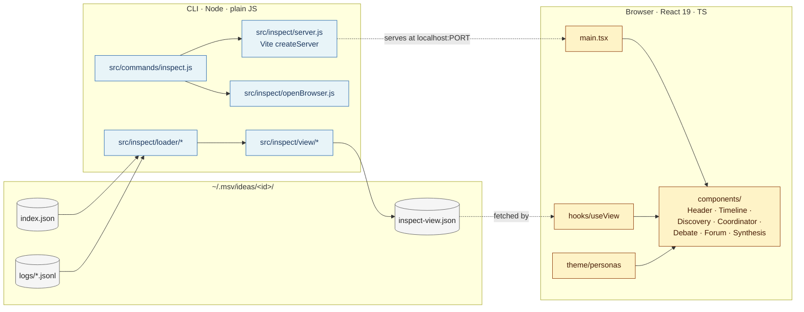

# `msv inspect` — Research Process Visualisation

**Status:** Draft\
**Author:** Eryk Napierała, 2026-05-16\
**Related:** [`specs/prototype.md`](prototype.md) — the pipeline this command visualises.

***

## 1. Overview

A new read-only command, `msv inspect <id>`, that boots a local Vite dev server hosting a React SPA over the full transcript of an investigation. Today the only way to see what the agent society did is `cat ~/.msv/ideas/<id>/index.json | jq` and tailing jsonl logs. That works for debugging but does not help the user understand *the shape of the deliberation* — which personas argued what, where confidence rose or fell, which contradictions the forum surfaced, and which threads the synthesizer collapsed into a finding.

The inspector reads `index.json` plus `logs/*.jsonl`, writes a normalised `inspect-view.json` next to them, starts Vite on a free port, and opens a browser. The pipeline itself is unchanged except for a small logging widening (Phase 2) so web-search tool blocks currently dropped are preserved on disk.

The CLI side is plain JavaScript (matching the rest of the repo); the SPA under `src/inspect-app/` is TypeScript-only — React 19 + Mantine v7 + Emotion + React Flow + Recharts. Vite handles HMR; restart-free editing of any UI component reflects instantly in the browser. There is no production build path in this spec — dev-mode is the only runtime.

***

## 2. Status

Draft.

***

## 3. Authors

Eryk Napierała · 2026-05-16

***

## 4. Background / Problem Statement

The msv pipeline produces a rich transcript: 5–7 personas debate 5–6 sub-questions across ~60 moves, cross-pollinate, contradict each other in a forum, and get collapsed by a synthesizer into a 1000-word report plus headline findings. The user reads the synthesis in `msv review`. Everything underneath — *why* the synthesizer reached its position — is invisible without manual `jq`.

That asymmetry breaks the prototype's own validation hypothesis ("structured disagreement between deliberately diverse personas leaves the user meaningfully further along"). To validate the hypothesis the user has to be able to see whether the disagreement was structured, whether the diversity was real, and whether confidence shifts tracked anything substantive — not just trust the synthesizer's prose.

The two reference runs in `~/.msv/` make this concrete:

* `722b7e3c-…` — original idea-management investigation. 6 sub-questions, ~70 moves, 12 forum nodes with 5 cross-cluster contradictions, ~503k tokens.
* `f61fd8b6-…` — its `[d]eeper` follow-up. 5 sub-questions, all paired skeptic-vs-builder (discovery returned 0 candidate personas — a separate bug surfaced by this exercise), 50 moves, 10 forum nodes, ~372k tokens.

Reading either as JSON takes 20 minutes and yields a fragmented picture. Reading the synthesis takes 4 minutes but elides the journey. The inspector is the missing middle: scan the whole investigation in a couple of minutes, drill into any sub-question or claim in seconds.

Specific user questions the inspector must answer at a glance:

* What were the search queries discovery ran, and what intellectual traditions did it surface?
* Which 5 candidate personas did the diversity selector pick, and which 5–7 did it cut? Why (distinctness)?
* For each sub-question, who was paired with whom, and how did the move-by-move debate evolve — including which moves were synthesised by the calcification validator?
* Where did confidence rise or fall, and on what evidence_basis?
* Which surviving claims contradict each other in the forum, and what was the LLM's stated reason for each contradiction verdict?
* Which forum nodes carry an open_question flag and from which cross-pollination reaction?
* How does the final synthesis map back to specific surviving claims?

***

## 5. Goals

* Render the full investigation transcript as a React SPA served by Vite, hot-reloading on UI changes so iteration on the inspector itself is cheap.
* Make all seven pipeline stages navigable as a linear timeline with click-to-expand detail per stage.
* Surface confidence trajectories per debate and per forum node so deliberation quality is visible, not just outcomes.
* Make contradiction edges in the forum visually explicit — including the LLM's contradiction-judgment reason.
* Provide three coordinated views of agent interaction: a forum graph (contradictions + cross-pollination as edges), per-sub-question debate threads (move-by-move with `references_move_id` chains), and a persona-interaction matrix (who actually engaged with whom).
* Preserve and display the web-search activity that grounded persona discovery (and that personas optionally invoked mid-debate).
* Work for any idea status (`investigating`, `ready`, `archived`) — partial transcripts must render the stages completed so far without crashing.
* Keep all CLI code as plain JavaScript matching the rest of the repo. Confine TypeScript to `src/inspect-app/`.
* Keep the dependency surface predictable for AI-assisted edits — favour popular, well-documented libraries (React Flow, Recharts, Mantine, react-markdown) over hand-rolled alternatives where the library reduces ambiguity.

***

## 6. Non-Goals

* No production build path. `vite build` is not wired up; the inspector runs only via the dev server. Portability of the inspect artefact is intentionally out of scope.
* No live re-loading of new investigation data. The page reads `inspect-view.json` once at mount; re-run `msv inspect <id>` to regenerate it. UI code itself hot-reloads through Vite HMR — the data does not.
* No multi-idea dashboard. One id per invocation. (Comparison views deferred — see §15.3.)
* No editing — read-only. The investigation transcript is append-only by design (`prototype.md` §3).
* No mid-pipeline steering UI. The user's only steering surface remains the topic pitch (`prototype.md` §1).
* No Tailwind. App-level styling is Emotion's `css` prop. Mantine handles layout primitives with its own CSS-modules-based system; the two coexist without interference.
* No theming knobs in this spec. A single light-mode design — built on Mantine's default theme — is the only target. Dark mode and responsive mobile layouts are explicitly deferred.
* No streaming/animation of the debate. Static rendering only. (Replay mode deferred — see §15.3.)
* No diff between runs of the same idea. The schema is single-run.
* No TypeScript outside `src/inspect-app/`. The CLI, loader, and view-builder stay plain JS with JSDoc types where they help.
* No state-management library (Redux/Zustand/Jotai). The view is read-only and small; React context + props are enough.
* No client-side routing library. Hash-fragment navigation (`#node-n_004`, `#debate-sq_002`) via a tiny in-tree hook.
* No claim-provenance back-links from synthesis to forum nodes. That would require a new LLM call after synthesis; not justified at this stage (see §14 Phase 3 — explicitly out of scope).
* No discovery of child ideas via filesystem scanning. The parent link is rendered when the record carries a `parent_id`; finding ideas spawned *from* this one would mean an O(n) read of every idea directory per inspect call.

***

## 7. Technical Dependencies

### CLI runtime (unchanged from prototype)

* `node >= 20`.
* `@anthropic-ai/sdk@0.54.0` — touched only for the logging widening in §9.5.
* `uuid@11.1.1` — unchanged.

### CLI runtime (new)

* `vite@^8` — programmatic API to boot a dev server from `src/commands/inspect.js`. Vite is imported only at command time, not at module load, so the rest of the CLI (`msv add`, `msv run`, `msv review`) does not pay any startup cost.
* `@vitejs/plugin-react@^6` — JSX/TSX transform.

### Browser-side runtime (`src/inspect-app/` dev deps only — no production bundle)

Versions reflect current latest at spec time (2026-05-16). Pinned to latest major; minor/patch via caret. AI agents implementing this should `npm install` without explicit version pins and let the registry resolve.

| Package | Version | Purpose |
|---|---|---|
| `react`, `react-dom` | `^19` | UI runtime. Uses React 19's stable concurrent features (no experimental APIs). |
| `typescript` | `^5.6` | Type checker. App is `.tsx`; Vite handles transpilation via esbuild. |
| `@emotion/react` | `^11` | `css` prop for app-level styles. |
| `@mantine/core`, `@mantine/hooks` | `^9` | Layout primitives (`AppShell`, `Stack`, `Group`, `Grid`, `Tabs`, `Accordion`, `Drawer`, `ScrollArea`, `Table`, `Code`, `Timeline`, `Spoiler`, `Progress`, `Alert`, `Anchor`, `HoverCard`, `Switch`, `Badge`, `Tooltip`, `List`). Mantine v9 ships CSS modules (`.css` files, no runtime CSS-in-JS) — no Emotion conflict. |
| `@xyflow/react` | `^12` | Forum graph rendering. Controlled mode via `useNodesState` / `useEdgesState`; custom node renderers via `nodeTypes` prop. |
| `recharts` | `^3` | Confidence trajectory sparklines. `<LineChart>` / `<Line>` / `<Dot>` / `<Tooltip>` API. |
| `react-markdown` | `^10` | Synthesis report rendering. |
| `rehype-sanitize` | `^6` | Default-on sanitisation plugin for `react-markdown`. |

No CDN, no service worker, no PWA wrapper. Vite serves everything from `node_modules` on localhost.

### Tooling

* `open` (macOS) / `xdg-open` (Linux) / `start` (Windows) for launching the browser at the dev server URL. Platform branch lives in `src/inspect/openBrowser.js` (~10 LOC).
* No bundler beyond Vite. No CSS preprocessor. No separate test runner — Node's built-in `node --test` for the CLI side; the React tree is exercised manually (see §10).

### External documentation (consulted while authoring)

* React Flow v12 docs — <https://reactflow.dev>. The `useNodesState`/`useEdgesState` hooks pattern, plus controlled-mode positioning, are the load-bearing references.
* Mantine v7 docs — <https://mantine.dev>. `AppShell` for the sidebar+main layout; `Tabs` for the Forum view; `Drawer` for the per-node slide-out.
* Recharts docs — <https://recharts.org>.
* react-markdown — <https://github.com/remarkjs/react-markdown>; rehype-sanitize defaults.
* Vite programmatic API — <https://vite.dev/guide/api-javascript>. `createServer()` with custom port and middleware mode for the inspector boot path.
* React 19 release notes — <https://react.dev/blog/2024/12/05/react-19>.

All version constraints are intentionally lax (`^` on major) — the inspector is a single-user tool and the prototype is explicit (`prototype.md` §1) that production stability is not a goal.

***

## 8. Detailed Design

### 8.1 Architecture overview



The CLI side is a pure pipeline from on-disk artefacts to `inspect-view.json`, plus the side-effect of booting Vite. The React app is a pure function of the view object — it never reaches back to disk via custom paths; the only network call it makes is `fetch('/inspect-view.json')`, served by a tiny Vite middleware (see §8.3) that reads from the resolved idea directory.

### 8.2 File layout additions

```text
src/
├── commands/
│   └── inspect.js                       # NEW — CLI dispatch, orchestrates build + boot
├── inspect/                             # NEW — Node-side, plain JS
│   ├── openBrowser.js                   #   platform open / xdg-open / start
│   ├── server.js                        #   vite.createServer wrapper
│   ├── loader/
│   │   ├── index.js                     #   buildLoaderInput(ideaDir) — orchestrator
│   │   ├── readIndex.js
│   │   ├── readLogs.js
│   │   └── enrichments/                 #   one file per stage
│   │       ├── discovery.js
│   │       ├── coordinator.js
│   │       ├── debates.js
│   │       ├── crossPollination.js
│   │       ├── forum.js
│   │       ├── synthesis.js
│   │       └── parseErrors.js
│   ├── view/
│   │   ├── build.js                     #   buildView(loaderInput) — pure function
│   │   └── derive/
│   │       ├── confidenceTrajectory.js
│   │       ├── contradictionEdges.js
│   │       ├── personaInteractions.js   #   matrix data (§8.7.3)
│   │       └── stageDurations.js
│   └── types.d.ts                       #   JSDoc-driven shared types
│
├── inspect-app/                         # NEW — Browser-side, TypeScript
│   ├── main.tsx
│   ├── App.tsx                          #   AppShell layout
│   ├── ViewContext.tsx                  #   provides the loaded InvestigationView
│   ├── hooks/
│   │   ├── useView.ts                   #   fetch + cache inspect-view.json
│   │   └── useHashRoute.ts              #   ~10 LOC hash listener
│   ├── components/
│   │   ├── Header/{Header.tsx, BudgetBar.tsx, StatusPill.tsx}
│   │   ├── Timeline/{Timeline.tsx, StageChip.tsx}
│   │   ├── Discovery/{Discovery.tsx, PersonaCard.tsx, SearchQueryList.tsx, SearchResultList.tsx}
│   │   ├── Coordinator/{Coordinator.tsx, SubQuestionCard.tsx}
│   │   ├── Debate/{DebateSection.tsx, MoveCard.tsx, ConfidenceChart.tsx}
│   │   ├── Forum/{Forum.tsx, ForumGraph.tsx, DebateThreadsTab.tsx, PersonaMatrix.tsx, NodeDrawer.tsx}
│   │   └── Synthesis/{Synthesis.tsx, Markdown.tsx}
│   ├── primitives/{Card.tsx, Section.tsx, PersonaChip.tsx}
│   ├── theme/
│   │   ├── tokens.ts                    #   spacing/typography/colour scales
│   │   └── personas.ts                  #   palette + deterministic colour assignment
│   └── utils/{format.ts, anchorScroll.ts}
│
└── cli.js                               # MODIFIED — add 'inspect' command

index.html                               # NEW — Vite's HTML entry; loads main.tsx
vite.config.ts                           # NEW — Vite + React config (see §8.3)
tsconfig.inspect-app.json                # NEW — scoped to src/inspect-app/

test/
└── inspect/
    ├── loader.test.js                   # NEW — readers + enrichments
    └── view.test.js                     # NEW — derivations + edge cases
```

Each enrichment file owns one stage's structured-vs-log merge. Each derivation file owns one computed view field. Each React component renders one visual concept. The composition surface is the JSX tree under `App.tsx` and the `<Tabs>` switch inside `Forum/Forum.tsx`. No plugin systems, no `options` objects.

### 8.3 Command surface and runtime flow

```text
msv inspect <id> [--no-open] [--port <n>]
```

| Flag         | Default                                  | Purpose                                                  |
| ------------ | ---------------------------------------- | -------------------------------------------------------- |
| (positional) | required                                 | idea id (uuid). Looks in `ideas/` then `archive/`.       |
| `--no-open`  | false                                    | Skip the platform `open`; print the URL to stdout only.  |
| `--port`     | auto (Vite picks a free port from 5180)  | Override the dev-server port.                            |

**One inspector invocation = one Vite instance = one idea.** Concurrent inspect sessions run as separate processes on separate ports. The SPA never switches ideas in-place; the `?id=` query parameter is purely informational (page title, parent-link label).

The boot sequence (`src/commands/inspect.js`):

1. Resolve the idea directory under `ideas/` or `archive/`. Exit 1 if not found.
2. Run the loader (`src/inspect/loader/`) → loaderInput.
3. Run the view builder (`src/inspect/view/build.js`) → view object. Exit 2 on any error; do not start Vite.
4. Write `inspect-view.json` next to `index.json` via `atomicWriteText`. The file is regenerated every invocation; staleness is worse than IO cost.
5. Build a Vite middleware that serves a single fixed route `/inspect-view.json` from the resolved idea directory (the path is captured in a closure during boot). The middleware is registered programmatically by `src/inspect/server.js`, not declared in `vite.config.ts` — this keeps the config file static while the served path varies per invocation.
6. Start Vite via `createServer({ root: <repo>, server: { port, host: '127.0.0.1', fs: { allow: [ideaDir, repoRoot] } }, configFile: 'vite.config.ts' })` and attach the middleware via `server.middlewares.use('/inspect-view.json', handler)` before calling `server.listen()`.
7. Open the browser at `http://localhost:<port>/?id=<id>` unless `--no-open`.
8. Keep the process alive. On `SIGINT`, close the Vite server gracefully and exit 0.

```ts
// vite.config.ts (final form)
import { defineConfig } from 'vite';
import react from '@vitejs/plugin-react';

export default defineConfig({
  root: '.',
  plugins: [react()],
  resolve: { alias: { '@app': '/src/inspect-app' } },
  // server.fs.allow and the /inspect-view.json middleware are set
  // programmatically by src/inspect/server.js per invocation.
});
```

```js
// src/inspect/server.js (sketch)
const { createServer } = require('vite');
const fs = require('node:fs/promises');
const path = require('node:path');

async function startInspectServer({ ideaDir, port }) {
  const server = await createServer({
    server: { port, host: '127.0.0.1', fs: { allow: [ideaDir, process.cwd()] } },
  });
  server.middlewares.use('/inspect-view.json', async (_req, res) => {
    const body = await fs.readFile(path.join(ideaDir, 'inspect-view.json'));
    res.setHeader('Content-Type', 'application/json');
    res.end(body);
  });
  await server.listen();
  return server;
}
```

The SPA fetches the view via `fetch('/inspect-view.json')` — a single fixed path, no parameters needed in the URL.

Exit codes:

* 0 — server started successfully (and browser opened, unless `--no-open`); cleanly shut down via SIGINT.
* 1 — idea not found in `ideas/` or `archive/`.
* 2 — view build error (corrupted `index.json`, malformed log). Vite is not started; `inspect-view.json` is not overwritten on error (atomic rename never fires).
* 3 — Vite failed to bind or crashed during boot. Stderr carries Vite's own error.

### 8.4 Loader (`src/inspect/loader.js`)

Reads:

1. `index.json` — the full structured transcript.
2. Every `logs/*.jsonl` present in the idea directory. Missing files are tolerated (early-stage failures leave some logs unwritten).

Produces an `InvestigationView` object that is *purely additive* over the index — every field on `view` is either copied from `index.json`, derived from it, or pulled from the logs. The loader never reads back into `index.json` to mutate it.

Per-log enrichment (logs/index.json bridging):

* `discovery.jsonl` → `view.discovery.timings`, `view.discovery.web_search_results` (Phase 2 — see §9.5).
* `coordinator-initial.jsonl` / `coordinator-spawn.jsonl` → `view.coordinator.timings`, `view.coordinator.spawn_reason` (the `declined` record's reason field).
* `pair-sq_<id>.jsonl` → `view.debates[sq_id].turns` enriched with per-move `attempt` count (how many re-prompts before validation passed), `synthesized` flag, and `usage` per move.
* `cross-pollination.jsonl` → `view.cross_pollination.timings` per reaction.
* `forum-contradictions.jsonl` → `view.forum.contradiction_verdicts: { key: { contradicts, reason, usage } }`. Keyed by the same `<claim_id_a>|<claim_id_b>` sorted convention `src/forum.js` already uses.
* `synthesizer.jsonl` → `view.synthesis.timings`.
* `parse-errors.jsonl` → `view.parse_errors: [{ stage, persona_id, errors, raw }]`. Surfaces persona executor failures the pipeline absorbed.

The loader's normalisation step also computes derived view data:

* **Confidence trajectory per debate** — chronological array of `{ move_id, by_persona_id, confidence, type }` for sparkline rendering.
* **Persona move-count totals** — per persona, count of moves emitted across all debates.
* **Forum contradiction edges** — flat list `{ from_node_id, to_node_id, reason }`, deduplicated by undirected pair. Drives the forum graph SVG.
* **Stage durations** — `completed_at - started_at` per stage when both timestamps are present (synthesizer and the pipeline use ISO timestamps consistently, so this is a simple diff).
* **Surviving-claim → forum-node map** — the index records `claim_id` on both sides; the loader just builds the lookup so the renderer doesn't re-walk it for every cross-link.

### 8.5 View model (`src/inspect/view.js`)

```text
InvestigationView {
  id, raw_capture, status, parent_id,
  captured_at, last_action_at,

  budget: { used_executor_calls, max_executor_calls,
            used_total_tokens, max_total_tokens, runtime_ms },

  stages: [                          // ordered, one entry per pipeline stage
    { key, label, status: 'done' | 'partial' | 'skipped' | 'failed',
      started_at, completed_at, duration_ms,
      summary: '...', detail_ref: 'discovery' | 'coordinator' | ... }
  ],

  discovery: {
    search_queries: [string],
    web_search_results: [{ query, results: [{ title, url, page_age }] }],   // Phase 2 — no snippet; SDK limitation, see §9.5
    candidate_personas: [Persona],
    selected_persona_ids: [string],
    fixed_personas: [string],
    selection_distinctness: { p_id: number }   // derived
  },

  coordinator: {
    initial: { decided_at, sub_questions: [SubQ] },
    spawn: { decided_at, sub_questions: [SubQ], reason, declined: bool }
  },

  debates: {                          // keyed by sub_question_id
    [sq_id]: {
      sub_question: SubQ, pair: [Persona, Persona],
      moves: [Move], surviving_claims: [Claim],
      terminated_by: string,
      confidence_trajectory: [{ move_id, persona_id, confidence, type }],
      synthesized_move_count: number
    }
  },

  cross_pollination: [{
    claim_id, reactions: [Reaction],
    target_node_id: string                 // back-link into forum
  }],

  forum: {
    nodes: [Node],
    contradiction_edges: [{ from_node_id, to_node_id, reason }]
  },

  synthesis: {
    report: string, headline_findings: [string], open_tensions: [string]
    // claim_references intentionally NOT modelled — see §14 Phase 3 (out of scope)
  },

  parse_errors: [{ stage, persona_id, errors, raw }]
}
```

Every field on the view is JSON-serialisable. The renderer never reaches back to the loader; the view is the only contract.

### 8.6 React component tree and layout

The SPA uses Mantine's `<AppShell>` for the persistent layout — sticky navbar (left), main scroll column (right). Every section below is a top-level React component mounted in order inside the main column:

```text
<AppShell navbar={{width: 240, ...}}>
  <AppShell.Navbar>           ← anchor links · sticky · active-section highlight
    Header · Timeline · Discovery · Coordinator · Debates · Forum · Synthesis
  </AppShell.Navbar>

  <AppShell.Main>             ← single scroll column
    <Header view={view}/>
    <Timeline view={view}/>
    <Discovery view={view}/>
    <Coordinator view={view}/>
    <DebateSection view={view}/>    ← one Accordion item per sub-question
    <Forum view={view}/>            ← Mantine <Tabs> · three views (§8.7)
    <Synthesis view={view}/>
  </AppShell.Main>
</AppShell>
```

Cross-pollination, which previously had its own section, folds into the Forum tabs (§8.7). Every section is a pure function of the `view` object pulled from `ViewContext`.

#### 8.6.1 `<Header>`

* Topic rendered in full (no truncation — `index.json` preserves verbatim).
* `<StatusPill>` (Mantine `<Badge>`): green `ready`, yellow `investigating`, grey `archived`. Investigating ideas show "partial transcript — not all stages completed" via a Mantine `<Alert>` below the pill.
* `parent_id` rendered as a Mantine `<Anchor>` pointing to `?id=<parent_id>` (same dev server, different idea — the user re-runs `msv inspect <parent_id>` in a separate terminal if they want to drill up). The link target is computed from the record's own `parent_id` field — no directory scanning. Child-direction discovery is **out of scope**.
* `<BudgetBar>`: two Mantine `<Progress>` bars (executor calls, tokens). Bar colour goes red when fill > 100%. The reference run `722b7e3c-…` overshot both — the inspector must surface that, not hide it.
* Runtime: `completed_at − started_at` formatted as `m:ss`.

#### 8.6.2 `<Timeline>`

Mantine `<Timeline>` component, oriented horizontally inside a `<ScrollArea>`. Each `<Timeline.Item>` is one of the seven pipeline stages: name, duration (`format.duration(ms)` → `1.4s` / `2m 13s`), status icon, per-stage token usage in a Mantine `<Tooltip>`. Clicking an item triggers `useHashRoute` to set `window.location.hash = '#stage-<key>'`, which `useAnchorScroll` resolves to a smooth-scroll.

The spawn round (4b) renders as an inline 8th item only when `coordinator.spawn.sub_questions.length > 0`. When declined, a small `<Text size="xs" c="dimmed">` annotation reads "spawn declined — budget_cap (used N%)".

#### 8.6.3 `<Discovery>`

* `<SearchQueryList>` — Mantine `<Group>` of `<Badge variant="light">` chips, one per `search_queries[]`.
* `<SearchResultList>` — Phase 2 only. Mantine `<Accordion>` keyed by query; each panel lists `{ title, url, page_age }` rows as `<Anchor target="_blank" rel="noopener noreferrer">`. Until §9.5 logging lands, this renders a `<Text c="dimmed">` stub.
* `<PersonaCard>` grid — Mantine `<Grid>` with 3-column layout. Selected personas get a coloured left border (their persona colour) and a "selected" `<Badge>`; cut personas are dimmed via `opacity: 0.6`. Card content: id, name, tradition, stance, description (clamped via Mantine's `<Spoiler maxHeight={72}>`). Order: selected first by `selected_persona_ids` order, then cut by id. Fixed personas (skeptic, builder) get a small separate `<Group>` labelled "Fixed (always added)".

#### 8.6.4 `<Coordinator>`

* Initial decomposition — N `<SubQuestionCard>` instances in a `<Stack>`. Each card: id, question, rationale, the assigned pair (two `<PersonaChip>` components colour-tagged consistently with their colour across the inspector), `pair_distinctness_score` as a Mantine `<Progress size="xs">`.
* Spawn decision — second block, same card layout when `spawn.sub_questions.length > 0`. When declined, render the reason + `budget_used_pct` from `coordinator-spawn.jsonl`.

#### 8.6.5 `<DebateSection>`

One Mantine `<Accordion>` panel per `pair_debates[]` entry. Each panel:

* Header (`<Accordion.Control>`): sub-question text, pair chips, terminated_by, surviving-claim count.
* Body (`<Accordion.Panel>`):
  * `<ConfidenceChart>` — Recharts `<LineChart width={…} height={80}>` with one `<Line>` per persona, dots customised by move type (`<Dot>` for Claim, custom SVG for Rebut/Concede/Question/Support). Synthesized moves get a dashed-stroke `<Dot>`. Recharts `<Tooltip>` shows move type + confidence on hover.
  * `<Stack>` of `<MoveCard>` instances. Each card has a left rail coloured by `personaColor(move.by_persona_id)` (via Emotion `css` prop with a CSS variable), header line `m_sq_001_0005 · Persona · Rebut · conf 8 · refs m_sq_001_0004`, `content` as prose, `evidence_basis` in a muted Mantine `<Code block>` with "Evidence basis" label. `references_move_id` is a clickable `<Anchor>` that sets the hash route to `#move-m_sq_001_0004`; `useAnchorScroll` adds a 600ms `animation: highlight-pulse` on the target. Surviving claims get a coloured left border accent and a "surviving claim" `<Badge>`. Synthesized moves get a Mantine `<Alert color="yellow">` with the calcification explanation.

#### 8.6.6 *(removed — folded into §8.7 Forum tabs)*

#### 8.6.7 *(moved to §8.7)*

#### 8.6.8 `<Synthesis>`

* `headline_findings[]` as a Mantine `<List type="ordered">`, prominent typography.
* `open_tensions[]` in a Mantine `<Alert>` callout, colour `yellow`.
* `report` rendered via `<Markdown>` (wraps `react-markdown` with `rehype-sanitize` and custom paragraph spacing — see §12).
* No back-links from synthesis prose to forum nodes — would require a new LLM stage (see §14 Phase 3, explicitly out of scope).

#### 8.6.9 Persona colour palette (`theme/personas.ts`)

Personas are coloured consistently across every visual that references them. The palette is a fixed 8-colour sequence (skeptic + builder + up to 6 discovered). The assignment function is pure:

```ts
const PALETTE = [
  '#E69F00', '#56B4E9', '#009E73', '#F0E442',
  '#0072B2', '#D55E00', '#CC79A7', '#000000',
] as const;  // Okabe-Ito; colourblind-safe; WCAG AA against #FFFFFF

export function personaColor(personaId: string): string {
  let h = 0;
  for (const c of personaId) h = (h * 31 + c.charCodeAt(0)) | 0;
  return PALETTE[Math.abs(h) % PALETTE.length];
}
```

No `ThemeProvider` for persona colours; components import `personaColor` and apply it via Emotion `css` with a CSS variable on the element.

### 8.7 `<Forum>` — three coordinated views of agent interaction

The Forum section uses Mantine `<Tabs>` with three panels. The user can inspect agent interaction at three levels of abstraction without leaving the section. State (selected tab, selected node) lives in local React state inside `Forum.tsx`.

#### 8.7.1 Tab 1: `<ForumGraph>` (default)

Built on `@xyflow/react` (React Flow v12) in **controlled mode** with deterministic positioning:

* **Nodes** — one per `forum.nodes[]` entry. Custom node renderer (`ForumNode.tsx`) draws a circle (radius proportional to `aggregate_confidence`, clamped 16–48 px) filled with the working group's colour. A `?` badge for `has_open_question: true`. The node label is the `node_id`; on hover, a Mantine `<HoverCard>` shows the full claim content.
* **Edges** — three types, all renderable simultaneously:
  * **Contradictions** (red, solid) — one per `forum.contradiction_edges[]`. Hovering shows the LLM's contradiction reason in a `<HoverCard>`.
  * **Cross-pollination reactions** (blue, dashed) — for each `cross_pollination[].reactions[]`, an edge from the reactor's "home" cluster centre to the target claim's node. Hovering shows reactor persona, reaction type, content, confidence.
  * **Intra-cluster references** (grey, faint, toggleable via a Mantine `<Switch>` above the canvas) — `references_move_id` chains within the same working group. Off by default to keep the canvas readable; on demand for debugging calcification or Support chains.
* **Layout** — deterministic ring grouped by `working_group_id`. Sub-questions form clusters around the perimeter; contradictions become arcs across the centre. Positions computed once at mount from a pure function `layoutRing(nodes)` in `view/derive/forumLayout.ts`. Force-directed layout is intentionally rejected — its non-determinism makes screenshots and AI-aided reviews unreliable.
* **Interaction** — `onNodeClick` from React Flow opens `<NodeDrawer>` (Mantine `<Drawer position="right" size="lg">`) showing:
  * The full claim content + `aggregate_confidence`.
  * The originating debate's full move thread, rendered as a parent-child tree by `references_move_id` (using a small recursive `<MoveTree>` component). Every Rebut/Concede/Support that fed into the surviving claim is visible.
  * All cross-pollination reactions targeting this claim, with their personas and confidence.
  * All contradictions involving this node (including the "not the most pointed" verdicts from `forum.contradiction_verdicts` that didn't make it into `contradiction_with_node_id`).

#### 8.7.2 Tab 2: `<DebateThreadsTab>`

Mirrors the existing `<DebateSection>` rendering inside the Forum scope so the user can flip between the graph and the underlying threads without scrolling. Implementation: re-use the same `<DebateSection>` component the main flow uses — no duplication.

#### 8.7.3 Tab 3: `<PersonaMatrix>` (who engaged with whom)

A Mantine `<Table>` with one row per persona and one column per persona. Cells contain the count of moves where the row persona's `references_move_id` points to a move authored by the column persona, broken down by move type:

```
                p_006   p_011   skeptic   builder
p_006             —      4R/2C    0       1R
p_011           5R/3C     —       0       0
skeptic           0        0      —       3R/1C
builder           2R       0     2R/1C     —
```

`R` = Rebut, `C` = Concede, `Q` = Question, `S` = Support. Cell background opacity is proportional to total references, producing a heatmap effect. The matrix is computed in `view/derive/personaInteractions.ts` and surfaces:

* **Calcification patterns** — a persona with high Rebut-out counts but zero Concede-out counts is calcifying.
* **Asymmetric engagement** — when persona A heavily references B but B never references A back.
* **Productive pairs** — high mixed-type counts (Rebut + Concede + Support) indicate real engagement.

Clicking a cell scrolls the user to the relevant debate's Accordion item via the `#debate-<sq_id>` hash route — re-using the existing debate view rather than duplicating a move listing inside a Modal. Keeps the surface small.

### 8.8 Hash routing (`useHashRoute`)

A ~10-LOC hook reading `window.location.hash` and exposing `{ route, setRoute }`. Routes recognised:

* `#stage-<key>` — scroll to a `<Timeline>` stage's detail section.
* `#debate-<sq_id>` — open the corresponding `<Accordion.Item>` and scroll to it.
* `#move-<move_id>` — scroll to a `<MoveCard>` and pulse it for 600ms.
* `#node-<node_id>` — switch Forum to tab 1, select the node, open `<NodeDrawer>`.
* `#persona-<persona_id>` — switch Forum to tab 3, highlight the persona's row.

`useAnchorScroll` is the consumer: subscribes to hash changes and runs `element.scrollIntoView({ behavior: 'smooth', block: 'start' })` plus a transient `data-pulse` attribute that an Emotion keyframe animation reads.

### 8.9 API / schema changes

None to `index.json`. The visualisation is purely a read-side artefact.

`inspect-view.json` is a new on-disk artefact next to `index.json` and `logs/`. It is regenerable from those inputs, so it lives outside `index.json`'s atomic-write discipline. It is added to `.gitignore` (the user's `~/.msv/` is not in git, but worth keeping the pattern available if anyone vendor-checks a fixture in).

One enhancement to the log envelope is required for Phase 2 (web-search capture) — see §9.5.

### 8.10 Failure modes the inspector must handle

* `index.json` missing → exit 1 with the same "idea not found" message `msv run` uses. Vite is not started.
* `index.json` present but `investigation.synthesis === null` (status: investigating) → view builder marks `synthesis` and any downstream stages as `not_run`; React renders the empty sections via a `<Empty>` primitive. Inspect-while-running is the prototype's documented partial-transcript use case (`prototype.md` §3 field notes).
* `index.json` present but `pair_debates` empty → header/discovery/coordinator render normally; `<DebateSection>` and `<Forum>` show `<Empty>` placeholders.
* A log file referenced by a stage that did run is missing or unreadable → the corresponding enrichment file logs to stderr and returns its structured fallback (empty timings, empty verdicts). The view build does not fail; the React app renders without the enrichment.
* `index.json` JSON-parse failure → exit 2 with file path + line/column. Vite is not started; a prior `inspect-view.json` (if any) is left intact.
* `inspect-view.json` already exists → overwrite via `atomicWriteText` (tmp + rename). Staleness is a worse failure than IO cost.
* Vite fails to bind (port in use, file watch limit) → exit 3 with Vite's stderr output. The user gets a clear error and can retry with `--port`.
* `SIGINT` received → `vite.close()` then `process.exit(0)`.

***

## 9. User Experience

### 9.1 Discovery (how the user finds this command)

* `msv --help` lists `inspect` alongside `add`, `run`, `review`.
* `msv review`'s steer card grows a new key: `[i]nspect — open visual transcript in browser`. Selecting `[i]` runs `msv inspect <current_id>` and re-renders the steer card after the browser opens.

### 9.2 Primary user flow

```text
$ msv inspect 722b7e3c-e231-46c8-84cd-b2f272222323
→ built view: 7 stages, 70 moves, 12 forum nodes
→ wrote ~/.msv/archive/722b7e3c-…/inspect-view.json
→ Vite dev server ready on http://localhost:5180
→ opened browser

  ➜  press Ctrl-C to stop
```

The terminal stays attached. Editing any file under `src/inspect-app/` triggers Vite HMR; the browser updates without losing scroll position. Editing the view-build pipeline does not auto-reload — re-run `msv inspect <id>` to regenerate `inspect-view.json`.

### 9.3 Secondary flows

* `msv inspect <id> --no-open` — start the dev server, print the URL to stdout, do not invoke the platform opener. Useful when running on a remote host with port-forwarding (`ssh -L 5180:localhost:5180 host`).
* `msv inspect <id> --port 6000` — pin the port (e.g., when several inspect sessions run side by side; Vite's default port-scan picks a different one each time otherwise).

### 9.4 Error UX

* `idea not found` → stderr, exit 1. Identical to `msv run`'s error.
* `view build error: corrupted index.json at line 42:13` → stderr, exit 2. The user knows to inspect the JSON directly. Vite is not started; the prior `inspect-view.json` is left intact.
* `vite failed to bind: EADDRINUSE :5180` → stderr, exit 3. Suggests `--port <n>` in the error message.

### 9.5 Logging widening (precondition for Phase 2)

Today, `src/agents/discovery.js` logs only `candidate_count` and `search_query_count` per discovery response. The actual `server_tool_use` / `web_search_tool_result` blocks the SDK returns are dropped. Same for persona executors (`maxUses: 2` — when invoked, results disappear).

The widening: extend `src/anthropic.js`'s response wrapper so that any `ServerToolUseBlock` (`type: 'server_tool_use'`, `name: 'web_search'`) and `WebSearchToolResultBlock` (`type: 'web_search_tool_result'`) content blocks are extracted and appended to the existing per-stage log under `kind: "web_search"`. One log line per search invocation with the shape the SDK actually exposes:

```json
{
  "kind": "web_search",
  "payload": {
    "query": "<from ServerToolUseBlock.input.query>",
    "results": [
      { "title": "...", "url": "...", "page_age": "..." }
    ]
  }
}
```

**Important constraint discovered during spec validation:** the SDK's `WebSearchResultBlock` does **not** expose a `snippet` field — its shape is `{ encrypted_content, page_age, title, url }`. The actual result text the model read is wrapped in `encrypted_content`, opaque to the client. So the inspector can show *what the model searched for* and *which pages it landed on*, but **not the prose excerpts the model read**. This is a limitation of the hosted web-search tool, not the inspector. The discovery section's UX must reflect this — render `title + url + page_age` per result, no fabricated snippet.

This change is small (~15 LOC) and additive — no behavioural change to the agents themselves.

Without this widening, the inspector still works; the discovery section just renders the queries plus a stub explaining the omission. With it, the inspector shows the search queries and the landing pages — the most faithful answer to "what did the sub-researchers find on the internet" that the hosted web-search tool permits.

***

## 10. Testing Strategy

The pipeline philosophy (`prototype.md` §1) is "no tests beyond a smoke run." This spec lifts that bar only for the *deterministic* CLI side — loader and view builder. The React app is exercised exclusively by manual smoke runs, matching the project's stance that LLM-driven and presentation code don't pay back unit tests at this scale.

### 10.1 Unit tests — Node side only (`node --test`)

Two test files, both running in well under 5s with no LLM calls.

`test/inspect/loader.test.js`:

* **loader merges index + logs correctly.** Purpose: catch silent regressions in log/structured-data bridging — the loader is the integration boundary most likely to drop fields silently. Given a fixture directory, assert every stage's structured data is enriched with the matching log timings and `forum-contradictions` verdicts are keyed via `contradictionKey` correctly.
* **loader tolerates missing logs and empty discovery.** Purpose: `investigating`-state ideas and degraded-discovery runs (`f61fd8b6` with `candidate_personas: []`) must still produce a valid `loaderInput`. Two sub-cases: (a) `synthesizer.jsonl` + `forum-contradictions.jsonl` missing; (b) empty persona arrays. Both should produce a complete `loaderInput` shape with stub values.

`test/inspect/view.test.js`:

* **view model: contradiction edges are deduplicated.** Purpose: forum graph would draw duplicate edges otherwise. Build a forum where A↔B contradiction appears in both directions; assert `contradiction_edges.length === 1`.
* **view model: persona interactions matrix counts move types correctly.** Purpose: the matrix is the most algorithmically dense derivation; off-by-one or wrong-axis bugs are easy. Build a debate with known counts (e.g., persona A emits 3 Rebuts referencing B, 1 Concede referencing B); assert `personaInteractions[A][B] === { Rebut: 3, Concede: 1, Question: 0, Support: 0 }`.
* **view model: stage durations handle null timestamps.** Purpose: `investigating` ideas have null `completed_at` on the in-flight stage. Assert that stage's `duration_ms` is `null`, not `NaN`.
* **atomic write helper round-trips.** Purpose: a half-written `inspect-view.json` opening in the browser causes a confusing JSON parse error in `useView`. `storage.atomicWriteJson` is JSON-only (it serialises via `JSON.stringify`); add a parallel `atomicWriteText(path, string)` to `src/storage.js`. Assert the temp file is removed on error and a prior file is intact.

### 10.2 React app — no unit tests, manual smoke only

The SPA exists to render the view; its correctness is visual. Component-level unit tests against a mocked view would be testing JSX rather than behaviour, and the design (single user, no production build) doesn't justify a Playwright/Vitest setup. The smoke run is the verification:

* `msv inspect <id>` on `~/.msv/archive/722b7e3c-…` — walk every section. Verify each stage section renders, every persona card is present, the debate Accordion expands, the Forum tabs switch cleanly, the graph renders, the node drawer opens, the persona matrix has the right shape, the synthesis paragraphs are readable.
* `msv inspect <id>` on `~/.msv/ideas/f61fd8b6-…` — degraded-discovery path. Verify the empty `<PersonaCard>` grid shows the "discovery returned 0 candidates" state, and the rest of the inspector still works.
* Manually trim a fixture's `index.json` to remove `synthesis` → re-run inspect → verify the partial-transcript state renders.

This is the equivalent of `msv run`'s own smoke run (`prototype.md` §9) — required before merging.

### 10.3 Fixture strategy

Fixtures live under `test/fixtures/inspect/`:

* `ready/` — copy of a known-good `ready` idea with all stages.
* `investigating/` — same idea trimmed to stage 3 only (no `pair_debates`).
* `degraded-discovery/` — copy of the `f61fd8b6` shape: empty `candidate_personas`.

Fixtures are checked in. Re-derivation: when the schema changes, regenerate from a real run with `MSV_ROOT=test/fixtures/inspect/<name>` and a throwaway topic. Document the regeneration command in `test/fixtures/inspect/README.md`.

### 10.4 What is *not* tested

* Browser rendering, component output, accessibility tree. Visual regression testing is overkill for a single-user prototype.
* Cross-platform `open` behaviour. The platform branch is one if/else.
* Vite startup itself. Trusting Vite is part of the dependency choice.
* TypeScript correctness beyond what `tsc --noEmit` catches at dev time. No CI enforcement.

***

## 11. Performance Considerations

* **CLI boot time.** End-to-end (load → view build → write `inspect-view.json` → Vite ready): expected 3–7s cold (first run after `npm install` — Vite pre-bundles Mantine, React Flow, Recharts, react-markdown), <1s warm (subsequent runs hit Vite's pre-bundle cache under `node_modules/.vite/`). The view build itself is O(moves) + O(nodes²) for contradiction-edge dedup — both small, contributing <100ms.
* **`inspect-view.json` size.** Reference runs project to 200–400 KB. Negligible for a `fetch` on localhost.
* **Browser memory.** No virtualisation, no large lists. Largest debate is <100 moves; React Flow handles 12 nodes + ~30 edges trivially.
* **HMR feedback loop.** Editing a React component file should hot-update the browser in well under 200 ms — Vite's default. The Forum graph (React Flow) re-renders cleanly under HMR; no manual reload required.
* **No streaming.** The inspector is post-hoc.

The hot path on the CLI side is the loader — reading 7+ jsonl files sequentially. They're independent; the loader uses `Promise.all` over reads.

Browser-side: React Flow with controlled nodes/edges is efficient at this scale; Recharts sparklines render in <16 ms for <20 data points. The bottleneck, if any, is `react-markdown` parsing a 1500-word synthesis report — still well under one frame.

***

## 12. Security Considerations

The inspector renders React components over user-supplied text (the raw topic), LLM-generated text (every move, claim, reaction, synthesis), and externally-titled URLs (Phase 2 web-search results). All of these are untrusted with respect to HTML/script injection.

* **React's default-escape covers most of the surface.** Children rendered via `{value}` in JSX are text-escaped by React. No code path uses `dangerouslySetInnerHTML` except where called out below, and those are gated.
* **Markdown rendering.** `<Markdown>` wraps `react-markdown` with `rehype-sanitize` configured for the GitHub-safe schema. The synthesizer's report has historically used only paragraphs, `**bold**`, and inline backticks (verified against both reference runs), but the sanitiser is non-negotiable — LLM output is untrusted at the boundary, full stop. No `dangerouslySetInnerHTML` is invoked manually.
* **React Flow custom node renderers.** Node labels and tooltip content rendered inside React Flow's `<HoverCard>` are JSX children — React's normal escaping applies.
* **External URLs (Phase 2 web-search).** Rendered as Mantine `<Anchor>` with `target="_blank" rel="noopener noreferrer"` to prevent tabnabbing. The URL itself is text-escaped by React when placed inside `<Anchor>`; `href` attribute is validated to start with `https://` (any other scheme — `javascript:`, `data:`, `file:` — is replaced with `#` and the link styled as inert).
* **Vite dev server scope.** `server.fs.allow` is set to exactly two paths: the project root (so the SPA source is reachable) and the resolved idea directory (so `inspect-view.json` is fetchable). Vite will reject `..` traversals outside that allowlist. This matters because Vite is a real HTTP server — without scoping, a stray fetch could read other files on disk.
* **Localhost binding only.** `server.host` defaults to `localhost`, not `0.0.0.0`. Spec explicitly forbids exposing Vite to the LAN. Override at the user's risk.
* **No analytics, no telemetry, no service worker.** The React app makes exactly one network call: `fetch('/inspect-view.json')`. Verified by inspecting the bundle.

The CLI command itself touches the filesystem under `~/.msv/`, the same boundary `storage.js` enforces (`assertWithinRoot`). The inspector reuses `ideaDir` and `archivedIdeaDir` from `storage.js` — no new path-handling logic.

***

## 13. Documentation

* **`README.md`** — add an `msv inspect` section between `msv run` and `msv review`. Mention `--port`, `--no-open`, the `[i]` key in review, and that the dev server stays attached until Ctrl-C.
* **`specs/feat-research-process-visualisation.md`** — this file.
* **`test/fixtures/inspect/README.md`** — how to regenerate fixtures when the schema changes.
* **Library/component map** — folded into the main `README.md`'s `msv inspect` section as a "where things live" subsection (~10 lines). Aimed at future AI agents editing the app; not worth a separate file.

`specs/prototype.md` is *not* updated to mention this command. The prototype spec is a frozen architectural commitment; this is a side-car feature. The cross-reference at the top of this spec is sufficient.

***

## 14. Implementation Phases

### Phase 1 — CLI + view builder + skeleton SPA

Goal: `msv inspect <id>` boots Vite, browser opens, view object reaches the React app, every section renders something — even if visual polish is minimal.

* Add npm dependencies per §7 (Vite, React 19, TS, Mantine, Emotion, React Flow, Recharts, react-markdown, rehype-sanitize).
* Add `vite.config.ts`, `index.html`, `tsconfig.inspect-app.json`.
* Add `src/storage.js#atomicWriteText`.
* Add `src/commands/inspect.js`, `src/inspect/openBrowser.js`, `src/inspect/server.js`.
* Add `src/inspect/loader/*` and `src/inspect/view/*` with the file layout per §8.2.
* Add `src/inspect-app/{main.tsx, App.tsx, ViewContext.tsx, hooks/useView.ts}` and the minimum components: `<Header>`, `<Timeline>`, `<Discovery>`, `<Coordinator>`, `<DebateSection>`, `<Forum>` (graph tab only), `<Synthesis>`.
* Wire `inspect` into `src/cli.js`.
* Tests per §10.1, fixtures per §10.3.
* Update `README.md`.

Done = both reference runs in `~/.msv/` boot the inspector, every section renders, the Forum graph displays nodes and contradiction edges, the synthesis report is readable.

### Phase 2 — Forum interaction depth + persona matrix + web-search capture

Goal: the inspector becomes a real tool for inspecting *how agents interacted*, and the discovery section answers the "what did they find on the internet" question.

* Implement Forum tabs 2 and 3 (`<DebateThreadsTab>`, `<PersonaMatrix>`).
* Implement `<NodeDrawer>` (click-through from graph nodes to the originating debate tree).
* Implement `useHashRoute` + `useAnchorScroll` and wire the cross-section navigation routes per §8.8.
* Implement cross-pollination edges on the Forum graph (blue dashed).
* Widen `src/anthropic.js` to capture `server_tool_use` / `web_search_tool_result` blocks per §9.5.
* Extend the loader to populate `view.discovery.web_search_results`.
* Implement `<SearchResultList>` rendering.

Done = a fresh `msv run` produces logs containing search results; `msv inspect <id>` renders them, and all three Forum tabs are usable.

### Phase 3 — Claim provenance (out of scope for this spec)

A speculative future enhancement — making the synthesis section drill back to the surviving claims it leaned on, via a new post-synthesis LLM call that maps each `headline_finding` to supporting `node_id`s. **Not in this spec.** Adding a new pipeline stage (and the cost it carries) for a UX nicety that may or may not get used violates the prototype's YAGNI discipline. Re-spec it later if Phases 1–2 in real use produce the concrete need.

***

## 15. Open Questions

### 15.1 Should `parse_errors.jsonl` get its own section, or be folded into the debates it relates to?

Both reference runs have zero parse errors (the move validator is strict enough that the calcification fallback usually catches issues before parse failure). Folding into the relevant debate is more useful when errors are rare; a dedicated section is more useful when errors are common. Default: fold into the relevant debate as a warning callout, and add a top-of-page banner when any parse errors exist. Revisit if real runs start producing them.

### 15.2 ~~Cross-pollination as separate panel or folded?~~ — **Resolved**

Resolved during the architecture pass: cross-pollination folds into the Forum tabs (§8.7). Blue dashed edges in the graph (tab 1) and reaction rows inside `<NodeDrawer>` cover the rendering need without a standalone section.

### 15.3 Comparison and replay modes — separate command or flags on `inspect`?

* **Comparison** — useful when an idea has been re-run after a schema/prompt change. Possible spelling: `msv inspect <id> --compare <other_id>`. Out of scope for Phase 1.
* **Replay** — animate the move thread as if it were happening live. Probably a UI toggle inside the rendered page rather than a CLI flag. Out of scope for Phase 1.

### 15.4 Should `msv inspect` work on `pending` ideas (zero pipeline output)?

A `pending` idea has only `raw_capture`, `captured_at`, and an empty `investigation` block. Rendering an inspector page for it shows the header and a stub of every later section. Useful as a "what will run" preview, but borderline. Default: yes, render it; the empty sections are clear about being unrun. Cost is zero.

### 15.5 Discovery returning zero personas (a real bug to surface, not a UX question)

The follow-up run `f61fd8b6` returned `candidate_personas: []` from discovery (`search_query_count: 11` but `candidate_count: 0`). The selector then silently fell back to skeptic+builder only — five sub-questions all paired skeptic-vs-builder. This is almost certainly a discovery-prompt regression on parent-context-only topics. The inspector must surface this clearly (it does — a count of 0 selected discovered personas is hard to miss), but the *fix* belongs in a separate bugfix spec against the discovery agent, not in this visualisation work. Recording it here so the trail is visible.

***

## 16. References

### Within this repository

* [`specs/prototype.md`](prototype.md) — the pipeline being visualised. §3 (schema), §5 (per-stage detail), and §10 (vocabulary) are the load-bearing references.
* `src/storage.js` — `ideaDir`, `archivedIdeaDir` reused; a new `atomicWriteText` helper is added there for the `inspect-view.json` output (`atomicWriteJson` is JSON-only — keeps the existing helper focused, adds a sibling for arbitrary strings).
* `src/forum.js` — `contradictionKey` is the shared keying convention for contradiction verdicts.
* `src/anthropic.js` — touched in Phase 2 to widen response-block capture per §9.5.

### External / inspirational

* Co-STORM's dynamic mind map (`prototype.md` §11 reference) is the conceptual ancestor of the forum view, though the visualisation here is flat-ranked rather than hierarchical, matching the prototype's own simplification.
* Okabe-Ito 8-colour palette — Okabe, M. and Ito, K., "Color Universal Design (CUD)" (referenced for the persona palette choice).

### Library documentation

* React 19 — <https://react.dev>
* Vite — <https://vite.dev/guide/api-javascript>
* Mantine v7 — <https://mantine.dev>
* Emotion — <https://emotion.sh/docs/introduction>
* React Flow v12 (`@xyflow/react`) — <https://reactflow.dev>
* Recharts — <https://recharts.org>
* react-markdown — <https://github.com/remarkjs/react-markdown>
* rehype-sanitize — <https://github.com/rehypejs/rehype-sanitize>
* Anthropic SDK web-search server-tool block format — informs §9.5's log shape; consulted from the SDK source bundled in `node_modules/@anthropic-ai/sdk` rather than online docs.
