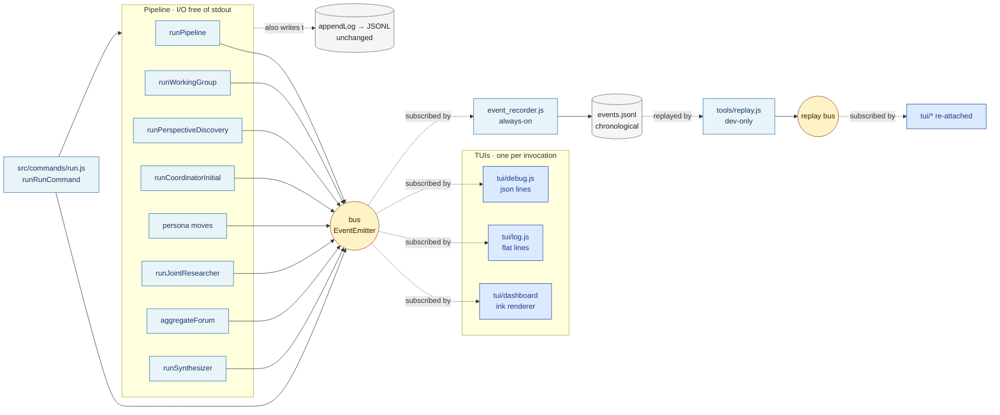

# `msv run` — TUI / Pipeline Decoupling via Event Bus

**Status:** Draft
**Author:** Eryk Napierała · 2026-05-16
**Related:** [`specs/architecture.md`](architecture.md) — pipeline this spec decouples from. [`specs/question-machine.md`](question-machine.md) — v5 stage definitions whose events this spec inventories.

---

## 1. Overview

`msv run` currently mixes three concerns in one call path: pipeline orchestration (in `src/commands/run.js`), terminal output (`process.stdout.write` interspersed with stage logic), and persistent forensic logging (`appendLog` writing JSONL to disk). The terminal output is a flat append-only stream of `→ ${id} [N/7] …` lines plus `→      …still working (Ns)` heartbeats, scrolling past as fast as the pipeline emits them. Working groups run in parallel but their log lines interleave on the same stdout, making it hard to read a single territory's progress mid-run.

This spec introduces a typed event bus inside the pipeline and ships three TUIs that consume the bus as side-by-side modules:

* **`dashboard`** (default, interactive TTY) — an [ink](https://github.com/vadimdemedes/ink)-rendered terminal dashboard. Stage list on the left, a panel per working group laid out in a grid, a budget header, and a tail of recent events. Re-renders in place; no scroll-up history.
* **`log`** (non-TTY default, e.g. CI, redirected stdout) — a flat line-per-event renderer matching the *shape* of today's `progress()` output. Preserves backward compatibility with anything that greps `msv run` logs.
* **`debug`** — every event flushed as one-line JSON to stdout. The escape hatch for grepping, jq'ing, replaying.

A fourth implicit TUI is **`silent`** — no listener attached, useful when piping through a custom consumer.

The pipeline itself stays where it is — `src/commands/run.js`, `src/working_group.js`, `src/agents/*` — but stops calling `process.stdout.write` or carrying `onProgress` callbacks. Instead each stage receives a `bus` (a typed wrapper around `node:events`'s `EventEmitter`) and calls `bus.emit('stage.start', {...})` and friends at well-defined points. The CLI command wires up exactly one TUI listener per invocation, plus one always-on **event recorder** that appends every event to `~/.msv/ideas/<id>/events.jsonl` for later replay.

A separate, internal-only tool (`tools/replay.js`, not part of the `msv` CLI) reads that file and replays the event stream into a fresh bus. The point: iterate on dashboard UI code against a captured run without re-running the pipeline. One real run costs $3–8 and 3–6 minutes; one replay costs ~zero and a few seconds. Replay supports completed runs, in-progress runs (tail-follow), and arbitrary playback speeds. This is a development helper, not a user feature — the goal is to make UI iteration cheap, not to expose replay as a `msv` subcommand.

The persistent JSONL log (`appendLog` → `~/.msv/ideas/<id>/logs/*.jsonl`) is left untouched. It serves `msv inspect` — a different consumer with different shape requirements — and decoupling those three consumers (live TUI, replay, inspector) is part of the point.

---

## 2. Status

Draft.

---

## 3. Authors

Eryk Napierała · 2026-05-16.

---

## 4. Background / Problem Statement

Reading a live `msv run --all` today is harder than it should be. Four concrete symptoms motivate this work.

**1. Interleaved working-group output.** Four to five territories run concurrently inside §5.4 of the v5 pipeline. Each emits sub-stage progress through `onProgress` in `src/working_group.js` (`[t_001] ideation done (8 candidates)`, `[t_002] adversarial pre-check start`, …). The lines are correctly prefixed by territory id, but they scroll past as a single linear stream. To watch a single territory you must `grep -F '[t_001]'` after the fact or run with `MSV_ROOT` pointed at a temp dir and tail logs. Mid-run, the user has no way to see "where is territory 3?" without scrolling.

**2. The pipeline knows about `process.stdout`.** `src/commands/run.js:35` defines `function progress(line) { process.stdout.write(\`${line}\n\`); }`, called from 20-odd sites in `runPipeline` and threaded into stages as `onProgress: (msg) => progress(\`→      ${msg}\`)`. Stages emit at different granularity (discovery streams blocks, working groups emit one line per sub-stage end, researcher emits nothing externally) and the formatting (`→`, `→      `, `→      [name]`) is hand-rolled at each call site. There is no contract for what gets emitted, so adding a new TUI means tracing every emission site.

**3. No event for things that already happen.** The Joint Researcher (`src/agents/researcher.js`) runs a multi-turn loop with web_search and web_fetch tool calls and emits nothing visible — only `appendLog` for forensic logs. From the user's perspective, the `→      [t_001] researcher start (5 questions)` line is followed by silence until `researcher done`. The `withHeartbeat` helper (`run.js:42`) papers over this by printing `…still working (Ns)` every 15s but says nothing about *what* is working.

**4. Different audiences want different views.** During hypothesis validation (the prototype's purpose, per `vision.md`) the user wants a fast overview while the run progresses. While debugging a single failing territory, the user wants every API call, every retry, every parse error. While diffing two runs after the fact, the user wants machine-readable JSONL. Today each of those needs separate tooling (one re-runs, the other tails logs, the third grep's). A typed event stream solves all three with one source-of-truth and three thin renderers.

**5. (Lesser) Inspect-tool overlap.** The persistent JSONL logs already capture most of what a debugger would want at high fidelity. But they're shaped for the inspector (per-stage files, kind-tagged records) and require post-hoc loading. Live observation is what's missing.

The goal is a single emission protocol the pipeline writes to, and a clean substitution surface for the renderer. Replacing the dashboard with a debug printer is one flag.

---

## 5. Goals

* **Define a typed event vocabulary** covering every observable pipeline transition: stage start/end, sub-stage start/end (working group six-stage flow), per-turn researcher activity, per-call API events (start, retry, error), structural milestones (territory count, candidate count, claim count), and terminal pipeline outcome.
* **Replace `process.stdout` and `onProgress` inside the pipeline** with `bus.emit(...)` calls. Pipeline code becomes I/O-free with respect to terminal output.
* **Ship three TUIs in-tree**: `dashboard` (ink, default for TTY), `log` (flat lines, default for non-TTY), `debug` (one-line JSON). Each is a single listener bound to the bus.
* **Default `dashboard` shows a live dashboard**: stage timeline header, per-working-group panels (one per territory, side by side in a grid), live budget/token counter, recent-events tail. Re-renders in place via ink; the terminal is reclaimed on exit.
* **Preserve the `log` flat shape** byte-for-byte where reasonable so that humans and scripts comparing v5 → v6 output see only minor differences (kind tags become more explicit; ordering unchanged).
* **No regression in `msv inspect`**. The JSONL persistent log keeps its shape; `appendLog` calls remain in-place. The bus is additive.
* **Make adding a new TUI a single file** under `src/tui/` with `attach(bus, options)` exporting a cleanup function. No plugin manifest, no registry beyond an enum in the CLI.
* **Auto-select TUI based on `process.stdout.isTTY`** unless `--tui=<name>` overrides. Honour `NO_COLOR`, `FORCE_COLOR`, `CI`.
* **Run multiple ideas (`run --all`) cleanly**. Either: one dashboard per idea sequentially (current execution model is already sequential at the idea level), or one dashboard that swaps between ideas. Spec settles on sequential; the dashboard mounts/unmounts per idea.
* **Persist every event to disk** in append-only JSONL (`events.jsonl`) per idea so that any TUI under development can be exercised against a real captured run without paying API cost.
* **Ship a developer-only replay tool** (`tools/replay.js`) that reads `events.jsonl` and emits into a fresh bus, supporting fast playback, real-time playback, and tail-follow against an in-progress run.

---

## 6. Non-Goals

* **No new external output sink.** No HTTP/WS server, no journald integration, no OpenTelemetry export. The bus is in-process only. (A future spec can add a "tee" listener if needed.)
* **No user-facing replay command.** The replay tool (`tools/replay.js`) is a developer aid invoked via `node tools/replay.js`, not exposed via the `msv` CLI, not documented in `--help`, not in `bin/`. It exists to make UI iteration cheap; it does not let an end user "rewatch" their investigation. (The `msv inspect` SPA remains the user-facing post-run view.)
* **No partial-run resume from `events.jsonl`.** Replay reconstructs UI state from events; it does not reconstruct pipeline state. A crashed `msv run` cannot be resumed from the event log — the manual recovery path (edit `index.json`, re-run) remains the only one.
* **No event-log compaction or rotation.** `events.jsonl` is append-only per idea. Across a typical run it stays under 200KB; we do not compress, prune, or roll it. Disk pressure is not a concern for a single-developer prototype.
* **No alternate replay TUI tree.** Replay reuses the exact same `src/tui/*` modules the live run does. The dashboard's reducer is the same function in both cases — that's the whole point of decoupling.
* **No changes to `appendLog` shape.** The forensic JSONL is decoupled from the bus by design — it serves a different consumer (`msv inspect`) with stage-specific kind tags already shipped.
* **No persistent dashboard state.** Quitting the dashboard mid-run (Ctrl-C) terminates the pipeline (same as today). No "detach" mode.
* **No mouse support, no scrollback, no theming.** Single light/dark terminal palette via ink defaults. Hex colours hard-coded where needed.
* **No multi-idea grid view.** `run --all` mounts the dashboard once per idea, sequentially. Cross-idea comparison stays in `msv inspect` territory.
* **No remote consumer protocol.** A future "JSON-line over stdout, dashboard over stderr" mode is mentioned in §15 but not delivered here.
* **No animation/easing.** Dashboard updates are direct state assignments; ink re-renders. No fade transitions.
* **No TypeScript.** Pipeline code is plain JS (`src/agents/*`, `src/working_group.js`, `src/commands/run.js`). The TUI module under `src/tui/` is also plain JS — even the ink-based one. Matches `inspect-app/` is TS-only because Vite handles transpile; here we run in Node directly under bare `node`.
* **No new dependency on `chalk`/`kleur`.** ink ships its own colour primitives via `<Text color="...">`. The `log` and `debug` TUIs use raw ANSI escapes only where the existing code does; otherwise plain text.
* **No event bus migration in `msv add`, `msv list`, `msv review`, `msv inspect`.** Those commands are interactive or one-shot, not long-running pipelines. Their stdout writes stay as-is.
* **No replacement of `withHeartbeat`** yet. The heartbeat is a useful watchdog; the dashboard rendering replaces its purpose for TTYs, but `log` and `debug` modes still benefit from periodic "alive" pings. We retain it as a bus event (`stage.heartbeat`) for the `log` mode.
* **No effort to make the dashboard accessible to screen readers.** The `log` TUI is the screen-reader path; the dashboard is for sighted, TTY users.

---

## 7. Technical Dependencies

### Runtime (existing, unchanged)

* `node >= 20` — already required. Uses `node:events`'s `EventEmitter` and `node:tty`.
* `@anthropic-ai/sdk@^0.96` — unchanged.
* `uuid@11.1.1` — unchanged.

### Runtime (new)

| Package | Version | Purpose | Why this one |
|---|---|---|---|
| `ink` | `^5.2` | React-for-CLI renderer powering the `dashboard` TUI. | De facto Node TUI library (used by GitHub Copilot CLI, Gatsby, Prisma). Alternatives considered: `blessed`/`neo-blessed` (older imperative API, jQuery-style — bad fit for declarative state changes streaming from a bus), `terminal-kit` (lower-level, no component model). ink lets the dashboard be a function of bus state, which is the right shape for this problem. **Pin to v5.x**, not the v7 latest: ink 7 requires Node ≥22, the project requires Node ≥20 (`package.json` `engines`). ink 5.2.x requires Node ≥18 and works with both React 18 and 19. |
| `ink-spinner` | `^5` | Animated spinner component (`<Spinner type="dots" />`). Peer-compatible with `ink@5.x`. | Common pattern; cheaper than rolling our own with `setInterval`. |
| `react-devtools-core` | `^4.19` | Peer dependency declared by `ink@5.x`. Without it, `npm install` prints an unmet-peer warning. | Required by ink internals (debug bridge); no source code in our tree imports it. |
| `react` | `^19` | Peer of `ink`. Already in `devDependencies` for `inspect-app/`; promote to runtime `dependencies`. | Single React major across the project. |

ink and react together add ~250kB to `node_modules` and ~5–8MB of disk weight. Acceptable for a CLI tool whose `inspect` subcommand already pulls in Vite + Mantine.

**Module-format note.** ink is published as ESM-only (`"type": "module"` in its `package.json`); the rest of `msv` is CommonJS (`"type": "commonjs"`). The dashboard module bridges this with a dynamic `await import('ink')` at attach time — see §8.6. No build step, no `.mjs` files, no project-wide ESM migration.

### Documentation referenced

* ink — <https://github.com/vadimdemedes/ink>. Specifically `<Static>`, `<Box>`, `<Text>`, `useApp`, `useInput`, and the rendering lifecycle around `render()`.
* node EventEmitter — <https://nodejs.org/api/events.html>. The `setMaxListeners` knob matters for `dashboard` (which subscribes ~15 handlers).
* React 19 release notes — `inspect-app/` already uses React 19; ink 5 is on React 18+. We pin to 19 to match the rest of the repo (`package.json` already has `react@^19.2.6`).

No CDN, no globals, no native dependencies.

---

## 8. Detailed Design

### 8.1 Architecture overview



The pipeline emits to one bus per run. Exactly one user-facing TUI is attached (or none, for `--tui=silent`). The event recorder is attached unconditionally and appends `events.jsonl`. The replay tool reads that file from a separate process, creates a fresh bus, and re-attaches any TUI module — the live and replay paths share the same TUI code. `appendLog` continues to write the per-stage forensic JSONL trail consumed by `msv inspect`, independently of the bus.

### 8.2 File layout

```text
src/
├── bus.js                          # NEW — createBus(), EVENTS catalog, safeDispatch
├── event_recorder.js               # NEW — always-on bus listener; appends events.jsonl
├── tui/
│   ├── index.js                    # NEW — selectTui({tty, mode}) returns the chosen module
│   ├── dashboard/
│   │   ├── index.js                # NEW — async attach(bus, opts) → cleanup; await import('ink')
│   │   ├── App.js                  # NEW — top-level ink component (React.createElement form)
│   │   ├── components/
│   │   │   ├── Header.js           #   topic, budget bar, status
│   │   │   ├── StageList.js        #   1..7 stage rows with state
│   │   │   ├── WorkingGroupGrid.js #   one cell per territory
│   │   │   ├── WorkingGroupCard.js #   sub-stage tracker for a single WG
│   │   │   ├── ResearcherList.js   #   in-flight researcher loops within a WG
│   │   │   ├── BudgetBar.js
│   │   │   └── RecentEvents.js     #   tail of last N events
│   │   ├── reducer.js              # NEW — pure function: (state, event) → state
│   │   └── style.js                # NEW — ink colour constants only
│   ├── log.js                      # NEW — attach(bus, opts) → cleanup
│   └── debug.js                    # NEW — attach(bus, opts) → cleanup
│                                   #       (`--tui=silent` is "no attach" in tui/index.js — no module)
├── commands/
│   └── run.js                      # MODIFIED — bus wiring, replace progress() calls
├── working_group.js                # MODIFIED — bus emits, remove onProgress
├── agents/
│   ├── discovery.js                # MODIFIED — bus emits in stream callback
│   ├── coordinator.js              # MODIFIED — bus emits around the call
│   ├── persona.js                  # MODIFIED — bus emits at move boundaries
│   ├── researcher.js               # MODIFIED — bus emits per turn / tool use
│   └── synthesizer.js              # MODIFIED — bus emits around the call
├── forum.js                        # MODIFIED — bus emits around contradiction batch
└── api_queue.js                    # MODIFIED — bus emits per call (start/retry/end)

tools/
├── replay.js                       # NEW — standalone replay tool (Phase 2); reads events.jsonl
└── replay-scrubber.js              # NEW — ink component for arrow-key scrubbing (Phase 2)

test/
├── bus.test.js                     # NEW — event vocabulary + helper invariants
├── event_recorder.test.js          # NEW — appendFile sequencing + envelope shape on disk
├── tui/
│   ├── dashboard.test.js           # NEW — reducer table-driven tests
│   ├── log.test.js                 # NEW — known-event → known-line table
│   └── debug.test.js               # NEW — payload pass-through
├── replay.test.js                  # NEW (Phase 2) — replay through stub bus from fixture jsonl
└── (existing files unchanged)
```

The dashboard tree is plain `.js` files using `React.createElement` directly — no JSX, no transpile step. ink is the only ESM peer in the tree; it's reached via `await import('ink')` at the dashboard's `attach` boundary (see §8.6). `bin/msv` continues to be a bare `node` execution. The dynamic-import bridge is intentional and scoped to one file.

### 8.3 Event vocabulary

Events are emitted on a single bus with `bus.emit(eventName, payload)`. Names use `dotted.case`. Payloads are plain objects, JSON-serialisable, with a fixed set of keys per event.

Every payload carries an implicit envelope automatically injected by `bus.emit` (the helper in `src/bus.js`):

* `ts` — `Date.now()` ms (cheap, monotonic-ish, suffices for ordering within a process)
* `idea_id` — the current investigation id, set once via `bus.setIdea(id)` per pipeline invocation

The pipeline emits the *core* payload; the envelope is wrapped on emit. Listeners receive the merged object.

#### Top-level pipeline lifecycle

| Event | Payload (core) | When emitted | Emitter |
|---|---|---|---|
| `pipeline.start` | `{ idea_id, raw_capture, model, synthesizer_model, budget }` | First line of `runPipeline` | `commands/run.js` |
| `pipeline.stage.start` | `{ stage, stage_index, total_stages }` (stage ∈ discovery, diversity, coordinator, working_groups, cross_pollination, forum, synthesis) | Top of each numbered stage in `runPipeline` | `commands/run.js` |
| `pipeline.stage.progress` | `{ stage, message }` | Free-form sub-step note (e.g. "5 personas selected"). Fallback for things not granular enough to warrant a dedicated event. | various |
| `pipeline.stage.end` | `{ stage, summary }` (summary is a small object, e.g. `{ territories: 4 }` or `{ nodes: 12, dead_ends: 2 }`) | End of each stage; carries the structured counts currently shoved into `progress()` lines | `commands/run.js` |
| `pipeline.stage.heartbeat` | `{ stage, seconds }` | Every 15s while a long stage is in flight (replaces `withHeartbeat`'s stdout writes) | `commands/run.js` |
| `pipeline.complete` | `{ idea_id, ok, used_executor_calls, used_total_tokens, used_researcher_tool_calls }` | After `idea.status='ready'` is persisted | `commands/run.js` |
| `pipeline.failed` | `{ idea_id, stage, error_message, error_stack }` | Catch block in `runOne` | `commands/run.js` |

#### Discovery (stage 1)

| Event | Payload (core) | When |
|---|---|---|
| `discovery.web_search.start` | `{ query }` | Server-tool `server_tool_use` block of type `web_search` arrives in stream |
| `discovery.web_search.result` | `{ query, count }` | `web_search_tool_result` block arrives in stream |
| `discovery.emit_personas` | `{ count, retry }` | `tool_use` for `emit_personas` block arrives in stream (retry: false on first turn, true on forced second turn) |

#### Coordinator (stage 3)

| Event | Payload (core) | When |
|---|---|---|
| `coordinator.territories.emitted` | `{ count, names: string[] }` | After `runCoordinatorInitial` returns; replaces today's `→      ${territories.length} territories: ${territoryNames}` line |

#### Working group (stage 4 — six sub-stages, fan-out across pairs)

These carry a `territory_id` correlation key. The dashboard groups by it.

| Event | Payload (core) | When |
|---|---|---|
| `wg.start` | `{ territory_id, territory_name, assigned_pair, distinctness_score }` | Top of `runWorkingGroup` |
| `wg.ideation.start` | `{ territory_id }` | Top of 5.4a |
| `wg.ideation.persona.done` | `{ territory_id, persona_id, candidate_count }` | After each persona's parallel ideation Promise resolves |
| `wg.ideation.done` | `{ territory_id, total_candidates }` | End of 5.4a |
| `wg.adversarial.start` | `{ territory_id }` | Top of 5.4b |
| `wg.adversarial.done` | `{ territory_id, mark_count, partial: boolean }` | End of 5.4b |
| `wg.alignment.start` | `{ territory_id }` | Top of 5.4c |
| `wg.alignment.done` | `{ territory_id, move_count, aligned_count, by_origin: { aligned, minority_<persona_id> } }` | End of 5.4c |
| `wg.researcher.start` | `{ territory_id, aligned_id, question }` | Top of `researchOne` for each aligned question |
| `wg.researcher.turn` | `{ territory_id, aligned_id, turn_index, stop_reason, server_tool_calls, forced }` | After each researcher loop turn |
| `wg.researcher.web_search` | `{ territory_id, aligned_id, query }` | Per server_tool_use block of type web_search |
| `wg.researcher.web_fetch` | `{ territory_id, aligned_id, url }` | Per server_tool_use block of type web_fetch |
| `wg.researcher.done` | `{ territory_id, aligned_id, outcome, finding_count }` | After researcher emits report |
| `wg.observation.start` | `{ territory_id }` | Top of 5.4e |
| `wg.observation.done` | `{ territory_id, observation_count }` | End of 5.4e |
| `wg.debate.start` | `{ territory_id }` | Top of 5.4f |
| `wg.debate.done` | `{ territory_id, move_count, claim_count, terminated_by }` | End of 5.4f |
| `wg.move` | `{ territory_id, phase, move_id, persona_id, type, confidence? }` (phase ∈ `alignment` \| `debate`; type ∈ Propose/Sharpen/Merge/Drop/Defer for alignment; Claim/Support/Rebut/Question/Concede for debate; `confidence` only on debate moves) | Each accepted move in either sub-stage |
| `wg.end` | `{ territory_id, candidate_count, aligned_count, report_count, observation_count, claim_count, terminated_by }` | Return point of `runWorkingGroup`. Replaces today's per-territory summary line. |
| `wg.failed` | `{ territory_id, reason }` | When `runWorkingGroupsConcurrently` sees a `Promise.allSettled` rejection |

#### Cross-pollination (stage 5)

| Event | Payload (core) | When |
|---|---|---|
| `cross_pollination.reaction` | `{ persona_id, target_territory_id, claim_id, type, confidence }` | After each accepted reaction |
| `cross_pollination.done` | `{ reaction_count }` | End of stage |

#### Forum (stage 6)

| Event | Payload (core) | When |
|---|---|---|
| `forum.contradiction.judged` | `{ a_node, b_node, contradicts: boolean }` | Each contradiction LLM call resolves |
| `forum.done` | `{ node_count, contradiction_count, dead_end_count }` | End of stage |

#### Synthesizer (stage 7)

| Event | Payload (core) | When |
|---|---|---|
| `synthesizer.done` | `{ headline_count, tension_count, has_question_landscape, has_dead_end_summary }` | After tool emit parses |

#### API queue (cross-cutting)

| Event | Payload (core) | When | Emitter |
|---|---|---|---|
| `api.call.start` | `{ call_id, model }` (call_id is a monotonic counter) | Inside `enqueue` after slot acquired | `api_queue.js` |
| `api.call.retry` | `{ call_id, attempt, reason, wait_ms }` | Inside `runWithRetries` retry branch | `api_queue.js` |
| `api.call.end` | `{ call_id, outcome, ms, input_tokens?, output_tokens?, attempt?, error_message? }` (outcome ∈ `ok` \| `failed`; token counts on `ok`; `attempt` + `error_message` on `failed`) | After `fn()` returns OR after the final retry throws | `api_queue.js` |

`api.*` events are high-frequency (tens to hundreds per run). The `dashboard` aggregates them into a queue-status header; the `log` mode mutes them by default (toggleable with `--verbose-api`); `debug` lets them through.

#### Event-count expectations per run

For a typical v5 run (4 territories, 5 aligned questions each, 200–300k tokens):

| Event class | Count |
|---|---|
| `pipeline.*` lifecycle | ~16 |
| `discovery.*` | ~10 |
| `coordinator.*` | ~1 |
| `wg.*` (per territory ~40) | ~160 |
| `cross_pollination.*` | ~10 |
| `forum.*` | ~25 |
| `synthesizer.*` | ~1 |
| `api.call.*` | ~250–500 |

Total ~500–800 events per run. At one event per ms even at the heaviest moment, the renderer is the only realistic bottleneck — see §12.

### 8.4 The bus module (`src/bus.js`)

```js
// src/bus.js (sketch)
'use strict';

const { EventEmitter } = require('node:events');

// Authoritative event names. Listeners and emitters import these to avoid typos.
const EVENTS = Object.freeze({
  PIPELINE_START: 'pipeline.start',
  PIPELINE_STAGE_START: 'pipeline.stage.start',
  PIPELINE_STAGE_PROGRESS: 'pipeline.stage.progress',
  PIPELINE_STAGE_END: 'pipeline.stage.end',
  PIPELINE_STAGE_HEARTBEAT: 'pipeline.stage.heartbeat',
  PIPELINE_COMPLETE: 'pipeline.complete',
  PIPELINE_FAILED: 'pipeline.failed',
  // …discovery, coordinator, wg.*, cross_pollination.*, forum.*, synthesizer.*, api.call.*…
});

function createBus() {
  const emitter = new EventEmitter();
  emitter.setMaxListeners(40); // dashboard subscribes ~15; headroom for future TUIs
  let ideaId = null;

  function setIdea(id) {
    ideaId = id;
  }

  function emit(name, payload = {}) {
    const envelope = { ts: Date.now(), idea_id: ideaId, ...payload };
    safeDispatch(name, envelope);
    safeDispatch('*', { name, ...envelope }); // catch-all for debug/log/recorder
  }

  // EventEmitter's default emit throws on the first listener that raises,
  // and stops calling subsequent listeners. We want exactly the opposite:
  // a broken TUI must never abort the pipeline, and a broken TUI must
  // never silently mute other listeners on the same event. Wrap each
  // listener invocation individually.
  function safeDispatch(name, envelope) {
    const listeners = emitter.listeners(name);
    for (const fn of listeners) {
      try {
        fn(envelope);
      } catch (err) {
        process.stderr.write(
          `[msv:bus] listener for ${name} threw: ${err?.message || err}\n`
        );
      }
    }
  }

  function on(name, handler) {
    emitter.on(name, handler);
    return () => emitter.off(name, handler);
  }

  function onAny(handler) {
    return on('*', handler);
  }

  return { emit, on, onAny, setIdea, _emitter: emitter, EVENTS };
}

module.exports = { createBus, EVENTS };
```

Three deliberate choices in this sketch:

1. **Catch-all `*` event.** Lets `debug` and `log` listen with one handler instead of subscribing to 40 names. Not a Node convention but cheap and removes a class of "we forgot to subscribe to event X" bugs in the renderers.
2. **`on` returns a cleanup function.** Mirrors the React `useEffect` convention. `attach()` in each TUI returns a single `() => cleanups.forEach(c => c())`.
3. **`setMaxListeners(40)`.** Node defaults to 10 and emits a warning beyond that. The dashboard alone exceeds this.

### 8.5 Pipeline integration

The `bus` flows through the pipeline as a regular argument. No async-local-storage, no globals. Concretely:

```js
// src/commands/run.js (sketch — modified)
const { createBus } = require('../bus');
const { selectTui } = require('../tui');

async function runOne(idea, client, busFactory) {
  const bus = busFactory();
  bus.setIdea(idea.id);
  const tui = selectTui();
  const cleanup = tui.attach(bus, { idea });

  try {
    await runPipeline(idea, client, bus);
    bus.emit('pipeline.complete', { ok: true, /* counters */ });
    return { ok: true };
  } catch (error) {
    bus.emit('pipeline.failed', {
      stage: bus._currentStage,            // tracked via on('pipeline.stage.start')
      error_message: error.message,
      error_stack: error.stack,
    });
    return { ok: false, error };
  } finally {
    await cleanup(); // ink unmount + final flush
  }
}
```

`runPipeline(idea, client, bus)` carries `bus` through to every helper. The `withHeartbeat` helper accepts `bus` and emits `pipeline.stage.heartbeat` instead of writing to stdout:

```js
async function withHeartbeat(stage, bus, fn) {
  const start = Date.now();
  const timer = setInterval(() => {
    bus.emit('pipeline.stage.heartbeat', {
      stage,
      seconds: Math.round((Date.now() - start) / 1000),
    });
  }, HEARTBEAT_MS);
  try {
    return await fn();
  } finally {
    clearInterval(timer);
  }
}
```

Working group integration replaces `onProgress` with `bus`:

```js
// src/working_group.js (sketch — modified)
async function runWorkingGroup({ client, idea, model, synthesizerModel, budget, territory, personas, bus }) {
  const territoryId = territoryKey(territory);
  const safeTerritoryId = safeSlug(territoryId);
  bus.emit('wg.start', {
    territory_id: safeTerritoryId,
    territory_name: territory.name,
    assigned_pair: territory.assigned_pair,
    distinctness_score: territory.pair_distinctness_score,
  });

  bus.emit('wg.ideation.start', { territory_id: safeTerritoryId });
  // …each persona's runIdeation resolves…
  for (const personaResult of ideationResults) {
    bus.emit('wg.ideation.persona.done', {
      territory_id: safeTerritoryId,
      persona_id: personaResult.persona_id,
      candidate_count: personaResult.candidate_questions.length,
    });
  }
  bus.emit('wg.ideation.done', {
    territory_id: safeTerritoryId,
    total_candidates: result.candidate_questions.length,
  });
  // …same pattern for adversarial / alignment / researcher / observation / debate…
}
```

Discovery, coordinator, persona, researcher, synthesizer follow the same pattern — bus passed in, emit at the boundaries described in §8.3. `onProgress` arguments are removed.

API queue gains a single hook:

```js
// src/api_queue.js (modified excerpt)
let busRef = null;
function setBus(bus) { busRef = bus; }

async function enqueue(fn, { model } = {}) {
  await acquireSlot();
  const callId = ++callCounter;
  if (busRef) busRef.emit('api.call.start', { call_id: callId, model });
  const startedAt = Date.now();
  try {
    const result = await runWithRetries(fn, startedAt, callId);
    if (busRef) {
      const usage = result?.usage || {};
      busRef.emit('api.call.end', {
        call_id: callId,
        ms: Date.now() - startedAt,
        input_tokens: usage.input_tokens || 0,
        output_tokens: usage.output_tokens || 0,
      });
    }
    return result;
  } finally {
    releaseSlot();
  }
}

module.exports = { enqueue, getStats, setBus };
```

The module-level `setBus` is intentional (vs threading `bus` through every callsite). `api_queue` is a singleton service and the bus is also effectively a singleton per `runRunCommand` invocation. The trade-off: if two pipelines run in parallel (today: never), the latest `setBus` wins. We don't support that.

### 8.6 The `dashboard` TUI

The default for interactive TTYs. Layout (ASCII mock, terminal 120×40):

```
─ msv investigating 8db8e9bf · Should I start a small urban farm? ───── api: 12 inflight / 3 queued · 47s elapsed ─
 ⠹ 1. discovery        ✓ 10 personas · 3 web searches
 ⠹ 2. diversity        ✓ 5 selected (+ skeptic + builder)
 ⠹ 3. coordinator      ✓ 4 territories: commercial-viability, cognitive-load, regulatory, environmental
 → 4. working groups   running · 3/4 done
   5. cross-poll       —
   6. forum            —
   7. synthesis        —

 budget: ████████░░░░░░░░░  68 / 180 executor calls · 142k / 1.5M tokens · $4.20

┌─ t_001 commercial-viability (p_002 × p_005) ─────┐ ┌─ t_002 cognitive-load (p_001 × p_007) ───────────┐
│ ✓ ideation     (8 candidates)                    │ │ ✓ ideation     (10 candidates)                   │
│ ✓ adversarial  (6 marks)                         │ │ ✓ adversarial  (8 marks)                         │
│ ✓ alignment    (7 moves, 5 aligned)              │ │ ✓ alignment    (5 moves, 4 aligned)              │
│ → researcher   3/5 done · q4 web_fetch(ft.com)   │ │ → researcher   4/4 done                          │
│   observation                                     │ │ → observation  …                                 │
│   debate                                          │ │   debate                                         │
└──────────────────────────────────────────────────┘ └──────────────────────────────────────────────────┘

┌─ t_003 regulatory (p_003 × p_006) ──────────────┐  ┌─ t_004 environmental (p_004 × skeptic) ──────────┐
│ ✓ ideation     (6 candidates)                    │ │ ✓ ideation     (9 candidates)                    │
│ ✓ adversarial  (4 marks)                         │ │ ✓ adversarial  (7 marks)                         │
│ ✓ alignment    (6 moves, 5 aligned)              │ │ ✓ alignment    (8 moves, 5 aligned)              │
│ ✓ researcher   5/5 done                          │ │ ✓ researcher   5/5 done                          │
│ ✓ observation  (12 observations)                 │ │ ✓ observation  (10 observations)                 │
│ → debate       4 moves, 0 claims                 │ │ ✓ debate       (7 moves, 3 claims · concession)  │
└──────────────────────────────────────────────────┘ └──────────────────────────────────────────────────┘

 latest:
   [t_001] researcher wg.researcher.web_fetch ft.com/content/…
   [t_004] debate     wg.move m_t_004_007 Concede conf=8
   [t_001] researcher wg.researcher.turn 2  forced=false
   [api]     call 198 → 1.8s · 11k in · 0.6k out · ok
   [t_002] observation wg.observation.done (10)

 [q] quit  [d] toggle debug events  [enter] full event tail (stdout when exited)
```

Three rules govern the layout:

* **Stages occupy fixed slots.** The header `1..7` rows never reflow; their status updates in place.
* **Working-group cells reflow on terminal resize.** Default: 2-column grid; 3-column on ≥160 cols; 1-column on <100 cols. Cells stack newest-first by `wg.start` order to keep early ones at the top.
* **The "latest" tail is bounded.** Last 5 events, oldest scrolled off. No scroll-up.

#### Dashboard internals

```js
// src/tui/dashboard/index.js (sketch)
const React = require('react');
const App = require('./App');
const { reduce, initialState } = require('./reducer');

// ink is ESM-only; load it via dynamic import so this CJS module stays
// loadable from the rest of the CJS project. attach() is async because
// of this; callers in runOne already await it.
async function attach(bus, { idea }) {
  const { render } = await import('ink');

  let state = initialState({ idea });
  let setReactState = null;
  const onEvent = (env) => {
    state = reduce(state, env);
    if (setReactState) setReactState(state);
  };
  const off = bus.onAny(onEvent);

  const inst = render(
    React.createElement(App, {
      initialState: state,
      registerSetState: (fn) => { setReactState = fn; },
    })
  );

  function reset() {
    state = initialState({ idea });
    if (setReactState) setReactState(state);
  }

  return {
    cleanup: async () => {
      off();
      inst.unmount();
      await inst.waitUntilExit();
    },
    reset,
    getState: () => state,
  };
}

module.exports = { attach, App, reducer, initialState };
```

Two notes on the public surface:

* **`attach` now returns an object, not a bare function.** Callers destructure `{ cleanup }` for the common case; the replay tool also reads `reset` to clear reducer state on backward seeks (see §8.15.5). The live `runOne` path uses only `cleanup`; everything else is dead code in that path.
* **`App`, `reducer`, `initialState` are exported.** The replay tool needs them to compose its own ink root with the dashboard plus a scrubber footer (§8.15.5). The live path ignores these exports.

The `await import('ink')` is the only ESM↔CJS bridge in the tree. All other dashboard files (`App.js`, `reducer.js`, `components/*.js`) stay CJS and use `React.createElement` form — no JSX, no transpile step, runs under bare `node`. The same pattern handles `ink-spinner` if/when used inside a component (`const { default: Spinner } = await import('ink-spinner')` at module load via top-level `await` in an async factory, or inline at first-use).

`reducer.js` is a pure `(state, envelope) => state` function. Each event updates one slice:

* `pipeline.stage.start` flips a stage row to "running".
* `wg.start` adds a working-group cell.
* `wg.<substage>.start` and `wg.<substage>.done` flip the substage marker inside the cell.
* `wg.researcher.start`/`done` track aligned-question progress as `3/5` within the researcher line.
* `wg.researcher.web_search`/`web_fetch` overwrite a single-line "current activity" string in the cell ("q4 web_fetch(ft.com)").
* `api.call.*` updates the api-status pill in the header (inflight/queued/total).
* `pipeline.stage.heartbeat` is **ignored** by the dashboard (ink already re-renders on its own clock; the heartbeat is for the `log` TUI's "alive" pings).

#### Keyboard

`ink` provides `useInput`. Bindings:

| Key | Effect |
|---|---|
| `q` or `Ctrl-C` | Send `SIGINT` to self → existing pipeline shutdown path |
| `d` | Toggle a "debug events" pane that prints all events in raw JSON below the main view (re-renders in place) |
| `enter` | No-op while running; on exit, prints last 100 events to stdout so the user can scroll back |

#### Non-TTY guard

If **either** `process.stdout.isTTY` or `process.stdin.isTTY` is false at attach time, the dashboard refuses to mount and prints `dashboard requires a TTY on stdin and stdout; falling back to log mode` to stderr, then attaches the `log` TUI instead. Both checks matter: ink's `useInput` hook puts stdin into raw mode, which throws when stdin is a pipe (CI runners, tests, certain editor terminals). CLI flag `--tui=dashboard` overrides this only if `FORCE_TTY=1` is set (escape hatch for manual testing).

### 8.7 The `log` TUI

The format mirrors today's stdout shape, with these explicit changes:

* Each line is prefixed `[level] [stage]` instead of free-form `→`/`→      `. Levels: `info` (default), `warn`, `error`. Stages map 1:1 to the §8.3 stage names.
* `api.call.*` is muted by default. `--verbose-api` includes them.
* Heartbeat lines mirror today's `…still working (Ns)` format byte-for-byte to keep scrapers happy.

Sample lines:

```
[info] [pipeline] starting 8db8e9bf · Should I start a small urban farm?
[info] [discovery] stage 1/7 — perspective discovery (interrogative posture)…
[info] [discovery] web_search: small urban farm economics
[info] [discovery] web_search returned 8 results
[info] [discovery] emit_personas (11 candidates)
[info] [discovery] done · 11 candidates · 3 searches
[info] [coordinator] stage 3/7 — territories…
[info] [coordinator] done · 4 territories: commercial-viability, cognitive-load, regulatory, environmental
[info] [t_001] wg.ideation.done · 8 candidates
[info] [t_002] wg.ideation.done · 10 candidates
[warn] [t_001] wg.researcher.turn 5 stop_reason=max_tokens forced=true
[info] [t_001] wg.end · 5 aligned, 5 reports, 12 observations, 3 claims · mutual_concession
[info] [pipeline] heartbeat · forum · 18s
[info] [pipeline] complete · 68 calls · 142k tokens · $4.20
```

The mapping is implemented as a flat table in `src/tui/log.js`:

```js
// src/tui/log.js (sketch)
const FORMATTERS = {
  'pipeline.start': (e) => `[info] [pipeline] starting ${e.idea_id} · ${e.raw_capture}`,
  'pipeline.stage.start': (e) => `[info] [${e.stage}] stage ${e.stage_index}/${e.total_stages} — ${e.stage}…`,
  'pipeline.stage.heartbeat': (e) => `[info] [pipeline] heartbeat · ${e.stage} · ${e.seconds}s`,
  'wg.end': (e) => `[info] [${e.territory_id}] wg.end · ${e.aligned_count} aligned, ${e.report_count} reports, ${e.observation_count} observations, ${e.claim_count} claims · ${e.terminated_by}`,
  // …others…
};

function attach(bus, opts) {
  const verboseApi = !!opts.verboseApi;
  const off = bus.onAny((env) => {
    if (!verboseApi && env.name.startsWith('api.')) return;
    const fmt = FORMATTERS[env.name];
    if (!fmt) return; // unknown event = silently ignored in log mode
    process.stdout.write(`${fmt(env)}\n`);
  });
  return async () => off();
}
```

### 8.8 The `debug` TUI

Single-line JSON per event, machine-parseable, no muting:

```
{"name":"pipeline.start","ts":1731786000123,"idea_id":"8db8e9bf-…","raw_capture":"Should I start a small urban farm?","model":"claude-sonnet-4-6","synthesizer_model":"claude-haiku-4-5","budget":{…}}
{"name":"discovery.web_search.start","ts":1731786001456,"idea_id":"8db8e9bf-…","query":"small urban farm economics"}
{"name":"wg.researcher.web_fetch","ts":1731786042789,"idea_id":"8db8e9bf-…","territory_id":"t_001","aligned_id":"aq_…_001","url":"https://www.ft.com/content/…"}
…
```

Implementation is one function: `bus.onAny((env) => process.stdout.write(JSON.stringify(env) + '\n'))`. Useful for `msv run <id> --tui=debug > events.jsonl` followed by `jq` or replay scripts.

### 8.9 TUI selection (`src/tui/index.js`)

```js
// src/tui/index.js (sketch)
const log = require('./log');
const debug = require('./debug');

// "silent" mode is the absence of a TUI, not a module.
const NO_ATTACH = { attach: async () => async () => {} };

// Lazy-require dashboard so the ink dep doesn't load in CI/non-TTY paths
// (faster startup, smaller cold-import surface when running with --tui=log).
function loadDashboard() { return require('./dashboard'); }

function selectTui({ explicit, isStdoutTty, isStdinTty, env = process.env } = {}) {
  const dashboardCapable = !!isStdoutTty && !!isStdinTty;

  if (explicit === 'silent') return NO_ATTACH;
  if (explicit === 'debug') return debug;
  if (explicit === 'log') return log;
  if (explicit === 'dashboard') {
    if (dashboardCapable || env.FORCE_TTY === '1') return loadDashboard();
    process.stderr.write(
      'dashboard requires a TTY on stdin and stdout; falling back to log mode\n'
    );
    return log;
  }
  // Auto:
  if (env.CI || env.NO_TUI) return log;
  if (!dashboardCapable) return log;
  return loadDashboard();
}

module.exports = { selectTui };
```

CLI surface:

```text
msv run [--all | <id>] [--tui=dashboard|log|debug|silent] [--verbose-api]
```

Default selection rules:

| Condition | TUI |
|---|---|
| `--tui=<x>` provided | exactly `<x>`; `dashboard` falls back to `log` if either stdin or stdout is not a TTY (unless `FORCE_TTY=1`); `silent` attaches no listener |
| `CI` env set | `log` |
| `NO_TUI` env set | `log` |
| stdin or stdout not a TTY | `log` |
| otherwise | `dashboard` |

### 8.10 What goes away

* `src/commands/run.js`:`progress()` — deleted.
* `src/commands/run.js`:`withHeartbeat()` — keeps its timer but emits `pipeline.stage.heartbeat` instead of `process.stdout.write`.
* All `onProgress:` callback parameters in `src/agents/discovery.js` and `src/working_group.js` — removed; replaced by bus.
* All `progress(\`→      ${msg}\`)` callsites in `runPipeline` — replaced by `bus.emit('pipeline.stage.progress', { stage, message })`.
* `process.stdout.write` calls in `runPipeline` and `runOne` for stage transitions — replaced by emits.

What stays:

* `appendLog` — every call. The JSONL trail is the inspector's input and is unaffected.
* `process.stdout.write` in `runRunCommand` for terminal user prompts (`Usage: msv run …`, `nothing to run`, the `re-run? [y/N]` confirmation via `readline`) — these are interactive UI, not pipeline progress.

### 8.11 Data model changes

None. The bus carries event payloads; nothing about the persisted investigation schema (`index.json`) changes.

### 8.12 API changes

External users have one CLI surface: `msv run`. The change is additive — new `--tui` and `--verbose-api` flags. Default behaviour for a TTY user changes from "scrolling lines" to "dashboard"; this is the explicit user-visible benefit.

For scripts or CI piping `msv run` into a file: stdout is not a TTY, so the `log` TUI is selected automatically — output stays line-oriented and grep-able.

### 8.13 Error handling

* **Bus listener throws.** Node's `EventEmitter` re-throws synchronously on the first failing listener and skips the rest. `src/bus.js`'s `safeDispatch` (§8.4) iterates listeners individually with per-listener try/catch, so a broken TUI cannot crash the run nor mute peer listeners. Failures land on `process.stderr` as one `[msv:bus] listener for <name> threw: <message>` line; we do not persist them — the next run will re-surface the issue, and a broken TUI is a development-time concern not a production forensic one.
* **ink fails to render.** `render()` throws on stream init? The dashboard `attach` catches and falls back to `log` TUI. A single warning line to stderr.
* **Pipeline throws.** Existing path: `runOne` catches and prints `✗ ${idea.id} stage failed…`. Becomes: `runOne` emits `pipeline.failed` then awaits TUI cleanup. The TUI is responsible for rendering the error (dashboard: red banner; log: `[error] [stage] ${message}` line; debug: JSON line).
* **Process termination via Ctrl-C.** The CLI installs a SIGINT handler that calls `cleanup()` then exits. ink's `useApp().exit()` is called from inside the App component on the `q` key.

### 8.14 Concurrency model

Working groups already run in parallel via `Promise.allSettled` (`runWorkingGroupsConcurrently` in `run.js`). The bus is fine with this: `EventEmitter.emit` is synchronous, single-threaded JS. Events from `t_001` and `t_002` interleave in emit order, which is the order the dashboard wants anyway for the "latest" tail.

The api_queue runs up to 6 concurrent API calls. `api.call.start` and `api.call.end` arrive in interleaved order, monotonically increasing `call_id`. The dashboard tracks `inflight = started - ended` for its header.

No locks, no queues, no buffering. Backpressure is not a concern at ~10 events/second peak rate.

### 8.15 Event recording and replay

The goal is to **decouple UI iteration from pipeline cost.** A real `msv run` costs $3–8 and 3–6 minutes. A dashboard tweak should not require that. The recording mechanism captures every bus event on disk during the live run; the replay tool reads it back into a fresh bus and attaches any TUI.

This whole subsystem is for the developer, not the user — it does not change `msv run`'s output, does not surface a new command, and adds one always-on listener plus one standalone script.

#### 8.15.1 Recording (always on)

A single bus listener in `src/event_recorder.js` is attached unconditionally by `runOne` before the user-facing TUI mounts. For every envelope received via `bus.onAny`, it writes one JSON line to `~/.msv/ideas/<id>/events.jsonl` via `fs.promises.appendFile`. Lines are envelopes verbatim, including `ts` (millisecond timestamp) and `name`, so the file format is identical to `--tui=debug` output.

```js
// src/event_recorder.js (sketch)
'use strict';
const fs = require('node:fs/promises');
const path = require('node:path');
const { ideaDir } = require('./storage');

function attachRecorder(bus, { idea }) {
  if (process.env.MSV_NO_RECORD === '1') {
    return async () => {};
  }
  const filePath = path.join(ideaDir(idea.id), 'events.jsonl');
  const queue = [];
  let writing = false;

  async function flush() {
    if (writing) return;
    writing = true;
    try {
      while (queue.length > 0) {
        const batch = queue.splice(0, queue.length);
        await fs.appendFile(filePath, batch.join(''), 'utf8');
      }
    } finally {
      writing = false;
    }
  }

  const off = bus.onAny((env) => {
    queue.push(`${JSON.stringify({ name: env.name, ...env })}\n`);
    flush(); // fire and forget; serialized via `writing` guard
  });

  return async () => {
    off();
    await flush();
  };
}

module.exports = { attachRecorder };
```

Design choices:

* **Batched but non-blocking append.** Events arrive ~10/sec at peak; serial `appendFile` per event would be fine but the queue+guard pattern coalesces bursts (working-group fan-out emits ~10 events in one tick) into a single syscall.
* **No fsync.** A crash mid-run loses at most a few hundred ms of events; the inspect-tool JSONL `logs/*.jsonl` files remain authoritative for forensics. Replay's purpose is dashboard iteration, not crash recovery.
* **Envelope shape preserved on disk.** `name` is the first key for human readability; the rest of the envelope follows. `JSON.parse` round-trips losslessly.
* **`MSV_NO_RECORD=1` opt-out.** Useful when running the test suite (a recording per fixture would clutter `~/.msv/`).

File path: `~/.msv/ideas/<id>/events.jsonl`. Top-level alongside `index.json`, not inside `logs/`, because it's a primary artefact (peer of `index.json`) consumed by the replay tool — not a per-stage forensic log.

#### 8.15.2 Replay tool (`tools/replay.js`)

A standalone Node script invoked as:

```
node tools/replay.js <id> [--tui=dashboard|log|debug] [--follow]
```

No `--realtime` and no `--speed` flag. Realtime playback is the only behaviour for completed runs — autoplay starts at the first event's `ts` and runs to the last. If the developer wants to fast-forward, they hold the right arrow (each repeat steps 1s; with typical terminal key-repeat of ~30/s, that's ~30× event-time-per-real-second, plenty for skipping through quiet stretches). Scrubbing replaces what a `--speed=N` flag would buy and makes the UX consistent: one control surface, not two.

Not registered in `package.json`'s `bin` map. Not documented in `msv --help`. Lives in `tools/` because that directory is the de facto "dev scripts" home, semantically separate from the user-facing CLI in `bin/msv`.

Behaviour:

1. Resolve `<id>` → `~/.msv/ideas/<id>/events.jsonl` (or `~/.msv/archive/<id>/…`). Exit 1 if missing.
2. Create a fresh bus via `createBus()`. Call `bus.setIdea(id)`.
3. Select TUI via `selectTui({ explicit: opts.tui || 'dashboard', isStdoutTty: process.stdout.isTTY, isStdinTty: process.stdin.isTTY })`. Defaults to dashboard because the whole point is UI iteration.
4. **Mount the ink tree.** Two paths depending on the selected TUI:
   - **Dashboard path** (the common case): replay does NOT call `dashboard.attach()`. Instead it imports `{ App, reducer, initialState }` from `src/tui/dashboard`, composes its own ink root — `<Box flexDirection="column"><App registerSetState={…} initialState={…} /><Scrubber events={…} bus={bus} reset={…} /></Box>` — and calls `ink.render()` directly. The replay tool owns the bus listener that flows events through the reducer into the dashboard's state, and owns the position cursor consumed by Scrubber. `dashboard.attach()`'s `reset` capability is reused via direct import: `state = initialState({ idea })` and pushing into `setReactState`. This pattern is exactly why §8.6 exports `App`, `reducer`, `initialState` as a public surface.
   - **Log/debug path**: no scrubber, no progress region — replay uses `tui.attach(bus, { idea })` as written. Process exits at EOF.
5. Load all events into memory (~160KB for a typical run — trivial), then start the realtime scheduler from event 0. Or, if `--follow` was passed, tail the file instead (§8.15.3).
6. After the last event, keep the TUI mounted until the user hits Ctrl-C. The dashboard remains at the final state; arrow keys scrub through history (§8.15.5).

The recorder also captures `pipeline.complete` / `pipeline.failed`, so the dashboard's "done" state renders identically on replay.

```js
// tools/replay.js (sketch — dashboard path; log/debug uses tui.attach as today)
'use strict';
const React = require('react');
const { createBus } = require('../src/bus');
const dashboardModule = require('../src/tui/dashboard'); // { App, reducer, initialState }
const Scrubber = require('./replay-scrubber');

async function replayDashboard({ ideaId, follow }) {
  const file = resolveEventsPath(ideaId);
  const { render, Box } = await import('ink'); // ESM bridge (same as §8.6)
  const bus = createBus();
  bus.setIdea(ideaId);

  // Replay owns the dashboard reducer state directly; Scrubber owns the
  // cursor and scheduler. No call to dashboard.attach() — that path is
  // for live runs.
  let dashState = dashboardModule.initialState({ idea: { id: ideaId } });
  let setDashState = null;
  const onEvent = (env) => {
    dashState = dashboardModule.reducer(dashState, env);
    if (setDashState) setDashState(dashState);
  };
  const off = bus.onAny(onEvent);

  const reset = () => {
    dashState = dashboardModule.initialState({ idea: { id: ideaId } });
    if (setDashState) setDashState(dashState);
  };

  const emitOne = (env) => {
    // Drop name + ts; bus.emit re-injects current ts. Original ts is only
    // used by the scrubber for scheduling and progress math.
    const { name, ts, idea_id, ...payload } = env;
    bus.emit(name, payload);
  };

  if (follow) {
    // Follow mode: no scrubber, no progress region — tail the live file.
    const inst = render(
      React.createElement(dashboardModule.App, {
        initialState: dashState,
        registerSetState: (fn) => { setDashState = fn; },
      })
    );
    await tailFollow(file, emitOne);
    await waitForSigint();
    off();
    inst.unmount();
    return inst.waitUntilExit();
  }

  // Default: realtime playback of a completed file with scrubber + progress.
  const events = await loadJsonl(file);
  const inst = render(
    React.createElement(Box, { flexDirection: 'column' },
      React.createElement(dashboardModule.App, {
        initialState: dashState,
        registerSetState: (fn) => { setDashState = fn; },
      }),
      React.createElement(Scrubber, {
        events,
        emitOne,
        reset,
        onExit: () => inst.unmount(),
      })
    )
  );
  await inst.waitUntilExit();
  off();
}
```

The log/debug path is unchanged from earlier sketches — `await tui.attach(bus, { idea })` then tail or emit-from-file.

#### 8.15.3 Modes

There are exactly two modes: **realtime playback (default)** and **`--follow`**. No fast mode, no speed flag.

**Default (realtime playback of a completed run).** Load the entire `events.jsonl` into memory, then schedule each event at `(event.ts - first_event.ts)` ms after playback start. Dashboard transitions through every state the live run produced, at the original pace. The user can intervene at any time:

- Arrow keys pause autoplay and scrub through the timeline (§8.15.5). Holding right-arrow advances ~10–30s of event-time per real second (depending on the terminal's key-repeat rate), replacing what a `--speed=N` flag would have done.
- `space` resumes autoplay from the current scrubber position.

This is the right mode for both static and timing-sensitive UI iteration. If you only care about the final state, hold `⇧→` until the time bar fills. If you want to study a specific transition, scrub to it.

**`--follow`.** Open `events.jsonl` and tail it — emit existing lines fast, then poll `fs.stat` every 200ms for size growth, read new lines as they arrive, emit each. Right mode when a *real* `msv run` is in flight in another terminal: the developer can iterate on the dashboard against a live run, in a separate process, without disturbing the run itself. Stop conditions: receive `pipeline.complete` / `pipeline.failed` AND no new lines for 2s, OR user hits Ctrl-C. **Scrubbing is disabled in `--follow`** — the position is always "tail" by construction; arrow keys are passed through to the dashboard's own bindings.

#### 8.15.4 Why this design and not alternatives

* **Why not in-process replay (a `--replay <id>` flag on `msv run`)?** Would conflate two concerns and require the live pipeline code path to accept "no pipeline, just events" branches. Standalone tool keeps the live and replay paths cleanly separated.
* **Why not generate `events.jsonl` from `inspect-view.json`?** The inspector view is *derived* — confidence trajectories, contradiction edges, stage durations — and elides intermediate events. The dashboard needs the raw stream.
* **Why not `appendLog`-style per-stage files?** Replay needs a single chronological stream. The forensic per-stage logs serve a different consumer and don't preserve cross-stage ordering.
* **Why not just `--tui=debug > events.jsonl` and consume that?** Almost works, but: (a) requires the user to remember the redirect, (b) `--tui=debug` is mutually exclusive with the dashboard, defeating the live-watch use case, (c) `--follow` mode needs the file to be appended to *during* a live run, which requires the recorder to be unconditional. Always-on recording costs ~zero and unblocks all three workflows.

#### 8.15.5 Interactive scrubbing (`--tui=dashboard` only)

After the replay engine has loaded `events.jsonl` into an in-memory array (default realtime mode), the developer can scrub through the captured timeline with the arrow keys. This is the primary UX for "what did the dashboard look like at minute 3?" without re-running the pipeline.

##### Key bindings

| Key | Action |
|---|---|
| `→` (Right arrow) | Seek forward 1 second of event-time |
| `←` (Left arrow) | Seek backward 1 second of event-time |
| `⇧→` (Shift + Right) | Seek forward 10 seconds |
| `⇧←` (Shift + Left) | Seek backward 10 seconds |
| `⌥→` / `Alt+→` (Option + Right) | Seek forward exactly 1 event |
| `⌥←` / `Alt+←` (Option + Left) | Seek backward exactly 1 event |
| `space` | Toggle realtime play/pause; resumes autoplay from the current scrubber position |
| `q` or `Ctrl-C` | Quit replay |

"Event-time" means the `ts` field captured at recording time, not wall-clock. A 1-second seek on a quiet stretch (no events) jumps to the next event that happens after that interval; a 1-second seek through a busy fan-out moves past dozens of events.

Modifier mapping in ink: `key.shift` for Shift, `key.meta` for Option/Alt. ink 5's `useInput` parses both reliably across macOS Terminal.app, iTerm2, and Linux terminals that honour `\x1b\x1b[C` for Alt+arrow.

**Holding arrows for fast-forward.** Terminal key-repeat (default ~30/s on macOS, configurable elsewhere) means holding `→` advances ~30s of event-time per real second; holding `⇧→` advances ~300s per real second. This replaces what a `--speed=N` flag would have done, and unifies the controls under one model.

##### Progress display

A two-bar progress region is rendered below the dashboard, persistent across replay. The top bar tracks **time progress** (event-time elapsed vs. total); the bottom bar tracks **event-index progress**. Both bars matter because the two are non-linear: working-group fan-out emits dozens of events in milliseconds, then quiet stretches produce no events for seconds. A single bar would hide the relationship.

Layout (terminal 120 cols, dashboard above):

```
┌─ ... dashboard content ... ────────────────────────────────────────────────────────────────────────────────────┐
│                                                                                                                │
└────────────────────────────────────────────────────────────────────────────────────────────────────────────────┘
 time  ████████████████████████████████████████░░░░░░░░░░░░░░░░░░░░░░░░░░░░░░░░░░░░░░░░░░░░░░░  t+02:17 / t+05:48  (40%)
 event ███████████████████████████████████████████████████░░░░░░░░░░░░░░░░░░░░░░░░░░░░░░░░░░░░  423 / 812 events   (52%)
 ▸ playing    ← 1s   ⇧← 10s   ⌥← 1e   space pause   q quit
```

When paused, the state indicator and binding hints change:

```
 ⏸ paused     ← 1s   ⇧← 10s   ⌥← 1e   space play   q quit
```

Bar width is `terminal_width - label_prefix_width - right_label_width - 2` (calculated each render). Filled portion uses `█` (U+2588), empty uses `░` (U+2591). Both bars update on every state change — that is, on every emitted event during autoplay and on every arrow press during scrubbing.

`time` bar progress: `(events[currentIndex].ts - events[0].ts) / (events.at(-1).ts - events[0].ts)`.
`event` bar progress: `currentIndex / (events.length - 1)`.

Both round to nearest character cell — no sub-cell rendering. Right-side label is fixed-width (uses `String.padStart` so the bars don't jitter as the time/index counters tick).

The progress region is a separate ink component (`tools/replay-scrubber.js`) rendered as a sibling of the dashboard's `App` by the replay tool. The dashboard module remains unaware of it; in the live `runOne` path no scrubber is mounted, so the live dashboard has no progress region. `tools/replay-scrubber.js` is CJS and reaches `ink` through the same `await import('ink')` bridge used by the dashboard module (§8.6) — exposed via an async factory or top-level dynamic import.

##### Terminal resize handling

ink does NOT auto-re-render userland components when the terminal resizes; `useStdout().stdout.columns` reflects the current width when read, but reading it inside a render does not subscribe to changes. The Scrubber subscribes explicitly:

```js
function useTerminalColumns() {
  const { stdout } = useStdout();
  const [columns, setColumns] = useState(stdout.columns);
  useEffect(() => {
    const onResize = () => setColumns(stdout.columns);
    stdout.on('resize', onResize);
    return () => stdout.off('resize', onResize);
  }, [stdout]);
  return columns;
}
```

The Scrubber reads `columns` from this hook and recomputes bar widths on every render. SIGWINCH causes Node to update `process.stdout.columns` and fire the `resize` event; the `useEffect` listener triggers a React re-render. Verified path on macOS Terminal.app, iTerm2, and standard Linux terminals.

##### Scrubber state and bus synchronisation

The Scrubber owns `currentIndex` as React state (`useState`). Every state-changing operation — autoplay tick, arrow press, space toggle — calls `setCurrentIndex` AND `emitOne(events[newIndex])`. The bus listener installed by `replay.js` (§8.15.2) catches that emit and feeds it into the dashboard reducer; React reconciles both components in the next commit, so the dashboard and the progress bars update atomically.

Backward scrubs additionally call `reset()` (the closure passed from `replay.js`) before re-emitting events `0..newIndex`. The dashboard's reducer state is cleared first, then refolded — no stale state survives.

The autoplay scheduler (`play()` in §8.15.5's snippet) lives inside the Scrubber and calls `setCurrentIndex` on each scheduled tick, so React state and the cursor stay in lockstep. No "position-changed" bus event is needed; the existing bus emit IS the position update from the dashboard's perspective.

##### Forward vs backward seeking

The dashboard reducer is forward-only — it accumulates state from each event without an inverse. Backward seeks therefore require resetting state and replaying from zero:

```js
function seekTo(targetIndex) {
  if (targetIndex < currentIndex) {
    // Backward: reset and replay 0..target inclusive.
    dashboard.reset();
    for (let i = 0; i <= targetIndex; i += 1) {
      emitOne(events[i]);
    }
  } else if (targetIndex > currentIndex) {
    // Forward: emit additional events past the current cursor.
    for (let i = currentIndex + 1; i <= targetIndex; i += 1) {
      emitOne(events[i]);
    }
  }
  currentIndex = targetIndex;
}
```

With ~800 events per run, a full reset+replay completes in ~10ms — well under the perceptual threshold for arrow-key responsiveness. No need for snapshotting or a reversible reducer.

`dashboard.reset()` is the `reset` capability returned by `dashboard.attach()` (§8.6). It clears the reducer state to `initialState({ idea })` and forces a re-render. The dashboard's React tree stays mounted throughout — only the underlying state object is swapped, so ink does an incremental re-render rather than a remount.

##### Time-based seek implementation

```js
function seekByTime(deltaMs) {
  const currentTs = events[currentIndex].ts;
  const targetTs = currentTs + deltaMs;
  if (deltaMs > 0) {
    for (let i = currentIndex; i < events.length; i += 1) {
      if (events[i].ts >= targetTs) return seekTo(i);
    }
    return seekTo(events.length - 1); // clamp at end
  } else {
    for (let i = currentIndex; i >= 0; i -= 1) {
      if (events[i].ts <= targetTs) return seekTo(i);
    }
    return seekTo(0); // clamp at start
  }
}
```

Linear scan is fast enough at this scale (worst case 800 comparisons per arrow press, sub-millisecond). Binary search adds complexity for no perceptible gain.

##### Play / pause / resume

Replay starts in **playing** state. The scheduler advances events at their original `ts` deltas (`(events[i].ts - events[0].ts)` ms after playback start). When the user presses any arrow key, the scheduler pauses (clears its pending `setTimeout`) and the replayer enters paused-scrub mode; arrow keys then move the cursor. Pressing `space` resumes autoplay from wherever the cursor currently sits — including positions reached by backward scrubbing.

Resume is a small loop:

```js
function play() {
  if (currentIndex >= events.length - 1) return; // already at end
  paused = false;
  const anchorTs = events[currentIndex].ts;
  const anchorWall = Date.now();
  function scheduleNext(i) {
    if (i >= events.length || paused) return;
    const delay = (events[i].ts - anchorTs) - (Date.now() - anchorWall);
    pendingTimer = setTimeout(() => {
      emitOne(events[i]);
      currentIndex = i;
      scheduleNext(i + 1);
    }, Math.max(0, delay));
  }
  scheduleNext(currentIndex + 1);
}

function pause() {
  paused = true;
  if (pendingTimer) clearTimeout(pendingTimer);
}
```

Backward scrubbing while paused triggers the reset+refold path as usual; resuming from a backward-scrubbed position rebuilds the dashboard state forward from there at realistic intervals — the "play forward from here" experience. Pressing `space` while playing simply toggles to paused.

If the cursor is at the last event when the user presses `space`, the call is a no-op (`currentIndex >= events.length - 1` guard).

##### Component layout

The replay tool constructs its own ink root that wraps the dashboard's exported `App` component (per §8.6 module surface) and adds a `Scrubber` footer:

```js
// tools/replay.js (sketch — interactive scrubber tree)
const React = require('react');
const { Box } = await import('ink');
const { App, reducer, initialState } = require('../src/tui/dashboard');
const Scrubber = require('./replay-scrubber'); // local to tools/

// Render tree:
//   <Box flexDirection="column">
//     <App initialState=... registerSetState=... />
//     <Scrubber position=... total=... onSeek=... />
//   </Box>
```

The `Scrubber` component owns its own `useInput` handler for arrow keys. The dashboard's `useInput` (for `q`/`d`/`enter`) is unaffected; ink dispatches input to every active handler. `q` falls through to the dashboard's quit binding.

`Scrubber` lives in `tools/replay-scrubber.js`, not `src/tui/dashboard/`, because it's replay-specific behaviour. The dashboard module stays unaware of scrubbing entirely.

##### What this design does NOT do

- **No mouse drag scrubbing.** Arrow keys only. Mouse handling in terminals is fiddly and a poor fit for the prototype.
- **No `--speed=N` flag.** Held arrows do the same job through terminal key-repeat. Fewer controls, one mental model.
- **No bookmarks.** No way to jump to a named event (`g` for start, `G` for end, named milestones). Defer.
- **No multi-character commands.** No vi-style `5→` to step by 5 seconds. Single-key responsiveness only.
- **No "fast mode" that dumps everything instantly.** Hold `⇧→` to reach the end in a second or two if you want the final state. Removing fast mode removed one flag, one branch in the scheduler, and one source of "which mode am I in?" confusion.

---

## 9. User Experience

### 9.1 Default scenario (interactive TTY)

User runs `msv run 8db8e9bf-…`. The terminal clears to the dashboard. Stage rows tick through. Working-group cells appear as soon as the coordinator emits territories. The user sees four cells side by side, each independently progressing through the six sub-stages. The budget bar fills as tokens are spent.

If a researcher gets stuck (forced emit on max_tokens, retry), the cell's status line shows `q3 retry · forced` in yellow. The user knows something is off without grepping logs.

On completion, the dashboard renders the final state for ~2 seconds, then unmounts and exits cleanly. Stdout is restored. The terminal prompt returns.

### 9.2 Non-TTY scenario

User runs `msv run --all > run.log 2>&1`. Stdout is not a TTY, so `log` TUI is selected. The file looks much like today's output but with explicit `[level] [stage]` prefixes. `grep '\[t_001\]' run.log` yields a per-territory log.

### 9.3 Debugging scenario

User suspects a researcher is mis-firing on `t_002`. Runs:

```bash
msv run <id> --tui=debug 2>&1 | jq 'select(.name | startswith("wg.researcher"))'
```

Every researcher event is visible with full payload.

### 9.4 CI scenario

`CI=1` is set; the `log` TUI is auto-selected. Output is line-oriented, no ANSI escapes from the dashboard.

### 9.5 Quitting mid-run

`q` or `Ctrl-C` raises `SIGINT`. The pipeline doesn't have cancellation today — inflight API calls keep running until they finish or hit the wall-clock cap, then the process exits. This spec does not change that. The dashboard shows a "stopping…" banner while the inflight calls drain.

### 9.6 Developer scenario — UI iteration via replay

A developer is tweaking the working-group cell layout in `src/tui/dashboard/components/WorkingGroupCard.js`. They want to see the result without paying another $5 and 6 minutes.

```bash
node tools/replay.js 8db8e9bf-5cb7-4fda-a2a8-9796b0511f9d
```

The dashboard mounts and realtime playback begins immediately. Below the dashboard, a two-bar progress region shows `time` and `event` progress side by side with their numerical labels. The developer can:

- Watch the run unfold at original pace (full investigation in ~5 minutes — long enough for animations and transitions to be inspectable).
- Press `space` to pause when something catches their eye.
- Hold `⇧→` to fast-forward through quiet stretches (~300s of event-time per real second at default key-repeat).
- Press `←` / `→` (or `⇧←` / `⇧→`, or `⌥←` / `⌥→`) to scrub backward or forward by 1s / 10s / 1 event.
- Press `space` again to resume autoplay from wherever the scrubber landed — "play forward from here."

Backward seeks reset the dashboard state and refold events from 0; the reset+replay completes in ~10ms for a typical run. Right tool for "the alignment phase looked wrong — let me jump back to it and re-check the component layout under that state."

### 9.7 Developer scenario — co-watch in a second terminal

In terminal A, the developer kicks off a real investigation:

```bash
msv run <id>
```

In terminal B, immediately after:

```bash
node tools/replay.js <id> --follow
```

Terminal A shows the dashboard against the live run. Terminal B shows the same dashboard rendered from `events.jsonl` as it's being appended — exercising the in-development dashboard branch without touching the live pipeline process. Useful when a UI change is hard to verify against the live run (race conditions, mount-time bugs, sub-second flicker).

---

## 10. Testing Strategy

The test surface splits cleanly into three layers: bus contract, TUI rendering, pipeline integration.

### 10.1 Bus contract (`test/bus.test.js`)

Purpose: lock in event names and envelope shape so renderers can rely on them.

* **`createBus` returns a wired emitter.** Subscribe to `pipeline.start`, emit, assert the handler ran with the envelope merged. *Why this exists:* If the envelope merge silently drops `ts` or `idea_id`, all downstream renderers misbehave; this catches it.
* **`*` catch-all receives every event.** Subscribe to `*`, emit `pipeline.start` and `wg.start`, assert both arrive in `*` with `.name` set. *Why this exists:* `log` and `debug` rely on `*`. A regression where named emits skip `*` would silently mute both TUIs.
* **Listener errors don't crash the emitter.** Subscribe a handler that throws, emit, assert no exception propagates; assert a separate handler still runs. *Why this exists:* a broken TUI must never abort a run.
* **`setIdea` is sticky.** Set an idea, emit two events, both carry `idea_id`. Setting null mid-run is undefined and we don't test it (out of scope).
* **`EVENTS` enum stays exhaustive.** Walk every emitter in `src/` (small grep test) and assert every emitted name appears in `EVENTS`. *Why this exists:* prevents drift where a developer adds `bus.emit('wg.new_thing')` without registering the name.

### 10.2 TUI: `log` (`test/tui/log.test.js`)

Purpose: lock the exact text output per known event so scripts grepping `msv run` keep working.

Table-driven test. For each row: a sample envelope → an exact expected line.

```js
const cases = [
  {
    event: { name: 'pipeline.start', idea_id: 'abc', raw_capture: 'topic' },
    expected: '[info] [pipeline] starting abc · topic',
  },
  {
    event: { name: 'wg.end', territory_id: 't_001', aligned_count: 5, report_count: 5, observation_count: 12, claim_count: 3, terminated_by: 'mutual_concession' },
    expected: '[info] [t_001] wg.end · 5 aligned, 5 reports, 12 observations, 3 claims · mutual_concession',
  },
  // …≥1 row per event in §8.3…
];
```

*Why this exists:* the `log` TUI is the CI-facing surface; a typo in a format string breaks log scrapers silently.

Edge cases that must fail the suite if format changes:

* `verboseApi: false` mutes `api.call.start`. (Captured stdout is empty.)
* `verboseApi: true` renders `api.call.start` with `call_id` and `model`.

### 10.3 TUI: `debug` (`test/tui/debug.test.js`)

Purpose: assert pass-through fidelity.

* Every payload round-trips through `JSON.stringify` without loss. Construct envelopes with nested objects, numbers, strings with newlines (sanitised: ensure newlines in source data are escaped, not literal).
* Output is one line per event terminated by `\n`. Capture two events, split, assert two lines.

### 10.4 TUI: `dashboard` reducer (`test/tui/dashboard.test.js`)

Purpose: lock the state-transition table.

The dashboard reducer is a pure function. Table-driven test feeds it a sequence of envelopes and asserts the resulting state. No ink, no React in this test — just the reducer.

Cases (each is a test):

* **Stage transitions.** Feed `pipeline.stage.start{stage:discovery}` → state.stages.discovery === 'running'. Then `pipeline.stage.end{stage:discovery, summary:{count:10}}` → state.stages.discovery === 'done' with summary attached.
* **Working group cell creation.** Feed `wg.start` → cell exists with empty sub-stages. *Why this exists:* mis-keyed event would create the cell under the wrong territory_id.
* **Researcher progress counter.** Feed `wg.researcher.start` 5 times, `wg.researcher.done` 3 times → cell shows `3/5`.
* **Out-of-order events tolerated.** Feed `wg.ideation.done` before `wg.start` → cell auto-created in `unknown` state, then `wg.start` populates metadata. *Why this exists:* race conditions between fan-out emits could plausibly land out-of-order. Better to be resilient than to drop events.
* **Latest-events tail caps at 5.** Feed 20 events → state.recent.length === 5, oldest dropped. *Why this exists:* a render of 800 events on every state change would tank performance.
* **Heartbeat ignored.** Feed `pipeline.stage.heartbeat` → state unchanged (deep equality on prev). *Why this exists:* re-renders on heartbeat would flicker the dashboard.

### 10.5 TUI: `dashboard` rendering (manual)

ink's render testability is rough (`ink-testing-library` exists but is fragile across major versions). Per project precedent in `inspect-app/` (manual UI testing), the dashboard's *rendering* is exercised manually:

* Run `msv run <id>` on a small idea (1 territory).
* Confirm: dashboard mounts, each stage transitions visibly, budget bar fills, exit is clean.

This is documented as a manual checklist in the task spec. Automated tests stop at the reducer.

### 10.6 Pipeline integration (`test/working_group.test.js`, `test/anthropic.test.js` extensions)

Purpose: assert each pipeline module emits the documented events.

The existing `test/working_group.test.js` already mocks the LLM call surface. Extend it: pass in a stub bus; after `runWorkingGroup` returns, assert the recorded event sequence includes:

```
wg.start
wg.ideation.start
wg.ideation.persona.done × 2
wg.ideation.done
wg.adversarial.start
wg.adversarial.done
wg.alignment.start
wg.move × N            (phase: alignment)
wg.alignment.done
wg.researcher.start × M
wg.researcher.done × M
wg.observation.start
wg.observation.done
wg.debate.start
wg.move × K            (phase: debate)
wg.debate.done
wg.end
```

*Why this exists:* the event vocabulary is a contract. Drift between docs and emits is the most likely future regression. The stub bus catches it in CI.

A similar (smaller) extension for `forum.test.js`: assert `forum.contradiction.judged` fires once per node pair and `forum.done` fires last with correct counts.

### 10.7 Mocking strategy

* **No new mocks for the bus.** Pass a real `createBus()` and record events in a `[]` via `bus.onAny`. Cheap, no library.
* **ink in tests.** Not loaded. The reducer is the unit; the renderer is manually exercised.
* **LLM calls.** Use the existing test fixtures under `test/fixtures/` — unchanged.
* **Recorder in tests.** Set `MSV_NO_RECORD=1` in the test setup to suppress event-file writes. Recorder-specific tests construct a recorder against a `tmpdir()` path and assert the file contents afterward.

### 10.8 Event recorder (`test/event_recorder.test.js`)

Purpose: prove the file format that `tools/replay.js` will consume.

* **Each emitted event yields one JSON line.** Emit three events through a real bus with the recorder attached; read the file and assert it splits to exactly 3 non-empty lines, each `JSON.parse`-able. *Why this exists:* a missing trailing newline or accidental object-pretty-print would silently break replay.
* **Envelope round-trips.** Emit an envelope with nested `budget` object; parse the on-disk line; deep-equal the original (modulo the bus's auto-added `ts`). *Why this exists:* if the recorder ever drops or transforms fields, replay diverges from the live run.
* **`MSV_NO_RECORD=1` short-circuits.** With env set, attach the recorder, emit, assert the target file is not created. *Why this exists:* test suite hygiene.
* **Append-only across two cleanup cycles.** Attach, emit 3, cleanup. Attach again with same path, emit 2 more, cleanup. File contains 5 lines in order. *Why this exists:* a future regression could `O_TRUNC` instead of `O_APPEND`.

### 10.9 Replay tool (`test/replay.test.js`, Phase 2)

Purpose: prove the dev workflow stays correct as the event vocabulary evolves.

* **Round-trip parity.** Create a real `createBus()`; collect every event it would emit during a stub pipeline; pass through the recorder to a tempfile; run replay against that file with a stub TUI that records every received envelope; assert the *names and payloads* (minus `ts`) match the original sequence. *Why this exists:* this is the contract the replay tool is built around. If any code path emits an event the recorder can't serialise (e.g. a `BigInt`), replay silently drops it; this catches it.
* **Realtime scheduler preserves order.** Build a fixture with non-monotonic emit but monotonic `ts` (which is what the recorder produces — emits arrive in arrival order, `ts` is in arrival order). Replay it via the scheduler with `setTimeout` mocked so all timers fire immediately in order. Assert events arrive in `ts` order. *Why this exists:* order is the only ts-derived invariant that survives replay; if scheduling logic mis-sorts, dashboards mis-render.
* **Realtime scheduler honours `ts` deltas.** With real timers, replay a fixture with events at `ts = 0, 100, 250` and assert the second arrives ≥80ms after the first, the third ≥130ms after the second (allow generous slack for CI timer jitter). *Why this exists:* if the delta computation breaks, autoplay either skips ahead or stalls.
* **Follow mode handles appends.** Open a tempfile with 2 lines; start replay in `--follow` mode in a worker; from the test, append 3 more lines; after 500ms assert the replay process saw all 5. *Why this exists:* this is the live-co-watch use case; if the file watcher misses appends, the dev sees a frozen UI.
* **Missing file exits 1.** Replay against a non-existent id; assert exit code 1, stderr mentions the path. *Why this exists:* clear failure mode.
* **Scrubber seek-by-time.** Build a fixture with explicit `ts` deltas: events at `t=0, 500, 1500, 1500, 3000, 9500`. Position starts at index 0; `seekByTime(+1000)` lands at index 2 (first event with `ts ≥ 1000`); `seekByTime(+1000)` again lands at index 4 (first event with `ts ≥ 2500`); from there `seekByTime(-1500)` lands at index 2 (last event with `ts ≤ 1500`). *Why this exists:* the time-based seek is the load-bearing operation behind every arrow press; off-by-one or wrong comparison direction makes scrubbing feel jittery and unpredictable.
* **Scrubber seek-by-event.** From index 5 in a 10-event fixture, `seekByEvent(-1)` lands at index 4; `seekByEvent(+10)` clamps to index 9; `seekByEvent(-100)` clamps to index 0. *Why this exists:* clamping at boundaries must not throw or wrap.
* **Backward seek resets and refolds.** Stub the dashboard `attach` to record `reset()` calls. Seek forward to event 50, then backward to event 10. Assert `reset()` was called exactly once on the backward seek and exactly 11 events were re-emitted afterward. *Why this exists:* if reset is skipped on backward seek, the reducer accumulates phantom state from the forward portion of the timeline.
* **Forward seek does not reset.** Seek from index 10 to index 50 in one step. Assert `reset()` was NOT called and exactly 40 new events were emitted. *Why this exists:* an unnecessary reset on forward seek would flicker the dashboard and waste cycles.
* **Arrow modifier matrix.** Stub the ink `useInput` callback. Feed synthetic key objects: `{leftArrow:true}`, `{leftArrow:true, shift:true}`, `{leftArrow:true, meta:true}`, and the right-arrow variants. Assert each invokes the correct seek function with the documented delta (±1000, ±10000, ±1 event). *Why this exists:* modifier detection is the most likely future regression — a future ink upgrade or a refactor could swap `meta` for `alt` or change the modifier name; this catches it.
* **Space toggles realtime play/pause.** Load fixture, start autoplay, fire `space` after 200ms, assert no further events emit for the next 500ms. Fire `space` again, assert events resume. *Why this exists:* the pause must actually halt the scheduler; a regression where `paused` is set but the timer is not cleared would silently keep emitting.
* **Space + scrub + space replays forward from new position.** Start autoplay, pause via `space`, scrub backward 2s, resume via `space`. Assert the next emitted event is the one immediately after the new (scrubbed) cursor, NOT the position autoplay had reached. *Why this exists:* this is the "play forward from here" guarantee; if resume reads stale state it replays the wrong region.
* **Arrow press during playback auto-pauses.** Start autoplay; fire `→` after 200ms; assert scheduler stops emitting AND cursor advances by 1s. *Why this exists:* the arrow→pause coupling must be atomic; a missed pause would race the scheduler with the user's seeks.
* **Space at end-of-stream is a no-op.** Position cursor at `events.length - 1`; press `space`; assert no error, no state change, no timer scheduled. *Why this exists:* the end-of-stream guard must hold.
* **Progress bar widths sum correctly.** With a 100-column terminal width reported by `useStdout`, render the progress region for an event at 40% time and 52% event-index. Assert the time bar contains exactly `floor(0.4 * bar_width)` `█` characters and the rest `░`, and the event bar contains `floor(0.52 * bar_width)`. *Why this exists:* an off-by-one in width math jitters the bars on every render and the human eye picks it up immediately.
* **Progress region adapts to terminal resize.** Mock `useStdout` to report 80 cols, then 160 cols; assert bar widths re-compute on the resize event. *Why this exists:* a developer dragging their terminal window during scrubbing would otherwise see a broken layout.

### 10.10 Edge cases covered

* **Working group fails.** `runWorkingGroupsConcurrently` catches the rejection and emits `wg.failed`. Test asserts the catch fires and `wg.end` is NOT emitted for the failed territory. (Today's behaviour: a `progress()` line says `[name] failed: ${reason}`; the new contract makes this an explicit event.)
* **Pipeline fails mid-stage.** `runOne` catches; `pipeline.failed` is emitted with the stage. Test: throw from a mocked stage, assert event payload's `stage` matches the active stage.
* **`--tui=debug` with output redirected.** Stdout captured; every line is valid JSON. Run a single-territory mock idea and `JSON.parse` every emitted line.
* **`--verbose-api` adds api events.** Off → no `[api]` lines; on → present.
* **Dashboard unmount runs on completion.** `inst.waitUntilExit()` resolves; the stdout cursor is restored (manual verify; ink handles this internally).
* **`api.call.end` outcome discriminator.** Test asserts both `outcome:'ok'` (with `input_tokens`/`output_tokens`) and `outcome:'failed'` (with `attempt`/`error_message`) round-trip through the recorder and replay.

### 10.11 What we intentionally do NOT test

* Specific ink rendering output. Snapshots break on minor terminal differences and add noise. The reducer is the contract.
* Exact ordering of parallel emits across territories. Order is not guaranteed (and shouldn't be); the reducer is order-independent.
* Performance under high event rates. Synthetic load testing is out of scope; manual observation of a real run is sufficient.

---

## 11. Performance Considerations

The pipeline emits ~500–800 events per run over 3–6 minutes. Peak rate: well under 10/sec.

**Bus overhead.** `EventEmitter.emit` is sub-microsecond for the listener counts we care about. Envelope merging is a single object spread. Total bus cost: <1ms across a full run. Negligible.

**Dashboard render cost.** ink re-renders on state change. Each working-group cell is ~20 lines; the whole dashboard is ~80 lines. At ~5 events/sec re-render rate, that's 400 lines/sec written to the terminal — within ink's comfort zone (Gatsby's CLI does heavier).

The reducer must be cheap (pure object spreads, no deep clones). The recent-events array is bounded at 5, so its update is O(1).

**Memory.** The dashboard holds at most: 7 stage rows + 5 working-group cells × ~10 substage flags + 5 recent events. Bounded, <10KB.

**Concurrency starvation.** None. The bus is synchronous; emit returns before listeners' microtasks complete only if listeners use promises. Default handlers in all three TUIs are synchronous.

**Risk: ink writes interfere with `readline`.** `runRunCommand` uses `readline.createInterface` for the `[y/N]` confirmation BEFORE pipeline start. The dashboard mounts AFTER confirmation. Order matters — keep confirmation in `runRunCommand`, mount dashboard inside `runOne`. Documented in §8.5.

**Risk: bursty api.call events overwhelm log mode in CI.** Mitigated by `--verbose-api` defaulting to off. If turned on, ~250–500 lines/run added to log files. Acceptable.

**Event recorder I/O.** `events.jsonl` receives every event — 500–800 per run, ~200 bytes each, ~160KB total. Writes are batched (queue + serial flush via the `writing` guard) so a working-group fan-out burst yields one syscall, not ten. Disk cost: negligible. Latency: well under the ~100ms granularity at which a human notices terminal lag. If the disk is slow, the queue grows and flushes catch up; the bus never blocks.

**Replay tool render cost.** Default realtime mode plays each event at its original `ts` offset; total wall-clock matches the live run unless the user scrubs or holds an arrow. Follow mode polls `fs.stat` every 200ms — single-digit overhead.

**Scrubber responsiveness.** A single backward arrow press triggers reducer reset + re-fold of `currentIndex + 1` events (~5–10ms for a typical 400-event mid-position; ~10ms worst case at 800 events). Forward seeks are O(delta) and basically free (≤2ms per press: linear scan + emit). Both well under the 100ms perceptual lag threshold for one press.

**Held-arrow fast-forward.** Terminal key-repeat rate varies — typically ~10/s on a stock macOS keyboard config, up to ~30/s with custom key-repeat or in iTerm2; some users disable key-repeat entirely. Forward held-arrows fit comfortably at any rate the terminal can produce. Backward held-arrows are tighter: at 30 Hz that's 150–300ms of reset+refold work per real second — still inside the perceptual budget, but the slack is narrower than forward. If a future investigation produces tens of thousands of events, swap reset+refold for snapshot/diff without changing the Scrubber API.

**Progress bar render cost.** Both bars re-render on every event emit during autoplay (~10 events/sec peak) and every keypress during scrubbing. Each render is two short strings of `█`/`░` characters — ink's diff is O(columns). Negligible.

---

## 12. Security Considerations

The bus is in-process and does not cross the process boundary. No new network surface, no new file handles. The dashboard writes to `process.stdout`; same trust boundary as today.

`debug` mode emits full payloads including question text, persona names, web search queries. These could be sensitive (the user's idea). We do not redact — this matches today's `appendLog` behaviour (which also writes the same content to disk). Documented in the README that `--tui=debug` exposes investigation content as JSON.

`appendLog` continues to strip ANSI / control characters from persisted content via `stripControlChars`. The bus does NOT strip — TUIs are responsible for rendering safely. The `log` and `debug` TUIs write only known event shapes; the dashboard uses ink's `<Text>` which escapes per its own rules.

---

## 13. Documentation

### Required updates

* **`README.md`** — add `--tui=<name>` and `--verbose-api` flags under `msv run`. One screenshot of the dashboard.
* **`specs/architecture.md`** — add a one-paragraph note that the pipeline is bus-driven and a pointer to this spec.
* **`specs/feat-research-process-visualisation.md`** — add a §1.1 cross-reference: the inspector consumes JSONL logs; the run-time bus is separate.

### New documentation

* **`docs/events.md`** (NEW) — the §8.3 event vocabulary table, copied/linked so people writing a new TUI have a one-stop reference.
* **`tools/replay.js` header comment** (NEW) — usage examples for fast/realtime/follow modes, a short note that it's intentionally outside the user-facing CLI. No separate Markdown file; the script self-documents via `--help`.

### Not required

* No man page (msv has no man pages).
* No API reference doc; the bus is internal.
* No user-facing replay docs in `README.md`. The replay tool is a developer aid; surfacing it in user docs would mis-signal that it's a supported feature.

---

## 14. Implementation Phases

### Phase 1 — Bus + log TUI parity

The minimum viable cut. Adds the bus, plumbs it through every stage, ships the `log` TUI as the default for both TTY and non-TTY. Behaviour-wise indistinguishable from today's output for a CI user; for a TTY user the format gains `[info] [stage]` prefixes but the information content is the same.

Steps:

* `src/bus.js` with `createBus`, `EVENTS`, the catch-all, `safeDispatch` per-listener error guard.
* `src/tui/log.js`, `src/tui/debug.js`. ("silent" is handled inline in `src/tui/index.js` as a no-attach branch — no separate module.)
* `src/event_recorder.js` attached unconditionally by `runOne` (writes `~/.msv/ideas/<id>/events.jsonl` — batched-append, opt-out via `MSV_NO_RECORD=1`).
* `src/tui/index.js` selection logic, no dashboard import.
* Pipeline integration: replace `progress()` and `onProgress` with bus emits across `commands/run.js`, `working_group.js`, `agents/*`, `forum.js`, `api_queue.js`.
* `--tui` and `--verbose-api` CLI flags.
* Tests per §10.1 (bus contract), §10.2 (log format), §10.3 (debug pass-through), §10.6 (pipeline integration), §10.8 (recorder).
* README/docs updates (§13).

End of Phase 1: a user typing `msv run <id>` sees the existing output flow, slightly differently formatted. The bus is in place; the recorder is producing `events.jsonl` per run; the dashboard and replay tool are not yet shipped but are unblocked.

### Phase 2 — Dashboard TUI + replay tool

Ships ink-based dashboard (becomes auto-default for TTY) and the standalone replay tool that consumes the Phase-1 `events.jsonl`.

Steps:

* Add `ink@^5.2`, `ink-spinner@^5`, `react-devtools-core@^4.19` to `dependencies`; promote `react`/`react-dom` from devDependencies.
* `src/tui/dashboard/` tree (components, reducer, style) — plain JS, `React.createElement`, ESM bridge via `await import('ink')`.
* Dashboard selection in `src/tui/index.js` (auto-detect TTY on both stdin and stdout; honour `FORCE_TTY`).
* `tools/replay.js` — realtime (default) and `--follow` modes against `events.jsonl`. Reuses `selectTui` and `createBus`. Composes its own ink root that wraps the dashboard's exported `App` with the scrubber + progress region.
* `tools/replay-scrubber.js` — ink component that owns arrow-key bindings (←/→ ±1s, ⇧←/→ ±10s, ⌥←/→ ±1 event, `space` play/pause) and renders the two-bar progress region (time + event-index) plus the binding-hints footer.
* Dashboard module exports `App`, `reducer`, `initialState`; `attach()` returns `{ cleanup, reset, getState }` instead of a bare cleanup function. Live `runOne` ignores `reset` and `getState`.
* Tests per §10.4 (dashboard reducer table) and §10.9 (replay round-trip, realtime ordering, follow appends, scrubber seek logic, modifier-key matrix).
* Manual rendering checklist in `specs/feat-tui-event-decoupling-tasks.md` — covers both live run and replay.

End of Phase 2: TTY users see the dashboard live; non-TTY users see the `log` TUI unchanged; developers can iterate on the dashboard against any captured run via `node tools/replay.js <id>`.

### Phase 3 — Polish

* Keyboard bindings (`q`, `d`, `enter`) tightened. `d` debug-overlay panel.
* Per-territory drill-in (key `1`–`5` to focus a cell; `esc` to unfocus) — defer.
* Final-event tail printed on exit when user pressed `enter` mid-run — defer.
* Replay-side niceties: a `--from <event_index>` flag, a `--until <event_name>` flag for stopping at a specific milestone, `g`/`G` (vi-style start/end jumps), named bookmarks at stage boundaries. All defer.

Phase 3 is opportunistic. Items can be cut without affecting Phase 1/2 deliverables.

---

## 15. Open Questions

1. **Should `appendLog` become a bus listener?** Currently appendLog calls are interleaved with pipeline logic at known sites. Unifying through the bus would centralise persistence and remove ~30 lines of duplication. **Held off** because: appendLog shape is consumed by `msv inspect` (per-stage files, kind tags), and the bus event vocabulary is shaped for UI consumption. With this spec's `events.jsonl` recorder, three persistence consumers exist (per-stage forensics, event stream, final state) — coupling them would risk all three. Re-evaluate only if a concrete shared-shape consumer emerges.

2. **Should `msv inspect` consume `events.jsonl`?** A possible future addition: an inspect-side "timeline" tab driven by the event stream rather than reconstructed from per-stage logs. Would augment, not replace, the existing inspector. Out of scope here.

3. **Multi-idea dashboard for `run --all`.** Today: dashboard mounts/unmounts per idea sequentially. Alternative: one persistent dashboard cycling through ideas with `tab`. Defers UX complexity until we have evidence that `run --all` is a frequent workflow (currently observed rarely in `vision.md`).

4. **Should `api_queue` events carry per-stage attribution?** Currently `api.call.start` has `{ call_id, model }` but does not know which stage made the call. The api queue is shared. Adding attribution would require threading a "current stage" label through `enqueue()` — possible but invasive. Defer.

5. **TypeScript or JS for the TUI tree?** This spec lands on JS to avoid a build step (`bin/msv` runs bare node). The `inspect-app/` tree is TS because Vite transpiles. If the TUI grows beyond ~500 LOC, revisit. For Phase 1+2 it's well under.

6. **Cap on `events.jsonl` size for a single idea?** A pathological run (e.g., a researcher loop that retries 100 times) could push the file into the MB range. Current cap: none. If a real run ever crosses ~10MB, add a circular truncation or compression. Wait for evidence.

7. **Should the replay tool become a `msv` subcommand?** Today: no, kept out of the CLI per the "dev helper, not user feature" framing. If multiple users end up wanting it (unlikely for this single-developer prototype), promote to `msv replay <id>` later — the implementation does not change, only the entry point.

8. **Fast-forward for users with system key-repeat disabled.** The arrow-key fast-forward design assumes the OS/terminal will repeat the key while it's held. Users with key-repeat off have no efficient way to skip a long quiet stretch — they'd need to tap `⇧→` repeatedly. The Phase-3-deferred `End` / `G` jump-to-end keys (and a matching `Home` / `g` jump-to-start) would close this gap. Punt until someone reports it as a real complaint; the alternative would be adding bookmark/seek bindings before they're needed.

6. **Should `--tui=dashboard` fallback be loud or silent?** Today's spec: stderr warning then attach log. Alternative: hard-fail when explicitly requested without TTY. The warn-and-fall-back is more forgiving and matches Unix-y CLI convention.

---

## 16. References

* `specs/architecture.md` — the pipeline this spec instruments.
* `specs/question-machine.md` — v5 working-group sub-stages (§6.4) and their existing logging conventions.
* `specs/feat-research-process-visualisation.md` — the `msv inspect` consumer that reads JSONL logs; companion to this spec.
* `src/commands/run.js` — current orchestration with `progress()` and `withHeartbeat()`.
* `src/working_group.js` — current `onProgress` callback pattern.
* `src/api_queue.js` — queue stats currently surfaced via `getStats()`; this spec adds events.
* ink — <https://github.com/vadimdemedes/ink>. Especially the rendering lifecycle and `useInput` hook docs.
* Node EventEmitter — <https://nodejs.org/api/events.html>. The `setMaxListeners`, error semantics, and synchronous emit model are load-bearing for §8.4.
* React 19 — already used in `inspect-app/`; same version pin for ink peer dep.
* React Ink rendering patterns — Gatsby CLI's source (<https://github.com/gatsbyjs/gatsby/tree/master/packages/gatsby-cli>) for prior art on stateful TTY dashboards that survive heavy event streams without flicker.
