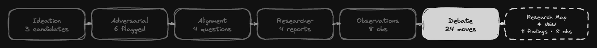
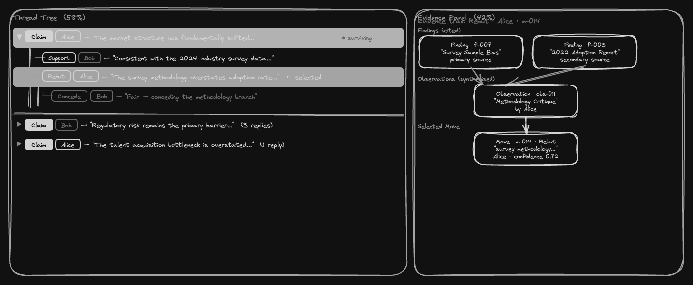
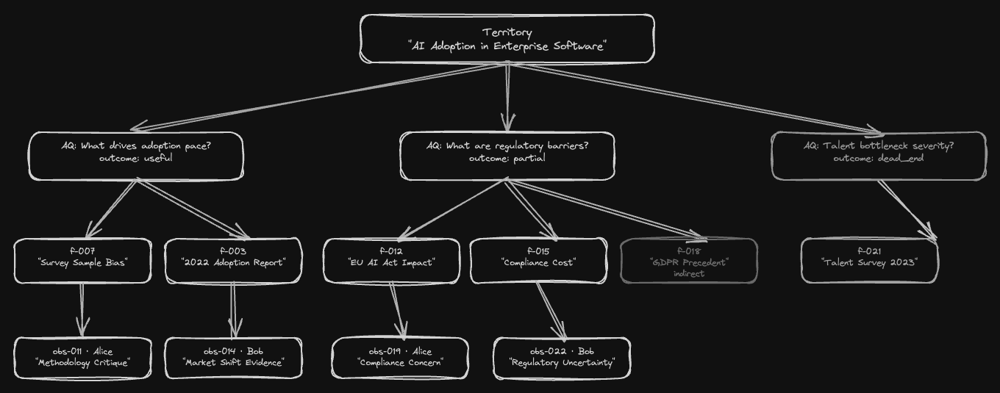

# Working Group Debate Visualization

**Status:** Draft\
**Author:** Eryk Napierała, 2026-05-19\
**Related:** [`specs/feat-research-process-visualisation.md`](feat-research-process-visualisation.md) — inspect app architecture this spec extends.

---

## Mockups

**View A — Substage navigation strip** (7 tabs; Debate active, Research Map dashed = new):



**View B — Debate panel split layout** (thread tree left, evidence graph right; Rebut selected):



**View C — Research map tab** (territory → aligned questions → findings → observations):



---

## 1. Overview

Three coordinated improvements to the working-group panels in `msv inspect` that make the debate structure and evidence lineage visible at a glance:

1. **Thread tree** — replace the flat `MoveCard` list in `DebatePanel` with an indented, collapsible reply tree that respects the `references_move_id` chain.
2. **Evidence panel** — a persistent right-side panel within the debate view that shows an XY Flow graph of the findings and observations cited by the selected move.
3. **Research map tab** — a new `'wg-map'` substage node in the working-group canvas that renders a top-down graph of the full research lineage: territory → aligned questions → findings → observations.

Without these changes the inspect app renders 40–80 flat `MoveCard` rows with no structural cues, `evidence_refs` as raw ID strings, and no visual connection between the research data (stages 4–5) and the claims built on it (stage 6).

---

## 2. Background / Problem Statement

The working-group debate is a directed graph:

```
Findings  ──►  Observations  ──►  Moves  ──►  Moves (reply chain)
```

The current UI collapses all four levels into a single flat list. Two distinct problems compound each other:

- **Debate structure lost**: `references_move_id` is shown only as a text link. There is no visual representation of which move is a direct rebuttal of which claim, or how deep a reply chain goes.
- **Evidence lineage invisible**: `evidence_refs` on a move points to observation and finding IDs that are displayed as raw `obs:xxx` or `finding:xxx` codes. The reader cannot see what research actually drove an argument without manually cross-referencing the observation and researcher panels.

These two problems are tangled — understanding a move requires both its position in the reply chain and the data it was built on. The flat list makes neither visible.

---

## 3. Goals

- Show debate moves as a collapsible reply tree so the argument structure is readable without expanding every card.
- Let the reader select any move and immediately see which findings and observations supported it, rendered as a small XY Flow graph in a persistent panel.
- Add a research map tab that shows the complete data lineage from territory through research findings to observations, as a navigable XY Flow graph.
- Encode the selected move in the existing `CanvasRoute`/hash-routing system so the state survives browser back/forward and is shareable via URL.
- Introduce no new npm dependencies beyond what is already installed (`@xyflow/react ^12`, `@mantine/core v7`).

---

## 4. Non-Goals

- Not replacing any existing panels — the six substage tabs (ideation through debate) remain unchanged; this spec adds to them.
- Not animating or replaying the debate sequence.
- Not adding edit or annotation capabilities — read-only throughout.
- Not modifying the `WorkingGroupView` data shape or the JS loader.
- Not implementing dark mode or mobile layouts.
- Not adding a cross-WG comparison view.

---

## 5. Technical Dependencies

| Dependency | Version | Already installed |
|---|---|---|
| `@xyflow/react` | `^12.10.2` | Yes |
| `@mantine/core` | `^7.x` | Yes |
| `recharts` | `^3.8.1` | Yes (unused in this spec) |

No new packages required.

---

## 6. Detailed Design

### 6.1 Thread tree (DebatePanel refactor)

**File:** `src/inspect-app/components/WorkingGroup/DebatePanel.tsx`\
**New component:** `src/inspect-app/components/WorkingGroup/MoveThreadTree.tsx`

#### Tree construction

Build a tree from the flat `moves` array using `references_move_id`:

```typescript
type MoveNode = { move: Move; children: MoveNode[] };

function buildMoveTree(moves: Move[]): MoveNode[] {
  const byId = new Map(moves.map(m => [m.move_id, { move: m, children: [] as MoveNode[] }]));
  const roots: MoveNode[] = [];
  for (const node of byId.values()) {
    const parentId = node.move.references_move_id;
    if (parentId && byId.has(parentId)) {
      byId.get(parentId)!.children.push(node);
    } else {
      roots.push(node);
    }
  }
  return roots;
}
```

Roots are moves with `references_move_id === null` or a reference to an unknown ID (defensive). Children preserve insertion order (no re-sorting needed — log order is debate order).

#### Collapsed row format

Each node renders as a single-line collapsed row by default:

```
[Type badge] [PersonaChip] — {first 90 chars of content}…
```

- Type badge: existing `TYPE_COLOR` mapping (Claim=blue, Support=teal, Rebut=red, Concede=orange, Question=grape)
- PersonaChip: existing `PersonaChip` component with `personaColor`
- Surviving indicator: green dot on the right when `survivingIds.has(move.move_id)`
- Truncation threshold: 90 characters

#### Expanded state

Click on any row to expand it inline. Expanded state shows the full `MoveCard` content (reuse the existing component). A second click collapses it. Expansion state is local to the component — `useState<Set<string>>` keyed by `move_id`.

All nodes start collapsed. There is no "expand all" button in v1.

#### Selection state

Clicking a row also sets the *selected move* — the move whose evidence is shown in the right panel. Selection is encoded in `CanvasRoute` as `leaf: { kind: 'move', id: move_id }` when in the debate substage. The `DebatePanel` reads `route.leaf` to determine which move is highlighted.

A selected move gets a visually distinct background (Mantine `var(--mantine-color-blue-light)` or equivalent). Clicking an already-selected-but-collapsed row expands it without deselecting.

#### Indentation

Each level of depth adds 20px of left padding. Depth cap for visual purposes: 6 levels (beyond that, continue indenting at 6 × 20px = 120px). A faint left border (1px solid `var(--mantine-color-gray-3)`) runs along the indent column to show thread depth.

#### Component API

```typescript
// MoveThreadTree.tsx
export function MoveThreadTree({
  moves,
  personaName,
  survivingIds,
  selectedMoveId,
  onSelect,
}: {
  moves: Move[];
  personaName: (id: string) => string;
  survivingIds: Set<string>;
  selectedMoveId: string | null;
  onSelect: (moveId: string) => void;
});
```

#### Updated DebatePanel

`DebatePanel` becomes a two-column layout:

```typescript
// Approximately 58% / 42% split
<Group align="flex-start" grow gap="md">
  <Box style={{ flex: '0 0 58%', minWidth: 0 }}>
    <MoveThreadTree ... />
  </Box>
  <Box style={{ flex: '0 0 42%', minWidth: 0 }}>
    <EvidencePanel ... />
  </Box>
</Group>
```

The `selectedMoveId` is derived from `route.leaf?.kind === 'move' ? route.leaf.id : null`. Calling `onSelect(moveId)` calls `setRoute({ ...route, leaf: { kind: 'move', id: moveId } })`.

---

### 6.2 Evidence panel (XY Flow)

**New component:** `src/inspect-app/components/WorkingGroup/EvidencePanel.tsx`\
**New component:** `src/inspect-app/components/WorkingGroup/evidence/` (sub-components for XY Flow node types)

#### When empty

If `selectedMoveId` is null: render a centered placeholder text "Select a move to see its evidence trail." in `c="dimmed"`.

If `selectedMoveId` is set but the move has no `evidence_refs` or the array is empty: render "This move has no recorded evidence references."

#### Graph structure

For a selected move with evidence:

```
Row 0 (y=0):   [Finding A]   [Finding B]   [Finding C]
                    │               │
Row 1 (y=180): [Observation X]  [Observation Y]
                         │
Row 2 (y=360): [Selected Move]
```

- **Finding nodes** (top row): one node per unique finding referenced, either directly via `evidence_refs` or transitively via observations' `cited_finding_ids`.
- **Observation nodes** (middle row): one node per observation in `evidence_refs`.
- **Move node** (bottom): the selected move.

Edges flow upward (finding → observation → move), representing "data flowed into the argument."

#### Position computation

```typescript
const NODE_W = 180;
const NODE_H = 60;
const H_GAP = 16;
const V_GAP = 80;

function rowPositions(count: number, y: number): Array<{ x: number; y: number }> {
  const totalW = count * NODE_W + (count - 1) * H_GAP;
  const startX = -totalW / 2;
  return Array.from({ length: count }, (_, i) => ({
    x: startX + i * (NODE_W + H_GAP),
    y,
  }));
}
```

The XY Flow viewport is `fitView` on load and whenever the selected move changes.

#### Node types

Three custom node types registered on the `<ReactFlow>` instance:

| Type key | Data | Visual |
|---|---|---|
| `evidenceFinding` | `Finding` | Blue outline, `nickname ?? finding_id`, quality badge |
| `evidenceObs` | `Observation` | Purple outline, `nickname ?? observation_id`, persona chip |
| `evidenceMove` | `Move` | Type-colored border (reuses `TYPE_COLOR`), `nickname ?? move_id`, type badge |

All node types show a single-line label by default. On click, a Mantine `Popover` (or `Tooltip` with truncation disabled) shows the full content.

#### Layout helper

```typescript
function layoutEvidenceGraph(
  move: Move,
  allObs: Observation[],
  allFindings: Map<string, Finding>,
): { nodes: Node[]; edges: Edge[] } {
  const obsRefs = (move.evidence_refs ?? [])
    .filter((r): r is { observation_id: string } => 'observation_id' in r);
  const directFindingRefs = (move.evidence_refs ?? [])
    .filter((r): r is { finding_id: string } => 'finding_id' in r);

  const citedObs = obsRefs
    .map(r => allObs.find(o => o.observation_id === r.observation_id))
    .filter((o): o is Observation => o !== undefined);

  const allCitedFindingIds = new Set([
    ...directFindingRefs.map(r => r.finding_id),
    ...citedObs.flatMap(o => o.cited_finding_ids),
  ]);

  const findingNodes = [...allCitedFindingIds]
    .map(id => allFindings.get(id))
    .filter((f): f is Finding => f !== undefined);

  const fPos = rowPositions(findingNodes.length, 0);
  const oPos = rowPositions(citedObs.length, NODE_H + V_GAP);
  const mPos = { x: -NODE_W / 2, y: (NODE_H + V_GAP) * 2 };

  const nodes: Node[] = [
    ...findingNodes.map((f, i) => ({
      id: `f:${f.finding_id}`,
      type: 'evidenceFinding',
      position: fPos[i],
      data: { finding: f },
      draggable: false,
    })),
    ...citedObs.map((o, i) => ({
      id: `o:${o.observation_id}`,
      type: 'evidenceObs',
      position: oPos[i],
      data: { observation: o },
      draggable: false,
    })),
    {
      id: `m:${move.move_id}`,
      type: 'evidenceMove',
      position: mPos,
      data: { move },
      draggable: false,
    },
  ];

  const edges: Edge[] = [
    ...citedObs.map(o => ({
      id: `e:o→m:${o.observation_id}`,
      source: `o:${o.observation_id}`,
      target: `m:${move.move_id}`,
    })),
    ...directFindingRefs.map(r => ({
      id: `e:f→m:${r.finding_id}`,
      source: `f:${r.finding_id}`,
      target: `m:${move.move_id}`,
    })),
    ...citedObs.flatMap(o =>
      o.cited_finding_ids
        .filter(fid => allCitedFindingIds.has(fid))
        .map(fid => ({
          id: `e:f→o:${fid}→${o.observation_id}`,
          source: `f:${fid}`,
          target: `o:${o.observation_id}`,
        }))
    ),
  ];

  return { nodes, edges };
}
```

The helper is pure and easily unit-testable.

#### EvidencePanel component API

```typescript
export function EvidencePanel({
  selectedMoveId,
  moves,
  observations,
  findings,
}: {
  selectedMoveId: string | null;
  moves: Move[];
  observations: Observation[];
  findings: Finding[];
});
```

The `findings` flat array is computed from `wg.researcher_reports.flatMap(r => r.findings)` in `DebatePanel` and passed down. The `EvidencePanel` builds the `Map<string, Finding>` internally.

#### XY Flow wiring

The panel uses a fixed-height container (e.g., `height: 420px`) with `<ReactFlow>` in `fitView` mode. `nodesDraggable={false}`, `nodesConnectable={false}`, `elementsSelectable={false}` — read-only canvas.

---

### 6.3 Research map tab (`'wg-map'` substage)

#### Type system changes

**File:** `src/inspect-app/hooks/useHashRoute.ts`

```typescript
export type WorkingGroupSubstage =
  | 'ideation'
  | 'adversarial'
  | 'alignment'
  | 'researcher'
  | 'observation'
  | 'debate'
  | 'wg-map';         // new
```

Add `'wg-map'` to `KNOWN_WG_SUBSTAGES`.

**File:** `src/inspect-app/inspector/layout/workingGroupLayout.ts`

Append `'wg-map'` to `STAGES`. Add to `substageStatus`:

```typescript
case 'wg-map':
  return wg.researcher_reports?.length && wg.observations?.length ? 'done' : 'not_run';
```

**File:** `src/inspect-app/inspector/nodes/SubStageNode.tsx`

```typescript
LABEL['wg-map'] = 'Research Map';
SUMMARY['wg-map'] = (w) => {
  const findings = w.researcher_reports?.flatMap(r => r.findings).length ?? 0;
  return `${findings} findings · ${w.observations?.length ?? 0} obs`;
};
```

**File:** `src/inspect-app/inspector/leafRenderers.tsx`

Add `case 'wg-map':` to the `wgPanel` switch:

```typescript
case 'wg-map':
  body = <WgMapPanel wg={wg} personaName={personaName} />;
  break;
```

#### WgMapPanel component

**New file:** `src/inspect-app/components/WorkingGroup/WgMapPanel.tsx`

A full-height XY Flow canvas with five node types:

| Type key | Represents | Color |
|---|---|---|
| `mapTerritory` | Territory (root) | Gray, heavy border |
| `mapAligned` | Aligned question | outcome-color (useful=green, partial=yellow, dead_end=red, none=gray) |
| `mapFinding` | Research finding | Blue; quality badge (primary/secondary/indirect) |
| `mapObservation` | Observation | Persona color; PersonaChip |

Edges:
- Territory → AlignedQuestion (one per aligned_id)
- AlignedQuestion → Finding (via `researcher_reports`: report.aligned_id → report.findings)
- Finding → Observation (via `observation.cited_finding_ids`)

#### Layout algorithm

The graph is a DAG with 4 levels. Because `@dagrejs/dagre` is not installed, positions are computed with a column-aware top-down layout:

```
Level 0 (y=0):    [Territory]
Level 1 (y=200):  [AQ-1]  [AQ-2]  [AQ-3]  ...
Level 2 (y=400):  [F-1a] [F-1b]  [F-2a]   ...   (grouped under their aligned question)
Level 3 (y=600):  [Obs-1] [Obs-2]          ...   (grouped under the findings they cite)
```

The level-2 and level-3 groups are computed per parent: each aligned question's findings are laid out as a sub-column centred under the aligned question node. Finding widths determine parent positions recursively (bottom-up sizing, then top-down placement).

**Implementation detail:** `layoutWgMap(wg: WorkingGroupView): { nodes: Node[]; edges: Edge[] }` is a pure function exported from `src/inspect-app/components/WorkingGroup/wgMapLayout.ts`. It is testable in isolation without rendering.

Algorithm sketch:

1. Assign each finding to its aligned question via `researcher_reports`.
2. For each aligned question, compute the total width of its findings subtree (including observation children of each finding).
3. Place aligned questions left-to-right with 24px gaps, widths determined by subtree.
4. Place territory centred over the aligned row.
5. Place findings centred under their parent aligned question.
6. Place observations centred under the findings that cite them (a finding may have multiple observation children).

If an observation cites findings from multiple aligned questions, it appears once under the *first* finding it cites. A note in the component explains this simplification.

#### Interaction

Clicking any node opens a `Popover` anchored to the node with the full content:
- AlignedQuestion: question text + origin
- Finding: full content, source link, quality
- Observation: full content, persona chip, cited findings list

The map canvas is navigable (pan + zoom). `fitView` on mount.

---

## 7. User Experience

### Debate substage

Opening the debate substage shows a split layout immediately:

```
┌──────────────────────────────┬──────────────────────────────┐
│ Thread tree (58%)            │ Evidence panel (42%)         │
│                              │                              │
│ ► [Claim] Alice — "The       │  Select a move to see its    │
│   market has shifted…"       │  evidence trail.             │
│                              │                              │
│   ├ [Support] Bob — "This    │                              │
│   │  is consistent with…"    │                              │
│   │                          │                              │
│   └ [Rebut] Alice — "Bob     │                              │
│     misreads the data…"      │                              │
│                              │                              │
│ ► [Claim] Bob — "The         │                              │
│   regulatory risk is…"       │                              │
└──────────────────────────────┴──────────────────────────────┘
```

Clicking "The regulatory risk is…" row:
1. Row expands showing full content + evidence_basis.
2. Row gets highlighted background.
3. Evidence panel populates with the XY Flow graph for that move.

Clicking the same row again: collapses content but keeps the move selected (evidence stays).

Clicking a different row: selects it, evidence panel updates.

### Research map tab

The `wg-map` substage node appears as the 7th box in the working-group canvas (after Debate). Status pip shows `done`/`not_run` based on whether findings and observations exist.

Clicking it opens the research map panel — a full canvas showing the research lineage. Clicking a Finding node shows its full content in a popover. Clicking an Observation node shows its content and the PersonaChip.

The map gives the answer to "what data was available to the agents when they argued?"

---

## 8. Routing changes

The only routing change is that `CanvasRoute.leaf` of kind `'move'` is now also meaningful when `substage === 'debate'` — it encodes the selected move for the evidence panel. This was already a valid `LeafRef` kind; no type change is needed.

URL example: `#wg:territory-abc123/substage=debate/leaf=move:m-005`

`DebatePanel` reads `route.canvas === 'wg' && route.substage === 'debate' && route.leaf?.kind === 'move'` to determine `selectedMoveId`.

---

## 9. Testing Strategy

### Unit tests

**`wgMapLayout.test.ts`**
- `layoutWgMap` with a minimal 2-AQ, 3-finding, 2-observation WG produces nodes and edges with no overlapping positions.
- Territory node is centred over the aligned-question row within ±1px.
- An observation citing two findings appears exactly once in the output.
- Empty `researcher_reports` → only territory node, no edges.

**`evidenceLayout.test.ts`**
- `layoutEvidenceGraph` with a move citing one observation which cites two findings: produces 4 nodes, 3 edges.
- Move citing a finding directly (no observations): 2 nodes, 1 edge.
- Move with no `evidence_refs`: returns `{ nodes: [moveNode], edges: [] }`.
- Finding cited by both direct ref and via observation appears only once in node list.

**`buildMoveTree.test.ts`**
- Flat list of 4 moves with a simple chain produces correct parent-child nesting.
- Move with `references_move_id` pointing to an unknown ID becomes a root (defensive).
- Circular reference (A refs B refs A) does not cause infinite recursion.

### Component tests (Vitest + Testing Library)

**`MoveThreadTree.test.tsx`**
- All moves collapsed by default; expanding one does not expand siblings.
- Clicking a collapsed row calls `onSelect` with correct `move_id`.
- Surviving move shows visual indicator.
- Thread depth indentation: depth-3 node has `paddingLeft` of 60px.

**`EvidencePanel.test.tsx`**
- Renders placeholder text when `selectedMoveId` is null.
- Renders "no evidence references" when move has empty `evidence_refs`.
- Renders XY Flow canvas when move has valid evidence refs.
- Correct node count for a known fixture.

### Integration

No network calls — all data is already in `WorkingGroupView`. No integration tests beyond unit + component.

---

## 10. Performance Considerations

- The thread tree renders all moves upfront (collapsed). With ~80 moves this is negligible — each collapsed row is a single `<div>` with a few Mantine primitives.
- The evidence panel XY Flow canvas re-renders only when `selectedMoveId` changes. `useMemo` on `layoutEvidenceGraph(move, ...)` prevents recomputation on unrelated re-renders.
- The research map XY Flow canvas calls `layoutWgMap` once on mount and memoizes the result. With ~50 nodes total the layout computation is under 1ms.
- `ReactFlow` nodes are `draggable={false}` — avoids position-state overhead.

---

## 11. Security Considerations

Read-only local dev tool. No user input is written to any surface. The evidence panel and research map display data from `inspect-view.json` which is generated locally from investigation logs. No XSS risk from node label content — Mantine `<Text>` components render as text nodes, not HTML.

---

## 12. Documentation

No external documentation required. Internal: update the `README` for `src/inspect-app/` to mention the `wg-map` substage and the split debate view. (Out of scope for this spec's implementation tasks — tracked as a follow-up.)

---

## 13. Implementation Phases

### Phase 1 — Thread tree (no new XY Flow work)

1. Extract `buildMoveTree` into `src/inspect-app/components/WorkingGroup/moveTree.ts` and add unit tests.
2. Create `MoveThreadTree.tsx` with collapsed rows, expand-on-click, and depth indentation.
3. Refactor `DebatePanel.tsx` to use `MoveThreadTree`, wiring `selectedMoveId` from route and `onSelect` to `setRoute`.
4. Update `leafRenderers.tsx` if any additional plumbing is needed.

This phase ships a useful improvement independently — the evidence panel can follow.

### Phase 2 — Evidence panel (XY Flow)

5. Create XY Flow node components in `src/inspect-app/components/WorkingGroup/evidence/`.
6. Implement `layoutEvidenceGraph` in `evidenceLayout.ts` with unit tests.
7. Create `EvidencePanel.tsx` integrating the XY Flow canvas.
8. Update `DebatePanel.tsx` to render the two-column split with `EvidencePanel`.

### Phase 3 — Research map tab

9. Add `'wg-map'` to `WorkingGroupSubstage` type and all dependents (`KNOWN_WG_SUBSTAGES`, `STAGES`, `LABEL`, `SUMMARY`, `substageStatus`, `leafRenderers` switch).
10. Implement `layoutWgMap` in `wgMapLayout.ts` with unit tests.
11. Create XY Flow node types for the research map in `src/inspect-app/components/WorkingGroup/map/`.
12. Create `WgMapPanel.tsx` integrating the layout and nodes.

---

## 14. Open Questions

- **Layout quality for large graphs**: The manual top-down layout can produce crowded columns when a WG has ≥5 aligned questions each with ≥4 findings. If this becomes a problem in practice, adding `@dagrejs/dagre` (28KB) would give automatic force-directed layout without significant added complexity.
- **Observation-to-finding edges crossing aligned-question boundaries**: If an observation cites findings from two different aligned questions, the current layout places the observation under the first finding. Should it be positioned at the intersection? Deferred — affects a minority of logs.
- **Empty `evidence_refs` on older logs**: Pre-v5 moves lack `evidence_refs` entirely. The evidence panel degrades gracefully with the "no evidence references" message. No special casing needed.

---

## 15. References

- [`specs/feat-research-process-visualisation.md`](feat-research-process-visualisation.md) — original inspect app spec; §7 describes the XY Flow canvas architecture.
- `src/inspect-app/hooks/useHashRoute.ts` — `WorkingGroupSubstage` type and `CanvasRoute` routing.
- `src/inspect-app/inspector/layout/workingGroupLayout.ts` — substage node layout; extended in Phase 3.
- `src/inspect-app/inspector/nodes/SubStageNode.tsx` — substage node component; extended in Phase 3.
- `src/inspect-app/inspector/leafRenderers.tsx` — leaf panel renderer; extended in Phases 1–3.
- `src/inspect/types.d.ts` — `WorkingGroupView`, `Move`, `Observation`, `Finding`, `EvidenceRef` types.
- [@xyflow/react docs](https://reactflow.dev/docs) — XY Flow API reference.
