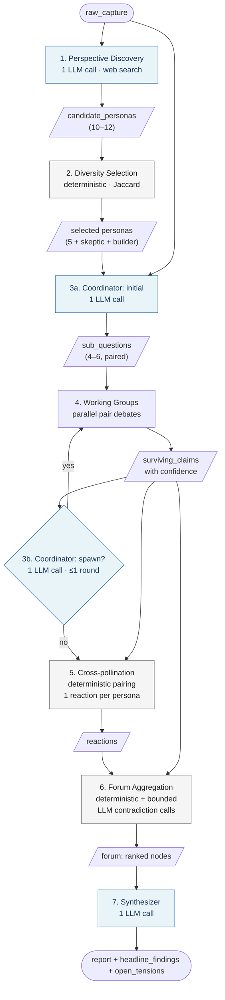
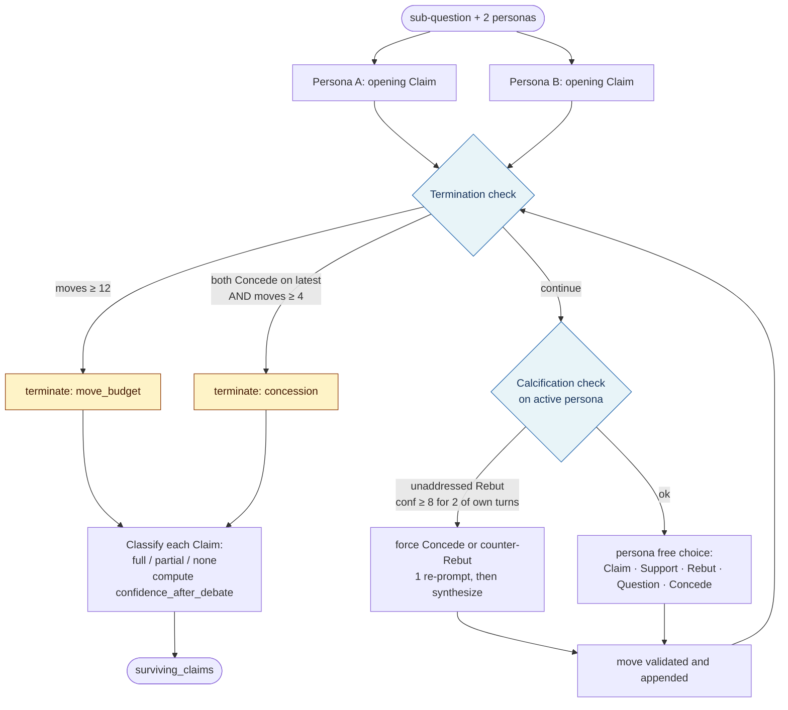
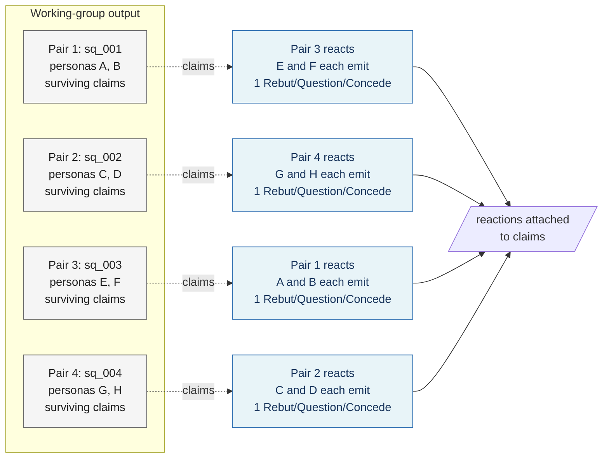

# `msv` — Multi-Agent Idea Research Pipeline (CLI Prototype)

**Status:** Spec for a validation prototype, not a production tool.\
**Author target:** A single developer building it for themself.\
**Goal:** Validate whether a society of LLM agents — discovering perspectives, debating in working groups, cross-pollinating, and converging in a forum — produces substantively better idea research than a single agent or a turn-based conversation could. The hypothesis being tested is that *structured disagreement between deliberately diverse personas, with confidence-weighted aggregation, leaves the user meaningfully further along in understanding an idea's landscape than they were before*.

What this spec does **not** do: define a roadmap, a v2, a deployment story, a multi-user surface, or anything that would survive contact with a second user. If the loop doesn't feel valuable after a handful of real runs on real ideas, the prototype is the deliverable.

This is v4 of the spec. Earlier versions (single-agent research with retrieval, then conversational iteration) are archived. The architectural commitment is now: *background long-running multi-agent investigation, post-investigation steering only*.

***

## 1. Scope and non-goals

### In scope

* Three commands: `msv add`, `msv run`, `msv review`.

* Local JSON storage in `~/.msv/ideas/`, one file per idea. The file accumulates the full transcript of the investigation: persona roster, sub-questions, every discourse move, the forum mind map, and the final synthesis.

* A multi-agent investigation pipeline with seven distinct agent roles (perspective discovery, diversity selection, coordinator, persona-as-executor, cross-pollinator, forum aggregator, synthesizer) running as a single in-process pipeline per `msv run`.

* A terminal-only review loop where the user reads the synthesis and either keeps the idea, archives it, or kicks off a follow-up investigation with a refined topic.

### Out of scope (deliberately)

* No daemon, no scheduler, no cron. The user runs `msv run` when the user wants to.

* No multi-user, no auth, no encryption at rest.

* No mid-investigation steering. The user has one steering surface: the topic pitch. Everything else is the agent society's call.

* No model heterogeneity. Every agent uses `claude-sonnet-4-6`. Mixing models is a v0.2 lever.

* No RL-trained confidence calibration. Agents emit verbalized confidence scores grounded in articulated evidence, accepting that absolute calibration will be noisy. A fallback (answer-stability via repeated sampling) is documented but not implemented.

* No streaming output from any agent. Each agent call blocks until the full response arrives.

* No tests beyond a smoke run on a couple of throwaway topics.

* No TUI library. Plain `readline` and `console.log`.

***

## 2. Architectural overview



Blue nodes are LLM-driven; grey are deterministic. The only loop is the optional coordinator spawn round (≤1 invocation, capped by executor-call budget).

### The pipeline

A single `msv run` invocation executes the following stages in sequence, each producing artifacts that the next consumes:

1. **Perspective Discovery.** One agent does a web survey of the topic and adjacent topics, generates 10–12 candidate personas grounded in real intellectual traditions visible in the survey.

2. **Diversity-aware Selection.** A deterministic algorithm (no LLM) picks the 5–6 most distinct candidates from the over-sampled pool. Two fixed attitudinal personas (skeptic, builder) are always added on top of the discovered roster.

3. **Coordinator.** One agent decomposes the topic into 4–6 focused sub-questions and pairs personas for each, deliberately choosing distinct pairings (not random draws). The coordinator holds a budget for total executor calls and can spawn additional sub-questions adaptively based on what comes back from the working groups.

4. **Working Groups (parallel pair debates).** For each sub-question, the assigned pair runs a structured debate using five discourse moves (Claim, Support, Rebut, Question, Concede). Every move carries a 0–10 confidence score grounded in articulated evidence. The debate terminates when both personas Concede on the current claim set or a per-pair move budget is hit.

5. **Cross-pollination Round.** Each pair's surviving claims are shown to personas from one other pair, who emit a single reaction-only move (Rebut, Question, or Concede — no new Claims). Reactions inherit the reacting persona's confidence. This single round adds cross-pair scrutiny without doubling the cost of a full debate.

6. **Forum Aggregation.** All surviving claims with their cross-pollination reactions are assembled into a flat ranked list of nodes. Contradictions across pairs are made explicit, not averaged. Confidence weights claim ranking. This is shared state, not a deciding agent — it's a data structure the synthesizer reads.

7. **Synthesizer.** One agent reads the forum, weights claims by confidence, grapples with contradictions, and produces the final opinionated report. This is what the user reads.

### Agent role inventory

| Role                                 | Count per run                | Decides?                              | Has tools?                |
| ------------------------------------ | ---------------------------- | ------------------------------------- | ------------------------- |
| Perspective Discovery                | 1                            | yes (what perspectives exist)         | web search                |
| Diversity-aware Selector             | 0 (deterministic)            | no (algorithm)                        | —                         |
| Coordinator                          | 1 (re-invoked across rounds) | yes (decomposition, pairing, budget)  | reads forum state         |
| Persona executor (pair debate)       | 5–6 personas × ~6 moves each | no (executes role within protocol)    | web search                |
| Persona executor (cross-pollination) | each persona × 1 move        | no                                    | reads other pairs' claims |
| Forum aggregator                     | 0 (deterministic)            | no (algorithm)                        | —                         |
| Synthesizer                          | 1                            | yes (what survives, what contradicts) | reads full forum          |

Deciding agents are the architecturally consequential ones: get their prompts wrong and the investigation is bad regardless of how good the executors are. Persona executors are interchangeable in structure — they vary only in role description, not in the protocol they follow.

### File layout

```text
msv/
├── package.json
├── bin/
│   └── msv                       # shebang entry, dispatches to src/cli.js
├── src/
│   ├── cli.js                    # arg parsing + command dispatch
│   ├── commands/
│   │   ├── add.js
│   │   ├── run.js                # the multi-agent pipeline runner
│   │   └── review.js
│   ├── storage.js                # atomic JSON read/write in ~/.msv/ideas/
│   ├── anthropic.js              # messages endpoint wrapper, retries, tool-use loop
│   ├── agents/
│   │   ├── discovery.js
│   │   ├── coordinator.js
│   │   ├── persona.js            # generic — instantiated per persona role
│   │   ├── synthesizer.js
│   │   └── prompts.js            # all system prompts as exported strings
│   ├── diversity.js              # deterministic selector + pair-distinctness scoring
│   ├── forum.js                  # forum data structure + aggregation rules
│   ├── moves.js                  # discourse-move schema + parsers
│   └── render.js                 # review-mode card formatter
└── README.md
```

### Dependencies

Pin everything. Two runtime deps:

* `@anthropic-ai/sdk` — messages endpoint, tool-use loop, retry handling

* `uuid` — v4 ids

* Nothing else. `readline`, `fs/promises`, `path`, `os` are stdlib. Token counts come from each Anthropic response's `usage` fields (`input_tokens + output_tokens`) — no tokenizer dependency needed since the budget is checked between stages, not mid-stream.

No TypeScript. No bundler. No linter beyond editor-on-save.

### Data directory

Each idea is a directory:

```text
~/.msv/ideas/<id>/
├── index.json                       # structured schema from §3
└── logs/
    ├── discovery.jsonl              # raw API exchanges for perspective discovery
    ├── coordinator-initial.jsonl
    ├── coordinator-spawn.jsonl      # only if the coordinator spawned a round
    ├── pair-<sq_id>.jsonl           # one per working group
    ├── cross-pollination.jsonl
    ├── forum-contradictions.jsonl   # LLM contradiction calls + cache hits
    ├── synthesizer.jsonl
    └── parse-errors.jsonl           # tool-use parse failures, rejected re-prompts
```

Archived ideas move as a whole directory: `mv ~/.msv/ideas/<id> ~/.msv/archive/<id>`. Directory rename is atomic on the same filesystem.

**Two write disciplines:**

* `index.json` is rewritten atomically (tmp + rename within the idea directory) after each stage. It holds the structured, queryable state — persona roster, moves with confidence, surviving claims, forum nodes, synthesis. Stays in the 50–200 KB range; `jq`-friendly.

* `logs/*.jsonl` are append-only. Each record is one line: `{"ts": "ISO", "kind": "request|response|tool_use|tool_result|rejected_move|synthesized_move|cache_hit", "payload": {...}}`. `fs.appendFile` is atomic for line-sized writes on Unix, and each pair writes to its own log file so parallel debates never contend.

Logs are for raw-trace debugging; the structured artifact is `index.json`. Pair-debate moves themselves stay inline in `index.json` (the forum aggregator and synthesizer read them as structured data), but the underlying API request/response bodies that produced each move live in `logs/pair-<sq_id>.jsonl`.

`fs.readdir('~/.msv/ideas/')` is still the idea index — each entry is now a directory rather than a file.

***

## 3. Idea schema

The schema reflects the full investigation transcript. Everything an agent produced is preserved — not because we'll surface all of it, but because debugging the system requires being able to read what the agents actually did.

```json
{
  "id": "uuid-v4",
  "raw_capture": "string — the original topic from stdin",
  "captured_at": "ISO-8601 timestamp",
  "status": "pending | investigating | ready | archived",
  "last_action_at": "ISO timestamp",
  "parent_id": "uuid-v4 or null — set when this idea was spawned via [d]eeper from another idea",

  "investigation": {
    "started_at": "ISO timestamp",
    "completed_at": "ISO timestamp or null if in progress / failed",
    "model": "claude-sonnet-4-6",
    "budget": {
      "max_executor_calls": 60,
      "max_total_tokens": 500000,
      "used_executor_calls": 0,
      "used_total_tokens": 0
    },

    "perspective_discovery": {
      "search_queries": ["..."],
      "candidate_personas": [
        {
          "id": "p_001",
          "name": "string — short label",
          "tradition": "string — the intellectual lineage",
          "stance": "string — methodological / attitudinal posture",
          "description": "string — full role prompt"
        }
      ],
      "selected_persona_ids": ["p_002", "p_005", "p_007", "p_009", "p_011"],
      "fixed_personas": ["skeptic", "builder"]
    },

    "coordinator_decisions": {
      "initial": {
        "decided_at": "ISO timestamp",
        "sub_questions": [
          {
            "id": "sq_001",
            "question": "string",
            "rationale": "string — why this question is worth investigating",
            "assigned_pair": ["p_002", "skeptic"],
            "pair_distinctness_score": 0.84
          }
        ]
      },
      "spawn": null
    },

    "pair_debates": [
      {
        "sub_question_id": "sq_001",
        "moves": [
          {
            "move_id": "m_sq_001_0001",
            "by_persona_id": "p_002",
            "type": "Claim | Support | Rebut | Question | Concede",
            "content": "string",
            "evidence_basis": "string — articulated grounding for the confidence",
            "confidence": 7,
            "references_move_id": "m_sq_001_0000 or null",
            "timestamp": "ISO"
          }
        ],
        "surviving_claims": [
          {
            "claim_id": "c_001",
            "originating_move_id": "m_sq_001_0003",
            "content": "string",
            "confidence_after_debate": 6.5,
            "concession_status": "none | partial | full"
          }
        ],
        "terminated_by": "concession | move_budget | coordinator_abort"
      }
    ],

    "cross_pollination": [
      {
        "claim_id": "c_001",
        "reactions": [
          {
            "by_persona_id": "p_007",
            "type": "Rebut | Question | Concede",
            "content": "string",
            "confidence": 6,
            "evidence_basis": "string"
          }
        ]
      }
    ],

    "forum": {
      "constructed_at": "ISO",
      "nodes": [
        {
          "node_id": "n_001",
          "claim_id": "c_001",
          "working_group_id": "sq_001",
          "aggregate_confidence": 6.3,
          "contradiction_with_node_id": "n_004",
          "has_open_question": false,
          "survival_rank": 1
        }
      ]
    },

    "synthesis": {
      "produced_at": "ISO",
      "report": "string — the user-facing opinionated report",
      "headline_findings": ["..."],
      "open_tensions": ["..."]
    }
  },

  "user_reactions": {
    "steer_notes": [
      { "at": "ISO timestamp", "text": "free-form note from msv review [n]" }
    ],
    "follow_up_topic": null
  }
}
```

Field notes:

* `status`**&#x20;transitions:** `pending` (just captured) → `investigating` (run started, in-flight) → `ready` (synthesis written, user hasn't reviewed) → `archived` (after `[k]`) OR back to `pending` with a new `raw_capture` if the user kicks off a follow-up via `[d]`.

* `investigating`**&#x20;is a real intermediate state.** A long run can crash, get killed, or run out of budget. An idea in `investigating` is *not* shown in review. To retry a failed run, hand-edit the JSON file: set `status` back to `"pending"`, clear `investigation.completed_at`, then `msv run <id>`. The pipeline restarts from scratch. No resumability — partial transcripts on disk are for inspection, not continuation.

* **All artifacts append, nothing mutates.** Once a move is written, it's permanent. Once a claim is in `surviving_claims`, the cross-pollination phase attaches reactions to it but doesn't modify it. The forum aggregator builds a new structure rather than rewriting prior state.

* `budget`**&#x20;is tracked live, checked between stages.** The coordinator reads it to decide whether it can afford another spawn. The synthesizer is always called, even if the budget overshot, because abandoning the run without a report wastes everything already spent.

* `follow_up_topic` is the user's refined topic when they hit `[d]`. Triggering it creates a *new* idea with `follow_up_topic` as its `raw_capture`, sets the new idea's `parent_id` to the current idea's `id`, and starts a fresh investigation. The original idea moves to `archived`. This is *not* an iteration on the existing investigation — each investigation is a one-shot run.

* **move_id namespacing.** Moves are id'd `m_<sub_question_id>_<NNNN>` where `NNNN` is a per-pair sequential counter starting at `0001`. This makes `references_move_id` self-documenting (you can see at a glance which working group a referenced move came from). Cross-pollination reactions are attached to claims via `cross_pollination[].reactions[]` and don't carry move_ids of their own.

***

## 4. Command specifications

### 4.1 `msv add`

Behaviour:

1. Read all of stdin until EOF, trim trailing whitespace.

2. If empty, exit 1 with `no input`.

3. Generate uuid, build the schema with `status: "pending"`, all `investigation` fields empty.

4. Create `~/.msv/ideas/<id>/` and `~/.msv/ideas/<id>/logs/`, then write `~/.msv/ideas/<id>/index.json` atomically. No log files are created yet — they're touched on first append by `msv run`.

5. Print `captured <id>` and exit 0.

Usage patterns the user will try:

```text
echo "vague half-formed thought" | msv add
msv add < notes.txt
msv add        # type, then Ctrl-D
```

### 4.2 `msv run [--all | <id>]`

Behaviour:

1. Resolve target set:

   * `msv run --all`: every idea with status `pending`.

   * `msv run <id>`: that one idea, regardless of status (manual escape hatch). If the idea is already `ready`, warn and ask for confirmation.

   * `msv run` with no args: error, print usage. No silent `--all` default.

2. For each target idea, run the pipeline (§5) end-to-end. Print progress per stage:

```text
→ <id> [1/7] perspective discovery…
→      surveyed 4 sources, generated 11 candidate personas
→ <id> [2/7] diversity selection…
→      selected 5 personas (+ skeptic, builder)
→ <id> [3/7] coordinator decomposing topic…
→      4 sub-questions, paired
→ <id> [4/7] working groups (4 parallel pair debates)…
→      pair 1 (sq_001): 8 moves, 3 surviving claims
→      pair 2 (sq_002): 12 moves, 4 surviving claims
→      pair 3 (sq_003): 10 moves, 2 surviving claims
→      pair 4 (sq_004): 6 moves, 1 surviving claim (early concede)
→ <id> [5/7] cross-pollination round…
→      28 reactions collected
→ <id> [6/7] forum aggregation…
→      14 nodes, 3 contradictions surfaced
→ <id> [7/7] synthesis…
✓ <id> ready  (used 47/60 executor calls, 312k/500k tokens)
```

1. On any failure during a stage: print `✗ <id> <stage> failed: <error>`, leave status as `investigating` so the user can inspect the partial transcript. The whole batch should not abort because one idea failed.

2. **Working groups parallelism.** Pair debates run in parallel via `Promise.all` over the sub-questions. Each pair is a sequential conversation internally; only the pairs are parallel. With 4 pairs running simultaneously, latency is dominated by the slowest pair, not the sum. This is the only place the prototype uses concurrency.

3. Exit 0 if at least one idea reached `ready`, 1 if all failed, 0 with `nothing to run` if no work was queued.

### 4.3 `msv review`

Behaviour:

1. List ideas with `status: "ready"`, sorted by `last_action_at` ascending.

2. For each idea, clear the screen, render the review card (§6), prompt for input.

3. Single letter + Enter:

   * `r` → **read full investigation**. Pages through the synthesis report. After reading, re-prompt at the steer menu.

   * `d` → **deeper** — prompt for a refined topic, create a new idea with that as `raw_capture`, set its `parent_id` to the current id, archive the current idea, advance.

   * `k` → kill, archive, advance.

   * `n` → notes — append timestamped free text to `steer_notes`, re-prompt.

   * any other → re-prompt without advancing.

4. After the last idea: `no more ready ideas`. If any follow-up topics were queued: `<n> follow-up investigation(s) queued — run msv run --all to process`.

5. If zero ready: `nothing to review`.

There's no `[s]nooze` in v4 — investigations are too expensive to snooze meaningfully. If an idea isn't worth a decision now, kill it; if it's worth more thinking, kick off a follow-up. Snooze was a useful primitive when re-running was cheap; it isn't anymore.

***

## 5. The pipeline in detail

### 5.1 Perspective Discovery

**Inputs:** `raw_capture`.\
**Outputs:** `candidate_personas` (10–12 entries), `search_queries` (logged for debugging).

The agent has web search available and is instructed to:

1. Run 3–5 broad searches on the topic and its adjacent fields.

2. Identify the distinct intellectual traditions speaking about this kind of question. Not "perspectives" in the abstract — *traditions*, with names attached. "The HCI research community on argumentation systems." "The startup-strategy commentariat on early-stage validation." "Cognitive scientists on group deliberation." Each tradition becomes one candidate persona.

3. Over-sample: aim for 10–12 candidates. Most will be cut by the selector. Generating more than needed is cheap; generating too few starves the selector.

4. For each candidate, produce: short name (≤30 chars), tradition (the intellectual lineage), stance (their methodological/attitudinal posture), and a full role prompt the persona executor will use.

**Why grounded in real traditions, not LLM-imagined personas:** STORM-style perspective discovery (§11) shows that personas grounded in actual prior discourse are meaningfully different from personas generated cold by an LLM. The cold version produces plausible-sounding but homogeneous personas; the grounded version produces personas whose disagreements track real disagreements in their respective fields.

**Source-domain adaptation:** STORM grounds persona discovery in related Wikipedia articles. msv uses general web search instead, because msv's topics include emerging ideas that may have little or no Wikipedia coverage. The grounded-in-prior-discourse principle holds; the source domain widens.

**Failure mode to watch:** the discovery agent under-samples on narrow topics. If a topic is genuinely niche (e.g., a specific technical implementation question), there may not be 10 distinct traditions to draw from. The prompt allows the agent to return fewer than 10 candidates if it can't honestly find more, and the selector handles down to 3 discovered candidates gracefully. The fixed roster (skeptic, builder) ensures the working set is never less than 5 total.

### 5.2 Diversity-aware Selection

**Inputs:** `candidate_personas` from discovery.\
**Outputs:** `selected_persona_ids` (5–6 entries).

This is **deterministic**, not an LLM call. The selector runs a greedy maximum-diversity selection:

1. Compute pairwise distinctness scores between all candidates. Distinctness is a weighted combination of:

   * **Tradition distance:** different intellectual lineage scores higher than the same field

   * **Stance distance:** different methodological posture (e.g., empirical vs. theoretical) scores higher

   * **Description distance:** lexical Jaccard distance on tokens of the `description` field, lowercased and split on non-alphanumeric characters. Crude but adequate at this scale.

2. Greedy selection: pick the candidate with the highest sum of distinctness to already-selected; repeat until 5 are chosen.

3. Append the two fixed personas (skeptic, builder) to the selected set unconditionally. They have static role prompts.

**Why deterministic and not an LLM:** the selector is doing a small optimization over a known input set. An LLM here would just slow things down and introduce variance that we don't want at this stage. The DMAD diversity result (§11) is operationally a greedy selection over an over-sampled candidate set — it doesn't need a model.

**Stretch goal:** the coordinator could be allowed to override the selector's pick if it sees a topic-specific reason to keep a particular candidate. Not in v0.1.

### 5.3 Coordinator

**Inputs:** `raw_capture`, full persona roster, current investigation state.\
**Outputs:** initial `sub_questions` with assigned pairs; later, additional spawn decisions read from the forum.

The coordinator runs at two distinct moments:

**Round 0 — initial decomposition.** Reads the topic and the roster. Produces 4–6 sub-questions that together cover the topic landscape, each phrased as a focused question (not a research area). For each, assigns a *pair* of personas chosen to maximize productive tension — high distinctness, conflicting stances if possible. The coordinator's prompt explicitly tells it to avoid pairing two personas that are likely to agree.

**Round 1+ — adaptive spawn.** After the working-groups stage produces its first batch of surviving claims, the coordinator is re-invoked with the full pair-debate transcripts. It can:

* Spawn 1–2 additional sub-questions if a working group surfaced a thread that needs its own investigation

* Decline to spawn anything if the existing claims look comprehensive

* Hard-stop further spawning when 80% of the executor budget is used

The coordinator's most important constraint: it must justify each spawn with reference to specific claims that triggered it. "Spawn an investigation into because pair 2's claim c_007 is high-confidence but unaddressed by any other pair." A spawn without that grounding is a signal that the coordinator is just spending budget.

### 5.4 Working Groups (pair debates)

**Inputs:** sub-question, two assigned persona prompts.\
**Outputs:** sequence of moves, surviving claims with confidence.



Personas alternate after the parallel opening Claims; the move validator (`src/moves.js`) runs before each turn and is the only place calcification is enforced.

**Discourse moves (defined in&#x20;**`src/moves.js`**):**

| Type       | Purpose                                           | Can reference       |
| ---------- | ------------------------------------------------- | ------------------- |
| `Claim`    | Assert a proposition relevant to the sub-question | —                   |
| `Support`  | Add evidence or reasoning backing a prior Claim   | a Claim             |
| `Rebut`    | Argue against a prior Claim or Support            | a Claim or Support  |
| `Question` | Surface a gap or unaddressed concern              | any prior move      |
| `Concede`  | Acknowledge a Rebut or Question as decisive       | a Rebut or Question |

Every move carries:

* `content`: the actual argument text (1–4 sentences)

* `evidence_basis`: a brief articulation of what the confidence rests on — prior knowledge, a search result, a reasoning chain, or speculation. **This field is mandatory before confidence is stated.** The prompt for personas requires evidence_basis to be filled in before confidence is committed; this is a prompt-level proxy for the DMAD paper's RL-trained calibration (§11) — a deliberate simplification.

* `confidence`: integer 0–10. 8+ requires concrete evidence_basis grounded in prior art or strong reasoning. 3 or below is appropriate for speculation. Forcing personas to *think about what they're confident about* approximates the DMAD paper's RL-trained calibration via prompting (§11).

* `references_move_id`: the prior move this one responds to (null for Claims).

**Debate protocol:**

1. Each persona opens with one Claim (in parallel — they each see the sub-question, neither sees the other's opening yet).

2. Personas alternate moves. On each turn, the active persona sees the full sequence of prior moves and chooses a move type freely.

3. Termination conditions:

   * Both personas have emitted a Concede on the other's most recent meaningful move AND at least 4 total moves have been emitted. The 4-move floor prevents vacuous early mutual concession; both real Concedes and calcification-synthesized Concedes count toward the predicate.

   * 12 moves total reached (`PAIR_MOVE_BUDGET`).

**Surviving claims and confidence.** At debate end, classify each Claim:

* **fully conceded** — a `Concede` move references the Claim directly (`references_move_id == claim.move_id`). Excluded from `surviving_claims`. Tagged `concession_status: "full"` in the transcript for debugging.

* **partially conceded** — no `Concede` references the Claim directly, but at least one `Concede` references one of the Claim's direct `Support` moves. Included in `surviving_claims` with `concession_status: "partial"`.

* **standing** — neither of the above. Included in `surviving_claims` with `concession_status: "none"`.

`confidence_after_debate` is computed from the originating Claim:

```text
conf = claim.confidence
     + 0.5 × min(direct_supports, 3)
     − 1   if concession_status == "partial"
clamp to [0, 10]
```

Only *direct* references count — a Support whose `references_move_id` equals the Claim's `move_id`. Chains (Support of a Support, Rebut of a Support) are not transitively credited. The −1 partial penalty is flat, not per-collapsed-Support; the lost `+0.5` for each conceded Support already accounts for additional damage.

**Calcification validator.** Before each persona's turn, `src/moves.js` runs a calcification check on that persona's history:

1. Find the most recent `Rebut` R authored by the *other* persona where `R.confidence >= 8` and `R.references_move_id` points to a move authored by *this* persona.

2. Count this persona's moves emitted after R. If two or more, and none of them is a `Concede` referencing R or a `Rebut` referencing R, the check fires.

3. When fired, the persona's next turn is constrained: the prompt instructs the persona to emit either a `Concede` referencing R or a `Rebut` of R, and the orchestrator rejects any other move type. One re-prompt is allowed; on second rejection, the orchestrator synthesizes a `Concede` with `confidence: 5`, content noting the synthesis, and `evidence_basis: "calcification rule triggered after two re-prompts"`. The synthesized move is logged in the transcript so debugging is possible.

The forced move counts toward `PAIR_MOVE_BUDGET`. Re-prompts within a single turn do not. The rule only fires on `Rebut`; high-confidence `Question` moves do not trigger calcification (deferred — easy to extend if real runs show evasion via raised Questions).

**Pair debate is sequential within a pair** but pairs run in parallel across sub-questions.

### 5.5 Cross-pollination Round

**Inputs:** all surviving claims from all pair debates, full persona roster.\
**Outputs:** reactions attached to claims.



The reactor-pair assignment is deterministic: each pair is matched with the other pair whose persona-set distinctness sum (from §5.2) is highest, with the constraint that the matching forms a permutation (no pair reacts to itself; no pair is reacted to twice). The diagram above shows one possible permutation for four pairs. Total cost is bounded: with N pairs of 2 personas each, the round produces exactly 2N reaction moves regardless of how many surviving claims each pair carried.

The selection is a small lookup over pre-computed scores — no LLM call.

Each persona from the reacting pair sees:

* The original sub-question (for context)

* The surviving claims from the pair being reacted to

* Their own role prompt

They produce one move — Rebut, Question, or Concede — for the most consequential claim from their perspective. No new Claims, no Supports. This constrains the cost: 5–6 personas × 1 reaction each = at most ~12 cross-pollination moves per run, regardless of how many pairs there are.

Reactions carry their own confidence and evidence_basis just like any other move.

### 5.6 Forum Aggregation

**Inputs:** all surviving claims with cross-pollination reactions.\
**Outputs:** `forum` — a flat ranked list of nodes with contradictions surfaced.

**Mostly deterministic — one bounded LLM call per cross-group node pair.** The aggregator:

1. Create a node for each surviving claim. Set initial `aggregate_confidence` = `confidence_after_debate`.

2. For each cross-pollination reaction on that claim:

   * Rebut with confidence ≥ 6 → reduce `aggregate_confidence` by 2

   * Rebut with confidence < 6 → reduce by 0.5

   * Question (any confidence) → flag node as `has_open_question: true`, do not change confidence

   * Concede → increase `aggregate_confidence` by 1

3. Detect contradictions: for each pair of nodes whose claims originated in *different* working groups, issue one short LLM call asking "do these two claims contradict?" with both claim contents. Cache results keyed by `(claim_id_a, claim_id_b)` sorted. For each node, record the single most pointed contradiction in `contradiction_with_node_id` (nullable) — when multiple contradictions exist, pick the one whose other node has the highest `aggregate_confidence`.

4. Rank by `aggregate_confidence` descending; assign `survival_rank`. The forum is a flat ranked list — no parent-child hierarchy in v0.1.

The forum is read by the synthesizer. It's not pretty-printed; it's a structured artifact.

### 5.7 Synthesizer

**Inputs:** `raw_capture`, full forum, full persona roster (for context on who said what).\
**Outputs:** the user-facing opinionated report.

The synthesizer is the most carefully-prompted agent in the system — it's the one whose output the user actually reads, and its job is the hardest:

* Weight claims by their `aggregate_confidence`. High-confidence claims get more space; low-confidence claims may be mentioned briefly or omitted.

* Explicitly grapple with `contradiction_with_node_id` links across the forum. Each node points to at most one most-pointed contradiction; many such links can exist across the forum. Do not average them. Do not equivocate. Either name each contradiction and explain the tension, or pick a side and justify why the other side's confidence is misplaced.

* Treat nodes with `has_open_question: true` as caveats. A high-confidence claim with an unanswered cross-pollination Question gets stated with the open question called out — "X holds, but Y remains unaddressed." Don't drop these claims; flag them.

* Surface `headline_findings` (3–5 bullet points) and `open_tensions` (the contradictions that genuinely resist resolution).

* Produce a `report` of 800–1500 words. Prose, structured but not list-heavy. The user reads this in the terminal; readability matters.

**The synthesizer's tone, per its prompt:** opinionated where the evidence warrants opinion, agnostic where it doesn't. Not encyclopedic. Not balanced for the sake of balance. The user already knows STORM produces neutral coverage; this tool's value is in *taking positions* the evidence supports.

***

## 6. Review card format

The review card is what the user sees when they run `msv review` and an idea is `ready`.

```text
────────────────────────────────────
{captured_at}  ·  {raw_capture truncated to 72 chars}
investigation: {sub_question_count} sub-questions · {move_count} moves · {token_count} tokens
────────────────────────────────────

HEADLINE FINDINGS
{headline_findings as bullets, max 5}

OPEN TENSIONS
{open_tensions as bullets, max 3}

────────────────────────────────────
[r]ead full report  [d]eeper (new topic)  [k]ill  [n]otes
> 
```

If the user hits `[r]`, the full `report` is paged to stdout using `less` (spawn a subprocess), or a simple line-by-line paginator if `less` is unavailable. After paging, return to the steer menu.

***

## 7. System prompts

Stored as exported strings in `src/agents/prompts.js`. Excerpts and rationale follow; full prompts are written when the file is implemented, since they'll need iteration on real runs.

### 7.1 `PERSPECTIVE_DISCOVERY`

Key instructions:

* "Identify intellectual *traditions*, not vibes. Each candidate persona must trace to a real community of thought with identifiable methods and prior writing."

* "Over-sample. Generate 10–12 candidates. The selector will cut down. Do not pre-filter for diversity yourself."

* "If the topic is narrow and you cannot honestly find 10 traditions, return fewer. Inventing personas to hit a target count produces homogeneous output."

### 7.2 `COORDINATOR_INITIAL` and `COORDINATOR_SPAWN`

Two prompts, one per coordinator invocation moment.

`COORDINATOR_INITIAL` instructs:

* "Decompose into focused questions, not research areas. 'What's the market size' is a question; 'the market' is not."

* "Pair personas to maximize tension. The distinctness scores are pre-computed; use them. Avoid pairs likely to agree."

* "Justify each sub-question briefly — what would investigating it actually surface."

`COORDINATOR_SPAWN` instructs:

* "Read the pair-debate transcripts. Spawn a new sub-question only if you can name a specific claim that triggered the need."

* "Decline to spawn if the existing claims feel comprehensive. Restraint is a valid choice."

* "Hard-stop spawning if 80% of the executor budget is used."

### 7.3 `PERSONA_BASE` + role-specific overlay

Each persona executor gets `PERSONA_BASE` plus a role overlay (either from the discovered description or from the fixed-persona definitions for skeptic and builder).

`PERSONA_BASE` instructs:

* "You are participating in a structured debate. Your moves must follow the protocol: Claim, Support, Rebut, Question, or Concede."

* "Every move carries an evidence_basis (what your move rests on) and a confidence (0–10). State evidence_basis first, then confidence. Confidence 8+ requires concrete grounding in prior art or strong reasoning. Confidence 3 or below is appropriate when you're speculating."

* "Stay in your role. You are not balancing perspectives. You are arguing your role's case, honestly — including conceding when an opposing move is decisive."

* Output format: the persona must invoke a forced tool `emit_move` whose JSON Schema declares the required fields `type` (enum of the five move types), `content` (string), `evidence_basis` (string, non-empty), `confidence` (integer 0–10), and `references_move_id` (string or null). Tool-use forced output guarantees a structured response — do not parse free-form JSON from text content.

**Skeptic role:** "Your job is to find the steel-manned version of why this idea fails. Not 'this is bad' but 'here's the specific assumption that, if wrong, breaks the whole thing.'"

**Builder role:** "Your job is to argue for the path forward, but honestly. What would actually have to be true for this to work, and is that plausible. Not a cheerleader, not a salesman."

### 7.4 `CROSS_POLLINATION_REACTION`

Constrained reaction prompt:

* "You are reacting to claims made by another working group. You may emit one move: Rebut, Question, or Concede. No new Claims."

* "Pick the claim where your role's perspective adds the most. Don't react to all claims."

* Output format: the persona must invoke a forced tool `emit_reaction` whose JSON Schema declares the required fields `type` (enum restricted to `Rebut | Question | Concede`), `content` (string), `evidence_basis` (string, non-empty), `confidence` (integer 0–10), and `references_claim_id` (string — the surviving claim being reacted to). Tool-use forced output guarantees a structured response.

### 7.5 `SYNTHESIZER`

The longest prompt in the system. Key instructions:

* "Weight by confidence. High-confidence claims are foreground; low-confidence are background or omitted."

* "Where claims contradict, name the contradiction. Do not average. Either pick a side with justification or declare the tension genuinely unresolved."

* "When a claim has `has_open_question: true`, state the claim and call out the unanswered question alongside it ('X holds, but Y remains unaddressed'). Do not drop the claim; flag it."

* "Be opinionated where the evidence warrants. The user came for a position, not a survey."

* "Produce: headline_findings (3–5 bullets), open_tensions (max 3 bullets), report (800–1500 words prose)."

* Output as JSON: `{ "headline_findings": [...], "open_tensions": [...], "report": "..." }`.

***

## 8. Anticipated gotchas

### Cost and latency

* **A single run is expensive.** Rough estimates per run, at Sonnet pricing:

  * Perspective discovery: ~1 call, ~5k tokens

  * Coordinator (round 0): ~1 call, ~3k tokens

  * Pair debates: 4 pairs × ~10 moves × ~1k tokens = ~40k tokens

  * Cross-pollination: ~12 calls × ~1k tokens = ~12k tokens

  * Coordinator (round 1+): ~1 call, ~5k tokens

  * Synthesizer: ~1 call, ~10k tokens

  * **Total: roughly 70k–100k tokens per run, $1–3 at current pricing.** Worth surfacing in the README. This is not a tool for casual shower thoughts.

* **Wall time is dominated by pair debates.** With 4 pairs running in parallel and each pair averaging ~10 sequential moves of ~3s each, expect 30–60s for working groups, plus ~5s per other stage. Realistic total: 1–3 minutes per run.

* **Parallel pair debates can hit rate limits.** Anthropic's per-minute token limits cap how aggressively pairs can run concurrently. The SDK handles 429s with backoff; on a tier with low TPM, parallel pairs effectively serialize. Acceptable for v0.1.

### Confidence calibration

* **Verbalized confidence is noisy without RL training.** The mitigations (evidence_basis required before confidence; confidence per move not per turn) reduce but do not eliminate the noise. If after several real runs the confidence numbers feel arbitrary, the fallback is **answer-stability sampling**: sample each persona's response 3–5 times and compute confidence from agreement frequency. This 3–5× the cost. Document it as a back-pocket option; don't implement preemptively.

* **Confidence is a relative signal, not an absolute one.** The forum's aggregation rules treat confidence relatively (which claim ranks above which). Even noisy confidence preserves relative ordering reasonably well. Avoid prompts that ask the user or the synthesizer to interpret absolute confidence numbers as probabilities.

### Multi-agent failure modes

* **Personas calcify into their roles.** The skeptic refuses to ever Concede. The builder dismisses every Rebut. This is a known failure mode in multi-agent debate literature; the specific framing of "agents calcify into rather than drift away from their personas" comes from Saigal's LangGraph experiments (§11). Mitigation: the calcification validator (§5.4) forces engagement — either a Concede or a counter-Rebut — when a persona ignores a Rebut at confidence ≥ 8 for two of their own turns. Enforced in `src/moves.js`, not a hope.

* **Debates devolve to vacuous mutual concession.** If both personas are uncertain about everything, they Concede early and produce nothing of value. Mitigation: a debate cannot terminate via concession until at least 4 total moves have been emitted. Forces actual engagement before exit.

* **Coordinator spawns wildly to spend budget.** The "justify each spawn with reference to a specific claim" rule is the brake. If the rule fails in practice (coordinator hand-waves justifications), tighten the prompt to require the exact claim ID.

* **Synthesizer over-averages.** This is the most consequential failure: the synthesizer reads contradictions and produces "on the one hand, on the other hand" prose. The prompt repeats "do not average, do not equivocate" multiple times because this exact failure mode is so common in LLM synthesis. If it persists, the fix is structural: instead of one synthesizer pass, do two — one that picks sides and one that critiques the side-picking — and use the critique to revise. Stretch goal.

### Pipeline robustness

* **Mid-run failures.** Any stage can fail (API error, parse error, timeout). The pipeline writes partial state to `index.json` after every stage so the structured artifact reflects what was completed. Logs continue to receive raw exchanges up to the failure. Status stays `investigating`. The user can read the partial transcript and decide whether to re-run from scratch.

* **Two write disciplines.** `index.json` mutations are tmp-then-rename within the idea directory. `logs/*.jsonl` use `fs.appendFile` — line-sized appends are atomic on Unix and each log file has a single writer (per-pair logs run in parallel without contention).

* **Tool-use parse failures.** Personas emit moves via forced tool-use (§7.3), which guarantees structured output — free-form JSON parsing is no longer in the hot path. When a tool-use response is malformed (rare: SDK validation already rejects most cases), append a record to `logs/parse-errors.jsonl` with the raw response and skip the stage's contribution. The investigation continues with what's available.

* **Concurrent invocations.** No locking. If the user runs two `msv run --all` instances in two terminals, both will pick up the same `pending` ideas and both will try to write to the same files. Last-write-wins. The user shouldn't do this; document it in the README.

### Encoding and terminal

* **Non-ASCII in topics.** Topics are user-written; they will contain em dashes, curly quotes, accented characters. UTF-8 throughout; never use `Buffer.toString()` without an encoding argument.

* **Terminal width.** The review card and synthesis report assume an 80-column terminal. Use `process.stdout.columns` to detect actual width; clip or wrap as needed.

* `os.homedir()`**&#x20;not&#x20;**`~`**.** Node does not expand `~`.

### Storage scale

* **Idea directories get large.** `index.json` stays in the 50–200 KB range. The `logs/` subdirectory adds roughly 500 KB–2 MB per run — raw API request/response bodies inflate quickly, especially when web-search tool-use traces are included. After 100 ideas: ~20 MB of structured state plus 50–200 MB of logs. Still negligible, but the log volume is the dominant term.

* **No index file across ideas.** `fs.readdir('~/.msv/ideas/')` enumerates idea directories. At 1000 ideas this is fine; at 100k it isn't. The prototype will never hit that.

***

## 9. Definition of done

The prototype is done when:

1. The user can capture an idea, run an investigation, and read a synthesis that *makes them feel meaningfully further along* in understanding the topic. This is subjective and intentional. If it doesn't feel that way after 5–10 real runs on real ideas, the architecture is wrong, and the validation has produced a negative result — also valuable.

2. A single `msv run --all` processes a batch of 3–5 ideas without manual intervention, with at least one partial-failure recovery (one idea fails a stage, the others complete).

3. The investigation transcripts on disk are readable by hand. Debugging is going to happen by `cat ~/.msv/ideas/<id>/index.json | jq` (for structured state) and `jq -s . ~/.msv/ideas/<id>/logs/pair-sq_002.jsonl` (for a specific working group's raw exchanges) for the first several weeks; the schema must support this.

4. Two weeks of normal use without structural changes to the schema. If the schema needs to change every few days, the architecture isn't stable enough to validate the hypothesis.

What is **not** part of done:

* A nice TUI

* Resumability beyond the manual approach

* Multi-model heterogeneity

* Confidence calibration improvements

* Cross-idea retrieval (the v0.2 lever)

* A `msv history` or `msv inspect` command — `jq` is the inspect command

If the loop produces real insight after a month of use, *then* it's worth investing in productizing. The point of this spec is to find out whether the loop works at all.

***

## 10. Vocabulary

A glossary for the domain-specific terms used throughout this spec. Most entries cross-reference the section where the term is defined in detail.

### Discourse moves

The five move types that make up a pair debate (§5.4). Every move carries `content`, `evidence_basis`, `confidence` (0–10), and `references_move_id`. Cross-pollination reactions (§5.5) use a constrained subset — `Rebut | Question | Concede` only, no new `Claim` or `Support`.

* **Claim** — Assert a proposition relevant to the sub-question. Opens a thread. `references_move_id` is null.

* **Support** — Add evidence or reasoning backing a prior Claim. References a Claim. Counts toward `confidence_after_debate` only when it directly references the originating Claim.

* **Rebut** — Argue against a prior Claim or Support. A Rebut at confidence ≥ 8 that goes unaddressed for two of the persona's own turns triggers the **calcification** validator.

* **Question** — Surface a gap or unaddressed concern. References any prior move. In cross-pollination, a Question sets the forum node's `has_open_question` flag without changing confidence.

* **Concede** — Acknowledge a Rebut or Question as decisive. References a Rebut or Question. A Concede whose `references_move_id` equals a Claim's `move_id` marks that Claim **fully conceded** (excluded from `surviving_claims`). A Concede that references a Support of a Claim marks the Claim **partially conceded**.

### Personas

* **Discovered persona** — One of the 5 personas the deterministic selector (§5.2) picks from the 10–12 candidates produced by Perspective Discovery (§5.1). Has a `tradition` (intellectual lineage) and `stance` (methodological posture) grounded in real prior discourse.

* **Fixed persona** — Role added to the discovered roster unconditionally: **skeptic** (steel-manned failure modes) and **builder** (honest path-forward case). Role prompts in §7.3.

* **Pair** — Two personas assigned to a single sub-question by the coordinator (§5.3), chosen to maximize distinctness. Runs one structured debate.

### Pipeline mechanics

* **Sub-question** — A focused question the coordinator decomposes the topic into. Identified `sq_NNN`. Each sub-question is assigned to exactly one pair.

* **Working group** — A sub-question plus its assigned pair plus the debate they run. The forum's `working_group_id` on a node equals the originating `sub_question_id`.

* **Pair debate** — The sequential move exchange between a pair's two personas. Bounded by `PAIR_MOVE_BUDGET` (12 total moves). Concession-based termination requires ≥ 4 moves emitted (the floor prevents vacuous mutual concession).

* **Cross-pollination** — The round (§5.5) after working groups in which each pair's surviving claims are shown to one other pair, whose personas each emit one constrained reaction. Reactor-pair assignment is a deterministic permutation that maximizes inter-pair distinctness. Total cost is bounded: exactly 2N reactions for N pairs.

* **Forum** — The flat ranked list of nodes (§5.6) the aggregator builds from surviving claims plus cross-pollination reactions. Read by the synthesizer — not a deciding agent itself.

* **Calcification** — The failure mode (§8) where a persona refuses to engage with a strong Rebut against its prior move. The **calcification validator** (§5.4) detects unaddressed Rebuts at confidence ≥ 8 across two of the persona's turns and forces the next move to be either a Concede referencing the Rebut or a counter-Rebut of it. One re-prompt is allowed; second rejection produces a synthesized Concede with `confidence: 5` and an explanatory `evidence_basis`.

### Confidence and evidence

* **Confidence** — Integer 0–10 attached to every move. ≥ 8 requires concrete `evidence_basis`; ≤ 3 is appropriate for speculation. The verbalized-confidence-with-evidence-basis pattern is the spec's stand-in for RL-trained calibration (§5.4, §8).

* **`evidence_basis`** — Mandatory free-text field stating what the confidence rests on (prior knowledge, search result, reasoning chain, speculation). Must be filled before the persona commits to a confidence value.

* **`confidence_after_debate`** — Per-claim aggregate at debate end. Computed from the originating Claim's confidence: `+0.5` per direct Support (capped at `+1.5`), `−1` if `concession_status == "partial"`, clamped to `[0, 10]`. Decimal-valued.

* **`aggregate_confidence`** — Per-node confidence in the forum (§5.6). Starts at `confidence_after_debate`; cross-pollination reactions adjust it (Rebut ≥ 6: `−2`; Rebut < 6: `−0.5`; Concede: `+1`; Question: no change but flags `has_open_question`).

### Claim and node states

* **Surviving claim** — A Claim with `concession_status` of `none` or `partial`. Lives in `pair_debates[].surviving_claims[]`.

* **`concession_status`** — One of `none`, `partial`, `full`. `full` claims are excluded from `surviving_claims` (the field is still recorded in the transcript for debugging).

* **Contradiction** — A pair of nodes whose claims are semantically opposed, detected by one LLM call per cross-group node pair during forum aggregation (§5.6). Each node records its single most pointed contradiction via `contradiction_with_node_id` (nullable).

* **`has_open_question`** — Boolean on a forum node. Set when a cross-pollination Question targets that node. The synthesizer treats `has_open_question: true` nodes as caveats, not omissions.

### Schema entities and id conventions

See §3 for the full schema and §2 for the on-disk directory layout.

* **`id`** — Idea uuid (v4). Names the on-disk directory `~/.msv/ideas/<id>/`.

* **`parent_id`** — Set on an idea spawned via `[d]eeper` from another idea. Null otherwise.

* **`move_id`** — `m_<sub_question_id>_<NNNN>` where NNNN is a per-pair sequential counter starting at `0001`. Self-documenting in `references_move_id`. Cross-pollination reactions don't carry move_ids.

* **`claim_id`, `node_id`, `sub_question_id`, `working_group_id`** — `c_NNN`, `n_NNN`, `sq_NNN` respectively. `working_group_id` on a forum node equals the originating `sub_question_id`.

* **`index.json`** — Per-idea structured, queryable artifact (§3 schema). Written atomically (tmp + rename).

* **`logs/<stage>.jsonl`** — Per-idea append-only raw exchanges, one file per pipeline stage. Each line is `{"ts": "ISO", "kind": "...", "payload": {...}}`.

### Status states

`pending` → `investigating` → `ready` → `archived`. Transitions are linear except for `[d]eeper` which archives the current idea and creates a new `pending` one with `parent_id` set. Manual retry path: hand-edit `status` back to `"pending"` and clear `investigation.completed_at` (§3 field notes).

***

## 11. References

The architecture borrows from prior work in multi-agent debate, retrieval-augmented research synthesis, and persona-grounded ideation. Citations are grouped by how directly they shaped the spec.

### Direct architectural inputs

**Demystifying Multi-Agent Debate: The Role of Confidence and Diversity** — Zhu et al., 2026. <https://arxiv.org/abs/2601.19921>. Code: <https://github.com/SpaceHunterInf/DMAD>.

The two interventions that became load-bearing in this spec: (a) over-sample-then-pick diversity-aware initialization (§5.1 + §5.2), and (b) confidence-modulated debate (§5.4). The implementation here is a prompt-level approximation of the paper's training methods — the paper fine-tunes models via GRPO + LoRA to produce calibrated confidence and to condition updates on others' confidence signals; msv replicates the *behavior* via prompting (mandatory `evidence_basis` before stating `confidence`, deterministic greedy selection over an over-sampled candidate set) without the training apparatus. The spec is testing whether the architectural pattern survives without the trained calibration; if it doesn't, the back-pocket fallback is the answer-stability-sampling mechanism noted in §8. We did not pull from the reference codebase directly.

**STORM: Synthesizing Topic Outlines through Retrieval and Multi-perspective Question Asking** — Shao et al., 2024. <https://arxiv.org/pdf/2402.14207>. Code: <https://github.com/stanford-oval/storm>.

Source of the grounded-persona-discovery pattern in §5.1: surveying adjacent prior writing to discover real intellectual traditions, rather than inventing personas from LLM priors. The §5.1 "intellectual traditions, not vibes" instruction is a direct lift of this orientation.

**STORM live demo** — <https://storm.genie.stanford.edu>.

Used as a diagnostic baseline during the design phase. Running representative topics through STORM showed concretely what neutral encyclopedic synthesis produces and where it falls short for opinionated idea research. This evidence motivates the spec's commitment in §5.7 to a synthesizer that takes positions rather than balancing perspectives.

**Co-STORM** — Jiang et al., 2024. Referenced from the STORM project.

Source of the dynamic mind map concept that became the forum aggregation stage in §5.6. Co-STORM's hierarchical mind map was simplified to a flat ranked list of nodes with explicit cross-node contradiction links — the hypothesis test doesn't require the hierarchy.

### Supporting references

These informed specific decisions but were not architectural prime movers.

**IAAG / DRTAG (dynamic agent generation)** — Perera, Basnayake, Wickramasinghe, "Auto-scaling LLM-based multi-agent systems through dynamic integration of agents," *Frontiers in Artificial Intelligence*, 2025. <https://doi.org/10.3389/frai.2025.1638227>. IAAG = Initial Automatic Agent Generation; DRTAG = Dynamic Real-Time Agent Generation. Provided evidence that dynamic persona generation outperforms static rosters, which is why the spec's persona discovery (§5.1) runs per-investigation rather than using a fixed cast.

**LangChain Open Deep Research** — <https://github.com/langchain-ai/open_deep_research>.

Looked at as a working production implementation of supervisor-worker patterns. The `src/legacy/` folder — containing earlier abandoned approaches (plan-and-execute with human-in-the-loop, supervisor-researcher with parallel processing) — was useful as negative evidence about what they tried and dropped.

**Saigal's LangGraph multi-agent debate experiments** — Rishav Saigal, "LangGraph Multi-Agent Architecture: Building a Self-Critiquing AI Debate System," *Towards AI*. <https://towardsai.net/p/machine-learning/langgraph-multi-agent-architecture-building-a-self-critiquing-ai-debate-system>.

Source of the specific observation that "agents may calcify into their personas rather than drift away from them." This directly informed the calcification validator (§5.4, §8): the forced Concede or counter-Rebut when a Rebut at confidence ≥ 8 goes unaddressed for two of the persona's own turns.

**Hear Both Sides: Efficient Multi-Agent Debate via Diversity-Aware Message Retention** — Nguyen et al., 2026. <https://arxiv.org/abs/2603.20640>. Code: <https://github.com/DA2I2-SLM/DAR>.

Surfaced as a citing paper of *Demystifying MAD*. Reinforced the diversity-as-prerequisite finding without contributing specific mechanisms the spec adopts. Proposes Diversity-Aware Retention (DAR), which broadcasts only the maximally disagreeing subset of agent responses each round — orthogonal to msv's pair-then-cross-pollinate structure but pointing in the same direction.

**DynaDebate: Breaking Homogeneity in Multi-Agent Debate with Dynamic Path Generation** — <https://api.emergentmind.com/papers/2601.05746>.

Same role as *Hear Both Sides* — corroborating the diversity-matters argument.
